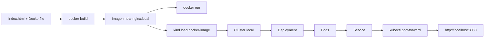
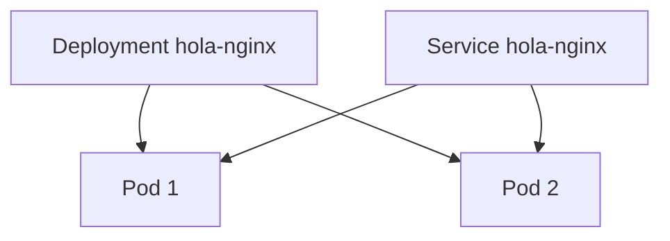
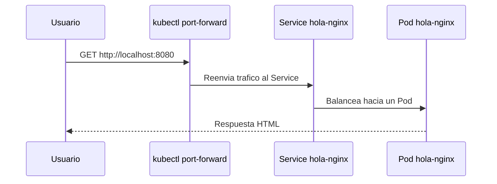

# Primer proyecto práctico

En este ejercicio vamos a recorrer el flujo completo:

1. Construir una imagen Docker
2. Probarla localmente
3. Cargarla en un clúster local de Kubernetes
4. Desplegarla con manifiestos YAML

## Estructura del ejemplo

Archivos implicados:

- `examples/k8s/hola-nginx/namespace.yaml`
- `examples/docker/hola-nginx/Dockerfile`
- `examples/docker/hola-nginx/index.html`
- `examples/k8s/hola-nginx/deployment.yaml`
- `examples/k8s/hola-nginx/service.yaml`

## Vista general del flujo



## Paso 1: construir la imagen

```bash
docker build -t hola-nginx:local examples/docker/hola-nginx
```

## Paso 2: probar el contenedor en local

```bash
docker run --rm -p 8080:80 hola-nginx:local
```

Abre en el navegador:

```text
http://localhost:8080
```

Si ves la página de ejemplo, la imagen está bien construida.

## Paso 3: crear un clúster local

Ejemplo con `kind`:

```bash
kind create cluster --name curso-k8s
```

Si ya tienes un clúster creado, puedes reutilizarlo.

## Paso 4: cargar la imagen en `kind`

Como la imagen es local y no está publicada en un registry, hay que cargarla en el clúster:

```bash
kind load docker-image hola-nginx:local --name curso-k8s
```

## Paso 5: desplegar en Kubernetes

```bash
kubectl apply -f examples/k8s/hola-nginx/
```

Comprueba el estado:

```bash
kubectl get pods -n hola-nginx-demo
kubectl get deployments -n hola-nginx-demo
kubectl get services -n hola-nginx-demo
```

## Topologia dentro del cluster



## Paso 6: acceder a la aplicación

Usaremos `port-forward`:

```bash
kubectl port-forward -n hola-nginx-demo service/hola-nginx 8080:80
```

Luego visita:

```text
http://localhost:8080
```

## Camino del trafico en local



## Qué deberías observar

- Docker ejecuta un contenedor individual.
- Kubernetes ejecuta pods gestionados por un deployment.
- El service da un punto estable de acceso dentro del clúster.

## Después de este ejercicio

Si este flujo ya te funciona, los siguientes laboratorios naturales dentro del repositorio son:

- `examples/docker/fullstack-demo/`
- `examples/docker/python-api/`
- `examples/docker/compose-web-api/`
- `examples/k8s/fullstack-demo/`
- `examples/k8s/configmap-secret/`
- `examples/k8s/ingress-demo/`
- `examples/k8s/job-cronjob/`

## Experimentos recomendados

### Cambiar el contenido HTML

Edita `examples/docker/hola-nginx/index.html`, reconstruye la imagen y vuelve a desplegar.

### Cambiar el número de réplicas

En `deployment.yaml`, modifica:

```yaml
replicas: 2
```

por:

```yaml
replicas: 3
```

y vuelve a aplicar:

```bash
kubectl apply -f examples/k8s/hola-nginx/deployment.yaml
```

### Ver el rollout

```bash
kubectl rollout status deployment/hola-nginx -n hola-nginx-demo
```

## Limpieza

Para borrar los recursos:

```bash
kubectl delete -f examples/k8s/hola-nginx/
```

Si quieres borrar también el clúster de `kind`:

```bash
kind delete cluster --name curso-k8s
```
