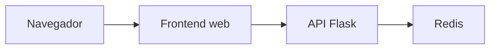
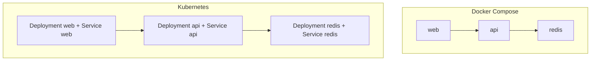
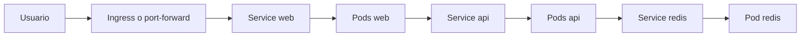

# Proyecto multiservicio

Este documento amplía la parte práctica del repositorio con una aplicación de referencia más realista. La idea es comparar el mismo sistema en dos contextos:

- Docker Compose para entorno local multi-servicio
- Kubernetes para despliegue declarativo

## Objetivo del proyecto

Construir y entender una aplicación compuesta por:

- un frontend estático
- una API Flask
- un Redis que guarda un contador

## Qué se practica aquí

- red entre servicios
- proxy HTTP con `nginx`
- variables de entorno y secretos
- persistencia ligera en Redis
- comparación Compose vs Kubernetes
- diagnósticos por capa

## Arquitectura general



## Estructura de los ejemplos

### Docker Compose

- `examples/docker/fullstack-demo/docker-compose.yml`
- `examples/docker/fullstack-demo/api/`
- `examples/docker/fullstack-demo/web/`

### Kubernetes

- `examples/k8s/fullstack-demo/configmap.yaml`
- `examples/k8s/fullstack-demo/secret.yaml`
- `examples/k8s/fullstack-demo/redis-*.yaml`
- `examples/k8s/fullstack-demo/api-*.yaml`
- `examples/k8s/fullstack-demo/web-*.yaml`
- `examples/k8s/fullstack-demo/ingress.yaml`

## Vista comparativa



## Parte 1: ejecutar con Docker Compose

### Arranque

```bash
docker-compose -f examples/docker/fullstack-demo/docker-compose.yml up --build
```

### Qué verificar

Abre:

- `http://localhost:8080`

Prueba también:

```bash
curl -s http://localhost:8000/api
curl -s http://localhost:8000/api/health
curl -s http://localhost:8000/api/stats
curl -s -X POST http://localhost:8000/api/visits
```

### Qué observar

- `web` expone la interfaz
- `web` reenvía `/api/*` hacia la API
- la API habla con Redis usando el hostname `redis`
- el contador se guarda fuera de la API y sobrevive al reinicio del contenedor de API mientras el volumen de Redis exista

## Parte 2: ejecutar con Kubernetes

### Construir imágenes

```bash
docker build -t fullstack-api:local examples/docker/fullstack-demo/api
docker build -t fullstack-web:local examples/docker/fullstack-demo/web
```

### Cargar en `kind`

```bash
kind load docker-image fullstack-api:local --name curso-k8s
kind load docker-image fullstack-web:local --name curso-k8s
```

### Aplicar manifiestos

```bash
kubectl apply -f examples/k8s/fullstack-demo/
```

### Verificación de recursos

```bash
kubectl get deployments
kubectl get pods
kubectl get services
kubectl get ingress
```

### Acceso local

```bash
kubectl port-forward service/web 8080:80
```

Luego prueba:

```bash
curl -s http://localhost:8080/api
curl -s http://localhost:8080/api/health
curl -s http://localhost:8080/api/stats
curl -s -X POST http://localhost:8080/api/visits
```

## Relación entre objetos en Kubernetes



## Qué cambia entre Compose y Kubernetes

| Aspecto | Compose | Kubernetes |
| --- | --- | --- |
| Red | automática por servicio | `Service` + DNS del clúster |
| Entrada HTTP | puerto publicado | `Service` + `Ingress` o `port-forward` |
| Configuración | `environment` en YAML | `ConfigMap` + `Secret` |
| Estado deseado | archivo Compose | manifiestos declarativos |
| Réplicas API | un servicio | `Deployment` con varias réplicas |

## Secuencia recomendada de práctica

1. Ejecuta primero Compose.
2. Entiende bien qué hace `web`, qué hace `api` y qué hace `redis`.
3. Luego despliega el mismo sistema en Kubernetes.
4. Compara:
   - nombres de red
   - variables
   - exposición del frontend
   - ubicación del estado

## Problemas frecuentes

### El frontend carga pero la API falla

Revisa:

- `api` está corriendo
- `redis` está disponible
- el proxy de `nginx` apunta a `api:8000`

### El contador no incrementa

Revisa:

- contraseña Redis
- nombre de host Redis
- endpoint `/api/visits`

### En Kubernetes la imagen no arranca

Revisa:

- la imagen fue construida
- la imagen fue cargada en `kind`
- el tag coincide con el manifiesto

### En Kubernetes el frontend responde pero el backend no

Revisa:

- `Service api`
- `readinessProbe`
- logs del deployment `api`

## Experimentos recomendados

### Experimento 1: cambiar branding

Modifica el frontend para reflejar otro nombre y vuelve a construir `fullstack-web`.

### Experimento 2: cambiar la clave del contador

En Compose o Kubernetes, cambia `REDIS_KEY` y observa que aparece un contador nuevo.

### Experimento 3: escalar la API

En Kubernetes, sube las réplicas del deployment `api` y verifica que el contador sigue siendo compartido porque vive en Redis.

### Experimento 4: romper Redis a propósito

Cambia la contraseña o el host y observa cómo responde el `health` y cómo falla el contador.

## Relación con el temario

Este proyecto se conecta directamente con:

- `Docker Compose`
- `ConfigMap` y `Secret`
- `Service` e `Ingress`
- `probes`
- `observabilidad`

## Siguiente paso

Después de este proyecto, el siguiente salto natural es:

- empaquetar la aplicación con Helm
- añadir persistencia más explícita en Kubernetes
- automatizar validación y build en CI/CD
- entrar en RBAC, políticas de red y despliegues por entorno
