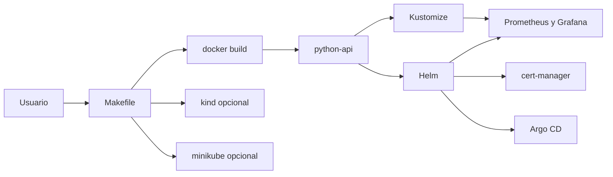

# Laboratorio local avanzado

Este modulo convierte la parte avanzada del repositorio en un laboratorio repetible desde un solo punto de entrada.

La idea no es sustituir la explicacion de cada capitulo, sino darte una capa de ejecucion comoda para:

- preparar un cluster local
- cargar imagenes del curso
- desplegar con `Kustomize`
- desplegar con Helm
- instalar `cert-manager`
- instalar Argo CD
- instalar observabilidad con Prometheus y Grafana

## Pieza central

La automatizacion local vive en `Makefile`.

Puedes ver todos los objetivos disponibles con:

```bash
make help
```

## Mapa del flujo



## Requisitos

- Docker
- `kubectl`
- Helm
- `curl`
- `minikube` para el flujo local principal
- `kind` si quieres repetir el camino del workflow `kind-e2e.yml`

## Flujo local recomendado con minikube

### 1. Verificar herramientas

```bash
make check-prereqs
```

### 2. Levantar el cluster

```bash
make minikube-up
```

Si quieres trabajar con `Ingress` local, activa tambien:

```bash
make minikube-enable-ingress
```

## 3. Construir y cargar la app base

```bash
make build-python-api
make minikube-load-python-api
```

## 4. Validar el camino Kustomize

```bash
make deploy-kustomize-dev
make verify-kustomize-dev
```

Esto comprueba:

- despliegue del overlay `dev`
- `rollout` correcto
- respuesta real de `/health`
- respuesta real de `/metrics`

## 5. Validar el camino Helm

```bash
make deploy-helm-dev
make verify-helm-dev
```

Esto instala el chart `examples/helm/python-api/` con `values-dev.yaml`.

## 6. Instalar y validar cert-manager

```bash
make install-cert-manager
make deploy-cert-manager-demo
make verify-cert-manager-demo
```

La demo usa el flujo `self-signed` del repositorio para no depender de DNS publico.

## 6.1. Validar mas laboratorios base

Si quieres ampliar la cobertura del laboratorio local con ejemplos basicos del curso:

```bash
make deploy-configmap-secret-demo
make verify-configmap-secret-demo
make deploy-job-cronjob-demo
make verify-job-cronjob-demo
```

Esto comprueba tambien:

- configuracion externa por `ConfigMap`
- lectura de secretos en runtime
- finalizacion correcta de un `Job`
- presencia operativa del `CronJob` base

## 7. Instalar y validar observabilidad

```bash
make install-observability
make deploy-observability-demo
make verify-grafana
```

Esto deja listo el stack de:

- Prometheus
- Alertmanager
- Grafana
- `ServiceMonitor`
- `PrometheusRule`
- dashboard de ejemplo para la `python-api`

## 8. Instalar y validar Argo CD

```bash
make install-argocd
make minikube-load-python-api-demo-tag
make deploy-argocd-demo-apps-local
```

### Por que existe `deploy-argocd-demo-apps-local`

En GitOps hay una diferencia importante entre:

- aplicar manifiestos locales
- lo que Argo CD sincroniza desde Git remoto

El objetivo `deploy-argocd-demo-apps-local` aplica directamente el `AppProject` y las `Application` hijas del repositorio local para que puedas validar la estructura y el comportamiento sin depender de que ya hayas publicado cambios en Git remoto.

### Cuando usar `deploy-argocd-demo-root`

```bash
make deploy-argocd-demo-root
```

Usa la `Root Application` cuando quieras probar el patron `app-of-apps` completo leyendo desde Git remoto.

Conviene hacerlo cuando:

- el remoto ya contiene los manifiestos actuales
- quieres reproducir el comportamiento GitOps de punta a punta

## Flujo CI y flujo local

El workflow [docs/ci-cd/04-ci-end-to-end-con-kind.md](ci-cd/04-ci-end-to-end-con-kind.md) cubre una parte del mismo camino con `kind`.

La idea es:

- `kind` para CI efimera y rapida
- `minikube` para laboratorio local mas rico

## Comandos utiles de estado

```bash
make status
```

Esto resume:

- contexto actual
- aplicaciones de Argo CD
- estado de `kustomize-dev`
- estado de `helm-demo`
- estado de `cert-manager-demo`
- pods de `observability`

## Matices importantes

### Ingress local

En `minikube`, un `Ingress` puede quedarse sin direccion publicada aunque la app funcione por `port-forward`.

Por eso:

- la app puede responder bien
- el `Service` puede estar sano
- Argo CD aun puede mostrar `Progressing`

### Git remoto

Argo CD sincroniza desde Git remoto, no desde cambios locales no publicados.

Para una referencia detallada de lo que ya fue comprobado en vivo, revisa:

- [Validacion operativa](validacion-operativa.md)

## Siguiente paso

Si quieres entender por que estos objetivos existen y que valida realmente la CI, conecta este laboratorio con:

- [Workflows del repositorio](ci-cd/02-workflows-del-repo.md)
- [CI end-to-end con kind](ci-cd/04-ci-end-to-end-con-kind.md)
- [Argo CD practico: app-of-apps y sync](kubernetes/27-argocd-practico-app-of-apps-y-sync.md)
- [Observabilidad completa con Prometheus y Grafana](kubernetes/28-observabilidad-stack-completo.md)
