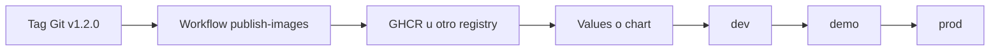

# Publicacion, promocion y releases

La CI valida y construye. La siguiente pregunta es como conviertes ese build en un artefacto versionado y como lo mueves entre entornos sin romper trazabilidad.

## Objetivo

Conectar cuatro piezas:

- tags del repositorio
- imagenes versionadas
- valores Helm o manifiestos
- promocion entre `dev`, `demo` y `prod`

## Flujo recomendado



## Paso 1: elegir una fuente de version

Opciones comunes:

- tag Git como `v1.2.0`
- SHA corto del commit
- fecha

En este repositorio, el ejemplo mas didactico es usar tags Git.

## Paso 2: publicar imagenes con esa version

El workflow propuesto en:

- `.github/workflows/publish-images.yml`

construye y publica:

- `hola-nginx`
- `python-api`
- `fullstack-api`
- `fullstack-web`

## Paso 3: referenciar la version desde el despliegue

Lo importante no es rehacer la imagen en cada entorno, sino actualizar el valor que la referencia.

Ejemplo:

```yaml
image:
  repository: ghcr.io/owner/kubernetes-docker-python-api
  tag: 1.2.0
```

## Paso 4: promocion por entornos

Hay varias estrategias razonables.

### Estrategia A: un archivo `values` por entorno

- `values-dev.yaml`
- `values-demo.yaml`
- `values-prod.yaml`

### Estrategia B: ramas o carpetas por entorno

Mas comun en modelos GitOps.

### Estrategia C: actualizacion automatica tras aprobacion

Mas avanzada, pero util cuando ya existe una cadena de despliegue estable.

## Que deberia cambiar entre entornos

- replicas
- recursos
- hostnames
- imagen o tag aprobada
- credenciales y endpoints externos

## Que deberia permanecer estable

- contrato principal de la aplicacion
- estructura del chart
- estrategia de probes
- nombres y convenciones

## Relacion con Helm en este repo

El repositorio ya trae dos casos utiles:

- `examples/helm/python-api/`
- `examples/helm/fullstack-demo/`

La idea natural es:

1. renderizar en local
2. validar en CI
3. publicar imagenes versionadas
4. promover solo cambiando valores

## Ejemplo de checklist de release

1. La CI principal esta verde.
2. El chart renderiza con los values de destino.
3. Existe changelog o descripcion del cambio.
4. La imagen publicada usa una tag inmutable.
5. El entorno de destino sabe exactamente que tag consumira.

## Ejemplo de promocion manual sencilla

1. Se publica `ghcr.io/owner/kubernetes-docker-python-api:1.2.0`.
2. Se actualiza `values-demo.yaml` para usar `1.2.0`.
3. Se valida con `helm template`.
4. Se aplica o se deja que el reconciliador GitOps la recoja.
5. Si la verificacion es correcta, se repite en `prod`.

## Errores frecuentes

### Reconstruir la imagen en cada entorno

Eso mezcla build con promocion.

### Cambiar demasiadas cosas a la vez

Si cambias imagen, replicas, recursos y hosts en el mismo salto, luego cuesta aislar problemas.

### No documentar que version se aprobo

Trazabilidad pobre implica rollback mas confuso.

## Rollback mental

Si un despliegue falla, un buen sistema te deja responder rapido:

- que imagen se promovio
- con que values
- desde que commit
- a que entorno

## Conexion con otros modulos

- [Versionado y publicacion de imagenes](../docker/08-versionado-y-publicacion.md)
- [Entornos, CI/CD y GitOps](../kubernetes/14-entornos-ci-cd-y-gitops.md)
- [Helm tutorial paso a paso](../kubernetes/19-helm-tutorial-paso-a-paso.md)
- [CI end-to-end con kind](04-ci-end-to-end-con-kind.md)
