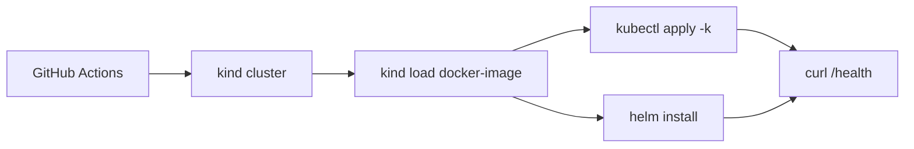

# CI end-to-end con kind

La validacion estructural es util, pero llega un punto en el que conviene comprobar que al menos una parte del repositorio se puede desplegar de verdad en un cluster efimero.

## Que problema resuelve este bloque

Sin una prueba end-to-end:

- un YAML puede ser valido y aun asi no arrancar
- un chart puede renderizar y aun asi no quedar `Ready`
- el curso puede parecer sano sin demostrar un despliegue real

## Objetivo

Usar `kind` dentro de CI para:

1. crear un cluster temporal
2. cargar una imagen local
3. desplegar con `Kustomize`
4. desplegar con Helm
5. hacer una prueba HTTP real

## Mapa del flujo



## Workflow del repositorio

Revisa:

- `.github/workflows/kind-e2e.yml`

Ese workflow comprueba dos caminos del curso:

- `examples/k8s/kustomize-demo/overlays/dev`
- `examples/helm/python-api/`

## Por que `kind`

`kind` encaja muy bien en CI porque:

- usa Docker
- crea clusters efimeros rapidamente
- permite cargar imagenes locales sin registry externo
- es suficientemente pequeno para un laboratorio educativo

## Flujo mental

El objetivo no es reproducir produccion, sino responder:

- la imagen arranca
- el `Deployment` queda `Ready`
- el `Service` expone la app
- el endpoint de salud responde

## Pasos tipicos del workflow

### 1. Crear el cluster

```bash
kind create cluster --name curso-k8s-ci
```

### 2. Construir una imagen local

```bash
docker build -t python-api:local examples/docker/python-api
```

### 3. Cargarla en `kind`

```bash
kind load docker-image python-api:local --name curso-k8s-ci
```

### 4. Aplicar un overlay Kustomize

```bash
kubectl apply -k examples/k8s/kustomize-demo/overlays/dev
```

### 5. Instalar el chart Helm

```bash
helm install python-api-demo examples/helm/python-api -f examples/helm/python-api/values-dev.yaml
```

### 6. Verificar con `curl`

En CI esto suele hacerse con `kubectl port-forward` en segundo plano y una peticion a `/health`.

## Que valida de verdad

- que la imagen puede ejecutarse en cluster
- que la sonda de salud responde
- que el `Service` enruta
- que Kustomize y Helm producen un despliegue funcional minimo

## Que no valida todavia

- observabilidad completa
- TLS con controlador real
- Argo CD ejecutandose de verdad
- escenarios de base de datos persistente mas pesados

## Errores frecuentes

### La imagen no esta cargada en `kind`

Si el cluster no puede descargarla y no la cargaste localmente, veras `ImagePullBackOff`.

### El overlay apunta a un tag distinto

CI puede construir `python-api:local` mientras tu overlay espera otra cosa.

### El `port-forward` falla

Suele indicar que el pod no estaba listo o que el servicio no tenia endpoints.

## Conexion con el resto del curso

- [Kustomize: bases y overlays](../kubernetes/25-kustomize-bases-y-overlays.md)
- [Workflows del repositorio](02-workflows-del-repo.md)
- [Publicacion, promocion y releases](03-publicacion-promocion-y-releases.md)
