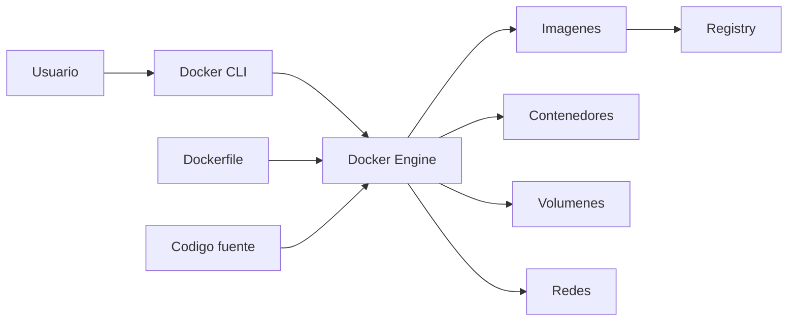
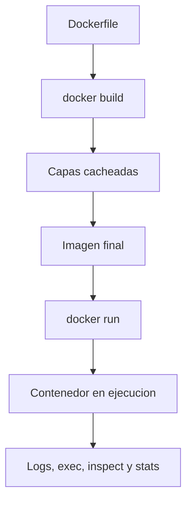
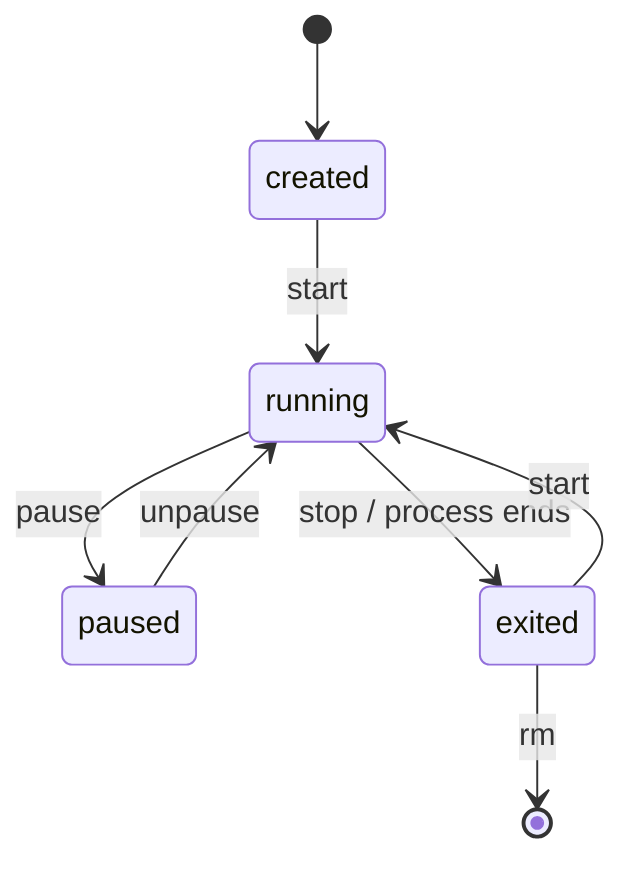

# Arquitectura y CLI de Docker

Docker no es solo un comando; es un conjunto de componentes que colaboran para construir, almacenar y ejecutar contenedores.

## Componentes principales

- `Docker CLI`: la herramienta que ejecutas desde terminal.
- `Docker Engine` o daemon: proceso que construye y administra imágenes, redes y contenedores.
- `Dockerfile`: receta declarativa de build.
- `Registry`: almacén remoto o local de imágenes.

## Diagrama de arquitectura



## Flujo habitual

1. Escribes un `Dockerfile`.
2. Ejecutas `docker build`.
3. Docker crea capas e imagen final.
4. Ejecutas `docker run`.
5. Docker crea un contenedor a partir de la imagen.

## Flujo de build y ejecucion



## Objetos clave

### Imagen

Es inmutable y versionable. Suele etiquetarse así:

```text
repositorio:tag
```

Ejemplos:

```text
nginx:alpine
python:3.12-slim
mi-api:v1.0.0
```

### Contenedor

Es una instancia viva de una imagen. Tiene:

- Un proceso principal
- Una configuración concreta
- Una red
- Un sistema de archivos basado en capas

### Volumen

Es una estrategia de persistencia desacoplada del ciclo de vida del contenedor.

### Red

Permite comunicación entre contenedores, el host y redes externas.

## Comandos base de la CLI

### Información general

```bash
docker version
docker info
```

### Imágenes

```bash
docker images
docker pull nginx:alpine
docker rmi nginx:alpine
```

### Contenedores

```bash
docker ps
docker ps -a
docker run --rm nginx:alpine
docker stop <container_id>
docker logs <container_id>
docker exec -it <container_id> sh
```

### Inspección

```bash
docker inspect <container_id>
docker stats
```

## Ciclo de vida de un contenedor

Estados frecuentes:

- `created`
- `running`
- `paused`
- `exited`
- `dead`

Comandos relacionados:

```bash
docker start <container_id>
docker restart <container_id>
docker rm <container_id>
```



## Publicación de puertos

Cuando un servicio escucha dentro del contenedor, necesitamos mapearlo al host:

```bash
docker run --rm -p 8080:80 nginx:alpine
```

Interpretación:

- `8080`: puerto del host
- `80`: puerto dentro del contenedor

## Variables de entorno

Muchos contenedores aceptan configuración por variables:

```bash
docker run --rm -e APP_ENV=dev -e PORT=8000 mi-api:local
```

## Ejemplo práctico del repositorio

Construcción:

```bash
docker build -t hola-nginx:local examples/docker/hola-nginx
```

Ejecución:

```bash
docker run --rm -p 8080:80 hola-nginx:local
```

## Errores frecuentes

- El contenedor arranca y se cierra porque el proceso principal termina.
- El puerto correcto no está publicado.
- La imagen local tiene otra etiqueta distinta a la esperada.
- Se intenta entrar con `bash` en una imagen que solo trae `sh`.

## Práctica recomendada

1. Ejecuta `docker ps -a`.
2. Lanza un contenedor de `nginx`.
3. Inspecciónalo con `docker inspect`.
4. Entra con `docker exec -it`.
5. Repite el flujo con otro contenedor minimalista.
