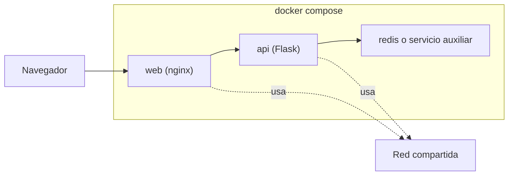
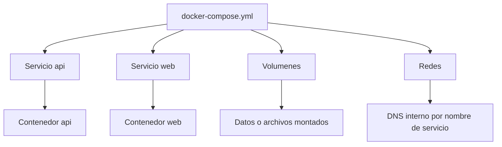

# Docker Compose

Docker Compose simplifica la definición de aplicaciones con múltiples servicios, redes, volúmenes y variables.

## Cuándo usarlo

Es ideal cuando una app necesita más de un contenedor:

- API + base de datos
- Frontend + backend
- Worker + cola
- Herramientas auxiliares de desarrollo

## Estructura básica

Ejemplo del repositorio: `examples/docker/compose-web-api/docker-compose.yml`

```yaml
services:
  api:
    build: ../python-api
    ports:
      - "8000:8000"

  web:
    image: nginx:alpine
    ports:
      - "8080:80"
```

## Topologia tipica con Compose



## Comandos principales

```bash
docker compose up
docker compose up --build
docker compose down
docker compose ps
docker compose logs -f
```

## Conceptos clave

### `services`

Cada servicio corresponde normalmente a un contenedor.

### `ports`

Publican puertos del host hacia el contenedor.

### `environment`

Permite pasar configuración:

```yaml
environment:
  APP_ENV: development
  API_URL: http://api:8000
```

### `depends_on`

Ordena arranque básico, aunque no garantiza que un servicio ya esté listo para recibir tráfico.

### `volumes`

Sirven para persistencia o montar código local.

## Como piensa Compose la aplicacion



## Ejemplo un poco más real

```yaml
services:
  api:
    build: ../python-api
    environment:
      APP_NAME: Curso Docker
    ports:
      - "8000:8000"

  redis:
    image: redis:7-alpine
    ports:
      - "6379:6379"
```

La API podría conectarse a `redis` usando ese nombre como hostname.

## Buenas prácticas

- Usa nombres claros de servicio.
- Evita meter secretos reales en el YAML.
- Añade un archivo `.env` cuando convenga.
- Separa el modo desarrollo del modo producción.

## Qué no sustituye

Compose es muy útil en local, pero no reemplaza un orquestador como Kubernetes cuando necesitas:

- scheduling avanzado
- auto-recuperación a escala
- despliegues declarativos de cluster
- políticas y networking de plataforma

## Ejercicio sugerido

1. Ejecuta `docker compose up --build` en `examples/docker/compose-web-api/`.
2. Comprueba que la API responde en `http://localhost:8000/health`.
3. Comprueba que `nginx` responde en `http://localhost:8080`.
4. Añade una variable de entorno nueva y vuelve a levantar la stack.
