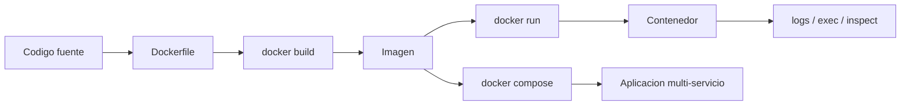
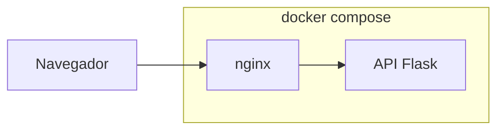

# Tutorial detallado de Docker

Este tutorial recorre Docker de forma progresiva y practica. La idea es que no solo entiendas conceptos, sino que ejecutes comandos reales y veas el comportamiento del sistema.

## Objetivos

Al terminar deberias poder:

- Entender la diferencia entre imagen y contenedor.
- Construir imagenes propias con `Dockerfile`.
- Ejecutar aplicaciones con puertos, variables y persistencia.
- Levantar varios servicios juntos con Docker Compose.
- Inspeccionar y depurar contenedores cuando algo falla.

## Requisitos

- Docker Desktop o Docker Engine instalado.
- Terminal disponible.
- Este repositorio clonado en local.

## Mapa del tutorial



## Paso 0: comprobar la instalacion

Verifica las herramientas:

```bash
docker --version
docker info
```

Si `docker info` falla, normalmente significa que el daemon no esta corriendo todavia.

## Paso 1: ejecutar el primer contenedor

Empieza por el ejemplo mas simple posible:

```bash
docker run --rm hello-world
```

Que observar:

- Docker busca la imagen si no esta en local.
- Crea un contenedor temporal.
- Ejecuta un proceso corto.
- El contenedor termina y se elimina con `--rm`.

Ahora prueba un contenedor que permanezca vivo:

```bash
docker run --rm -p 8080:80 nginx:alpine
```

Abre en el navegador:

```text
http://localhost:8080
```

Aqui ya aparecen dos ideas fundamentales:

- La imagen es `nginx:alpine`.
- El contenedor es la instancia viva que responde por el puerto `8080`.

## Paso 2: inspeccionar el contenedor

Con `nginx` corriendo en otra terminal, prueba:

```bash
docker ps
docker logs <container_id>
docker inspect <container_id>
docker exec -it <container_id> sh
```

Dentro del contenedor puedes listar archivos:

```bash
ls /usr/share/nginx/html
```

Este paso es importante porque Docker deja de ser una "caja negra". Empiezas a ver filesystem, proceso principal, variables y networking.

## Paso 3: construir tu primera imagen propia

Vamos a usar el ejemplo `examples/docker/hola-nginx/`.

Archivos:

- `examples/docker/hola-nginx/Dockerfile`
- `examples/docker/hola-nginx/index.html`

Construye la imagen:

```bash
docker build -t hola-nginx:local examples/docker/hola-nginx
```

Ejecutala:

```bash
docker run --rm -p 8080:80 hola-nginx:local
```

Abre:

```text
http://localhost:8080
```

## Como pensar el Dockerfile

El Dockerfile de este ejemplo es pequeno, pero ya muestra la idea correcta:

```dockerfile
FROM nginx:alpine
COPY index.html /usr/share/nginx/html/index.html
EXPOSE 80
```

Lectura mental:

1. Partimos de una imagen base conocida.
2. Sustituimos el contenido HTML.
3. Documentamos el puerto.

## Paso 4: reconstruir y ver la cache

Cambia algun texto en `examples/docker/hola-nginx/index.html` y reconstruye:

```bash
docker build -t hola-nginx:local examples/docker/hola-nginx
```

Observa que Docker reutiliza capas cuando puede. Esa cache es una parte central del rendimiento de build.

## Paso 5: contenedorizando una API Python

Ahora pasa a un ejemplo mas real: `examples/docker/python-api/`.

Archivos importantes:

- `examples/docker/python-api/Dockerfile`
- `examples/docker/python-api/app.py`
- `examples/docker/python-api/requirements.txt`

Construye la imagen:

```bash
docker build -t python-api:local examples/docker/python-api
```

Ejecutala:

```bash
docker run --rm -p 8000:8000 python-api:local
```

Prueba la API:

```bash
curl -s http://localhost:8000/
curl -s http://localhost:8000/health
```

## Variables de entorno en tiempo de ejecucion

La API acepta variables. Prueba:

```bash
docker run --rm \
  -e APP_NAME="Curso Docker" \
  -e APP_ENV=demo \
  -e PORT=8000 \
  -p 8000:8000 \
  python-api:local
```

Vuelve a consultar:

```bash
curl -s http://localhost:8000/
```

Deberias ver reflejados `APP_NAME` y `APP_ENV`.

## Paso 6: bind mounts y volumenes

Los contenedores son efimeros. Si necesitas persistencia o compartir archivos, tienes varias opciones.

### Bind mount

Monta una carpeta del host:

```bash
docker run --rm -v "$PWD":/workspace alpine ls /workspace
```

Esto es util para desarrollo local, aunque depende de la estructura del host.

### Volumen gestionado por Docker

Crea un volumen:

```bash
docker volume create curso-demo
```

Escribe un archivo en ese volumen:

```bash
docker run --rm -v curso-demo:/data alpine sh -c "echo hola > /data/mensaje.txt"
```

Leelo desde otro contenedor:

```bash
docker run --rm -v curso-demo:/data alpine cat /data/mensaje.txt
```

## Paso 7: varios servicios con Docker Compose

Usa el ejemplo:

- `examples/docker/compose-web-api/docker-compose.yml`
- `examples/docker/compose-web-api/nginx.conf`

Diagrama del flujo:



Levanta la aplicacion:

```bash
docker-compose -f examples/docker/compose-web-api/docker-compose.yml up --build
```

Pruebas:

```bash
curl -s http://localhost:8000/health
curl -s http://localhost:8080/
```

Que esta pasando:

- `api` construye desde `examples/docker/python-api/`.
- `web` usa `nginx` como proxy.
- Ambos comparten una red interna.
- `web` alcanza `api` usando el hostname `api`.

Para parar todo:

```bash
docker-compose -f examples/docker/compose-web-api/docker-compose.yml down
```

## Paso 8: versionado y publicacion de imagenes

Aunque aqui trabajemos en local, conviene entender el flujo de publicacion:

```bash
docker login
docker tag python-api:local usuario/python-api:0.1.0
docker push usuario/python-api:0.1.0
```

Buenas practicas:

- No dependas solo de `latest`.
- Usa tags con semantica clara.
- Documenta que puerto expone la imagen.
- Evita secretos en la imagen o en el `Dockerfile`.

## Paso 9: checklist de depuracion

Cuando algo no funcione, usa este orden:

1. `docker ps -a`
2. `docker logs <container_id>`
3. `docker inspect <container_id>`
4. `docker exec -it <container_id> sh`
5. Revisa puertos, variables y comando principal

Errores frecuentes:

- Puerto del host ya ocupado.
- El proceso principal termina enseguida.
- El build no copio un archivo esperado.
- La aplicacion escucha en otro puerto distinto.

## Paso 10: recorrido recomendado de practica

Haz esta secuencia completa sin saltarte pasos:

1. Ejecuta `hello-world`.
2. Ejecuta `nginx:alpine`.
3. Construye `hola-nginx:local`.
4. Modifica `index.html` y reconstruye.
5. Construye `python-api:local`.
6. Ejecuta la API con variables de entorno.
7. Levanta `compose-web-api` con Compose.
8. Para todo y limpia los contenedores.

## Ejercicios sugeridos

1. Cambia el puerto de la API a `9000`.
2. Añade una nueva ruta en `app.py`.
3. Introduce un error intencional en `requirements.txt` y observa el build.
4. Modifica `nginx.conf` para enrutar `/api` hacia la API.
5. Crea una etiqueta nueva para la imagen `python-api`.

## Cierre

Si ya puedes recorrer este tutorial de memoria aproximada, tienes una base muy buena para pasar al tutorial detallado de Kubernetes:

- [Tutorial detallado de Kubernetes](../kubernetes/08-tutorial-kubernetes-paso-a-paso.md)
