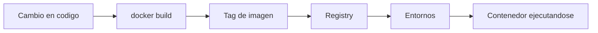

# Versionado y publicacion de imagenes

Cuando una imagen ya no vive solo en tu portatil, necesitas una forma clara de nombrarla, publicarla y promoverla entre entornos sin perder trazabilidad.

## Que problema resuelve este bloque

Sin una estrategia de versionado:

- es dificil saber que codigo esta corriendo
- varias personas pueden reutilizar la misma etiqueta con significados distintos
- promocionar cambios entre `dev`, `demo` y `prod` se vuelve fragil

## Mapa del flujo



## Principio 1: una imagen deberia ser identificable

Una buena etiqueta responde al menos a una de estas preguntas:

- que version funcional contiene
- que commit la genero
- cuando fue publicada

Etiquetas utiles:

- `0.1.0`
- `0.1.1`
- `main-a1b2c3d`
- `2026-06-08`

Etiquetas poco utiles si se usan solas:

- `latest`
- `test`
- `final`

## Principio 2: reconstruir y promover no son lo mismo

Es mejor construir una sola vez y luego promover esa misma imagen.

Mal flujo:

1. reconstruir en `dev`
2. reconstruir otra vez en `demo`
3. reconstruir otra vez en `prod`

Mejor flujo:

1. construir una vez
2. etiquetar con una version
3. publicar
4. referenciar esa misma version desde Helm o manifiestos

## Ejemplo con la API Python

Construir una imagen local versionada:

```bash
docker build -t python-api:0.1.0 examples/docker/python-api
```

Etiquetar para un registry:

```bash
docker tag python-api:0.1.0 ghcr.io/usuario/python-api:0.1.0
```

Publicar:

```bash
docker push ghcr.io/usuario/python-api:0.1.0
```

## Ejemplo con tags dobles

Es comun publicar dos tags:

- una inmutable con version o commit
- otra de conveniencia como `latest`

```bash
docker tag python-api:0.1.0 ghcr.io/usuario/python-api:latest
docker push ghcr.io/usuario/python-api:latest
```

La tag importante para despliegues deberia seguir siendo la versionada.

## Convenciones recomendadas para este repositorio

### Imagenes simples

- `hola-nginx`
- `python-api`

### Imagenes del laboratorio fullstack

- `fullstack-api`
- `fullstack-web`

### Convencion de publicacion

Una convencion razonable seria:

```text
ghcr.io/<owner>/kubernetes-docker-python-api:<version>
ghcr.io/<owner>/kubernetes-docker-fullstack-api:<version>
ghcr.io/<owner>/kubernetes-docker-fullstack-web:<version>
```

## Como conectar esto con Helm

El objetivo no es editar YAML a mano cada vez que cambias una version, sino cambiar valores como:

```yaml
image:
  repository: ghcr.io/usuario/python-api
  tag: 0.1.0
```

o en el chart fullstack:

```yaml
api:
  image:
    repository: ghcr.io/usuario/kubernetes-docker-fullstack-api
    tag: 0.1.0
```

## Estrategias de versionado

### SemVer

Util cuando quieres comunicar cambios funcionales:

- `1.0.0`
- `1.1.0`
- `1.1.1`

### Tag por commit

Util para trazabilidad tecnica:

- `git-1a2b3c4`

### Tag por fecha

Util para pipelines simples:

- `2026-06-08`

## Publicacion manual vs automatizada

### Manual

Buena para aprender:

- `docker login`
- `docker build`
- `docker tag`
- `docker push`

### Automatizada

Mejor para trabajo repetible:

- workflow de GitHub Actions
- publicacion en GHCR
- version derivada de tags del repositorio

En este repo ya existe una base para esa idea en:

- `docs/ci-cd/03-publicacion-promocion-y-releases.md`
- `.github/workflows/publish-images.yml`

## Errores frecuentes

### Publicar solo `latest`

Luego cuesta saber que imagen estaba desplegada realmente.

### Cambiar contenido sin cambiar tag

Rompe trazabilidad y hace mas dificil depurar.

### Etiquetar con nombres ambiguos

`test-final-bueno-2` no ayuda a largo plazo.

### Subir una imagen sin haberla probado localmente

Publicar basura mas rapido sigue siendo publicar basura.

## Verificacion sugerida

1. Construye `python-api` con una version concreta.
2. Etiquetala con un nombre de registry.
3. Simula actualizar un chart cambiando solo `image.tag`.
4. Explica por que eso es mejor que editar muchos archivos.

## Siguiente paso

Despues de versionar y publicar, el siguiente salto natural es endurecer la imagen y reducir superficie de riesgo:

- [Seguridad de contenedores y hardening](09-seguridad-de-contenedores-y-hardening.md)
