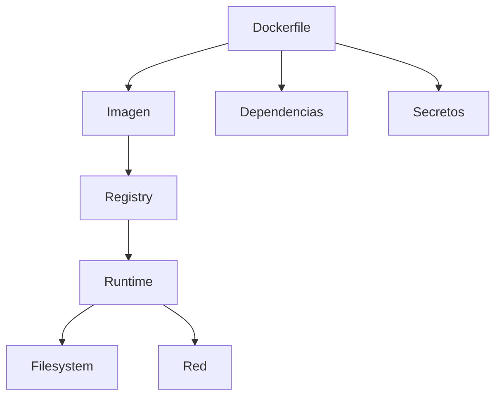

# Seguridad de contenedores y hardening

La seguridad en contenedores no depende de una sola herramienta. Empieza en el `Dockerfile`, sigue en la imagen publicada y termina de reforzarse en tiempo de ejecucion.

## Que problema resuelve este bloque

Una imagen puede funcionar y aun asi estar mal preparada para un entorno compartido.

Riesgos comunes:

- ejecutar como `root`
- instalar demasiados paquetes
- dejar secretos en capas
- no fijar dependencias
- exponer puertos o procesos innecesarios

## Superficie de riesgo



## Capa 1: construir una imagen mas pequena

Buenas practicas:

- usar una base conocida y minima
- copiar solo lo necesario
- limpiar caches cuando aplique
- preferir multi-stage builds cuando el caso lo justifique

Ejemplo mental:

```dockerfile
FROM python:3.12-slim
WORKDIR /app
COPY requirements.txt .
RUN pip install --no-cache-dir -r requirements.txt
COPY app.py .
CMD ["python", "app.py"]
```

## Capa 2: no ejecutar como root si no hace falta

Muchos servicios del curso no necesitan privilegios elevados.

Ejemplo:

```dockerfile
RUN useradd -r -u 1001 appuser
USER 1001
```

Esto no convierte automaticamente la imagen en segura, pero reduce daños potenciales.

## Capa 3: no meter secretos en la imagen

Evita:

- claves en el `Dockerfile`
- tokens en `ENV`
- archivos `.env` copiados dentro de la imagen

Mejor:

- variables de entorno al ejecutar
- `Secret` en Kubernetes
- secretos del sistema CI/CD

## Capa 4: fijar dependencias con criterio

No todo debe quedar congelado para siempre, pero conviene evitar una ambiguedad completa.

En Python, por ejemplo:

- fijar versiones estables
- revisar dependencias indirectas cuando toque
- reconstruir periodicamente para absorber parches de base

## Capa 5: reducir privilegios y escritura

Cuando el entorno lo permita:

- usa filesystem de solo lectura
- evita capacidades Linux extra
- monta volumenes solo si hacen falta

En Kubernetes esto se conecta con:

- `runAsNonRoot`
- `readOnlyRootFilesystem`
- `allowPrivilegeEscalation: false`

## Checklist minima para una imagen del curso

- base explicable y razonable
- proceso principal claro
- sin secretos embebidos
- dependencias instaladas desde archivos visibles
- ejecucion no root cuando sea viable
- logs por stdout o stderr

## Como auditar rapidamente una imagen

Ver capas e historia:

```bash
docker history python-api:local
```

Inspeccionar configuracion:

```bash
docker inspect python-api:local
```

Ejecutar shell dentro del contenedor:

```bash
docker run --rm -it python-api:local sh
```

## Endurecimiento aplicado al repositorio

Si quieres practicar con los ejemplos existentes, revisa:

1. `examples/docker/python-api/Dockerfile`
2. `examples/docker/fullstack-demo/api/Dockerfile`
3. `examples/docker/fullstack-demo/web/Dockerfile`

Preguntas utiles:

- que usuario ejecuta el proceso
- que archivos quedan dentro de la imagen
- que puertos se exponen
- que variables dependen del entorno

## Errores frecuentes

### Confundir imagen pequena con imagen segura

Una imagen pequena ayuda, pero no garantiza una configuracion sana.

### Copiar demasiado contexto

Si no usas `.dockerignore`, puedes meter archivos innecesarios o sensibles.

### Usar `latest` como base sin control

Eso dificulta reproducir builds y analizar cambios.

### Hacer debugging manual dentro del contenedor en lugar de mejorar la imagen

Entrar con `sh` puede ayudar, pero no deberia sustituir un `Dockerfile` claro.

## Ejercicio sugerido

1. Revisa una imagen del repo.
2. Identifica tres mejoras de hardening posibles.
3. Explica cuales harian mas visible el beneficio en un curso introductorio.

## Puente hacia Kubernetes

Este bloque encaja con:

- [Seguridad aplicada y hardening](../kubernetes/17-seguridad-aplicada-y-hardening.md)
- [Policies con Gatekeeper y Kyverno](../kubernetes/23-policies-con-gatekeeper-y-kyverno.md)
