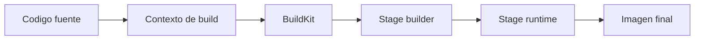

# BuildKit, multi-stage y optimizacion

Cuando una imagen ya funciona, el siguiente salto no es "hacerla mas compleja", sino hacerla mas eficiente, legible y portable.

Este modulo cierra la parte de builds avanzados en Docker con tres ideas que aparecen muy pronto en proyectos reales:

- `BuildKit`
- `multi-stage builds`
- control del contexto y la cache

## Que problema resuelve este bloque

Sin una estrategia de optimizacion es facil acabar con:

- imagenes mas grandes de lo necesario
- builds lentas
- capas mal ordenadas
- dependencias de build mezcladas con runtime

## Mapa mental



## Que aporta `BuildKit`

`BuildKit` mejora el motor de build de Docker. En la practica se nota sobre todo en:

- mejor cache
- salida mas clara
- funcionalidades modernas de build

En muchos entornos ya viene activado. Si quieres forzarlo:

```bash
DOCKER_BUILDKIT=1 docker build -t python-api-optimized:local examples/docker/python-api-optimized
```

## Que es un `multi-stage build`

Un `Dockerfile` multi-stage separa pasos de construccion y de runtime.

Ejemplo mental:

1. en una etapa construyes artefactos o ruedas Python
2. en otra etapa copias solo lo que necesitas para ejecutar

Eso te deja:

- menos basura en la imagen final
- menos herramientas innecesarias en runtime
- una frontera mas clara entre compilar e instalar

## El ejemplo del repositorio

Revisa:

- `examples/docker/python-api-optimized/Dockerfile`
- `examples/docker/python-api-optimized/.dockerignore`
- `examples/docker/python-api-optimized/app.py`
- `examples/docker/python-api-optimized/requirements.txt`

La idea del ejemplo es sencilla:

- una etapa `builder` genera ruedas
- una etapa final instala desde esas ruedas
- la imagen final corre como usuario no root

## Flujo recomendado de comparacion

### 1. Construir la version base

```bash
docker build -t python-api:baseline examples/docker/python-api
```

### 2. Construir la version optimizada

```bash
DOCKER_BUILDKIT=1 docker build -t python-api:optimized examples/docker/python-api-optimized
```

### 3. Comparar tamaño e historia

```bash
docker image ls | grep python-api
docker history python-api:baseline
docker history python-api:optimized
```

### 4. Ejecutar la imagen optimizada

```bash
docker run --rm -p 8001:8000 python-api:optimized
```

Luego prueba:

```bash
curl -s http://localhost:8001/health
curl -s http://localhost:8001/
```

## Orden de capas: por que importa

Si copias todo el codigo demasiado pronto:

- cualquier cambio invalida demasiada cache

Una secuencia mas sana suele ser:

1. copiar `requirements.txt`
2. instalar dependencias
3. copiar el codigo aplicacion

Eso hace que cambios pequenos en `app.py` no rehagan toda la instalacion.

## `.dockerignore`

El contexto de build es parte del rendimiento y de la higiene del proyecto.

Conviene excluir:

- `__pycache__/`
- `*.pyc`
- `.git/`
- archivos grandes que no hacen falta
- secretos locales

Si no controlas el contexto, puedes:

- ralentizar builds
- subir ficheros inutiles al daemon
- filtrar archivos sensibles dentro de una capa

## Lectura practica de `docker history`

`docker history` no sustituye un analisis profundo, pero sirve para:

- ver capas grandes
- detectar pasos innecesarios
- comprobar si copiaste mas de la cuenta

## Heuristicas utiles

### Buenas señales

- etapas separadas por responsabilidad
- imagen final sin herramientas de build innecesarias
- usuario no root
- contexto pequeno y controlado

### Malas señales

- `COPY . .` al principio sin pensarlo
- instalacion de dependencias mezclada con cambios frecuentes
- compiladores presentes en runtime sin necesidad
- capas gigantes por archivos auxiliares

## Errores frecuentes

### Optimizar antes de entender la imagen

Primero necesitas una version clara y correcta. Luego optimizas.

### Confundir `multi-stage` con magia

`multi-stage` ayuda, pero no arregla un `Dockerfile` caotico por si solo.

### Medir solo tamaño y olvidar mantenibilidad

Una imagen algo mayor pero muy legible puede ser mejor para un curso que una micro-optimizada e incomprensible.

## Conexiones importantes

- [Dockerfiles y buenas prácticas](03-dockerfiles-y-buenas-practicas.md)
- [Versionado y publicacion de imagenes](08-versionado-y-publicacion.md)
- [Seguridad de contenedores y hardening](09-seguridad-de-contenedores-y-hardening.md)
