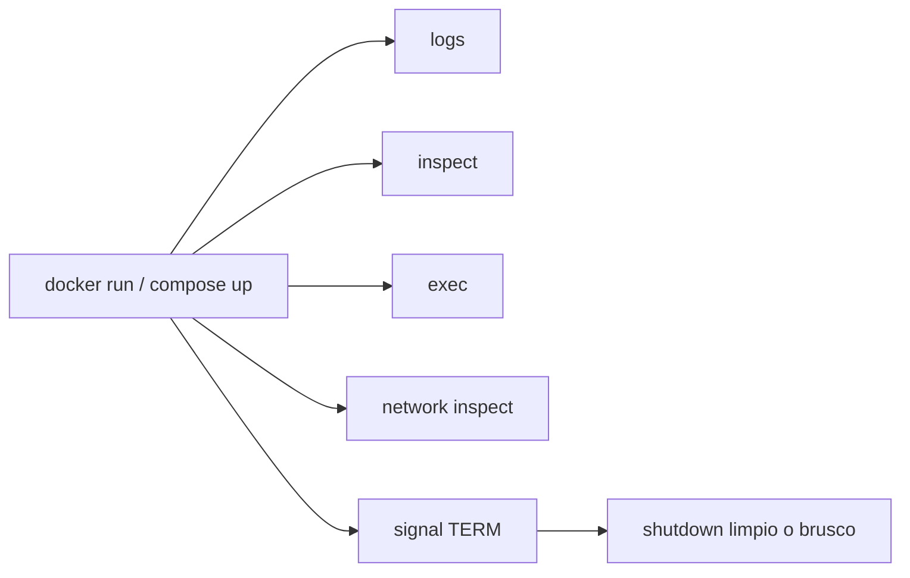

# Debugging de runtime, redes y señales

Muchas incidencias con Docker no aparecen durante `docker build`, sino cuando el contenedor ya intenta ejecutarse.

Este modulo cierra la parte de diagnostico de Docker con una pregunta practica:

- que miro cuando el contenedor arranca, se cae, no responde o no recibe bien una señal

## Que problema resuelve este bloque

Errores tipicos de runtime:

- la app arranca y sale enseguida
- el puerto publicado no responde
- el proceso principal no gestiona bien el cierre
- un contenedor intenta hablar con `localhost` cuando en realidad deberia usar otro servicio

## Mapa mental



## Herramientas base de diagnostico

### Ver logs

```bash
docker logs <container_id>
docker logs -f <container_id>
```

### Inspeccionar configuracion real

```bash
docker inspect <container_id>
```

### Entrar al contenedor

```bash
docker exec -it <container_id> sh
```

### Ver procesos

```bash
docker top <container_id>
```

### Ver red

```bash
docker network ls
docker network inspect <network_name>
```

## Diferencia entre error de build y error de runtime

### Build

Falla antes de crear la imagen final.

Ejemplos:

- dependencias imposibles de instalar
- `COPY` a una ruta que no existe
- sintaxis incorrecta en el `Dockerfile`

### Runtime

La imagen existe, pero el contenedor no se comporta como esperas.

Ejemplos:

- comando de arranque equivocado
- puerto incorrecto
- variable de entorno ausente
- proceso principal que termina al instante

## PID 1 y señales

El proceso principal del contenedor recibe señales como `SIGTERM` cuando haces `docker stop`.

Si el proceso no las maneja bien:

- el cierre puede ser brusco
- puede perder trabajo pendiente
- el contenedor puede tardar demasiado en parar

## Ejemplo del repositorio

Revisa:

- `examples/docker/runtime-debug-demo/Dockerfile`
- `examples/docker/runtime-debug-demo/entrypoint.sh`
- `examples/docker/runtime-debug-demo/README.md`

Este laboratorio sirve para observar:

- logs continuos
- entorno en runtime
- comportamiento al recibir `SIGTERM`

## Recorrido recomendado

### 1. Construir la imagen

```bash
docker build -t runtime-debug-demo:local examples/docker/runtime-debug-demo
```

### 2. Lanzar el contenedor

```bash
docker run --name runtime-debug-demo -e APP_MODE=debug runtime-debug-demo:local
```

### 3. En otra terminal, inspeccionar

```bash
docker logs -f runtime-debug-demo
docker inspect runtime-debug-demo
docker exec -it runtime-debug-demo sh
docker top runtime-debug-demo
```

### 4. Pararlo

```bash
docker stop runtime-debug-demo
```

El objetivo es ver si el proceso registra la recepcion de la señal y sale de forma limpia.

## Redes: el error clasico con `localhost`

En Compose o en redes Docker:

- `localhost` dentro de un contenedor apunta a ese mismo contenedor

Si `web` necesita hablar con `api`, normalmente debe usar:

- el nombre del servicio

No:

- `localhost`

Para practicar esto ya tienes:

- `examples/docker/compose-web-api/`
- `examples/docker/fullstack-demo/`

## Casos tipicos de diagnostico

### El puerto host esta ocupado

Sintoma:

- `docker run -p 8080:80 ...` falla o no responde como esperas

Mirar:

- que otro proceso usa ese puerto
- si el contenedor realmente expone el puerto correcto

### El contenedor sale inmediatamente

Mirar:

- `docker logs`
- `CMD` o `ENTRYPOINT`
- si el proceso principal queda en foreground

### Compose resuelve DNS pero la app no responde

Mirar:

- nombre del servicio
- puerto interno correcto
- readiness real de la app

## Errores frecuentes

### Entrar con `sh` antes de leer logs

Los logs suelen contar mucho antes de abrir una shell.

### Depurar solo el host

El hecho de que `curl localhost` funcione en tu maquina no significa que un contenedor vea lo mismo.

### No comprobar el proceso principal

Si PID 1 termina, el contenedor termina.

## Conexiones importantes

- [Arquitectura y CLI de Docker](02-arquitectura-y-cli.md)
- [Docker Compose](05-docker-compose.md)
- [Registro, seguridad y troubleshooting](06-registry-seguridad-troubleshooting.md)
