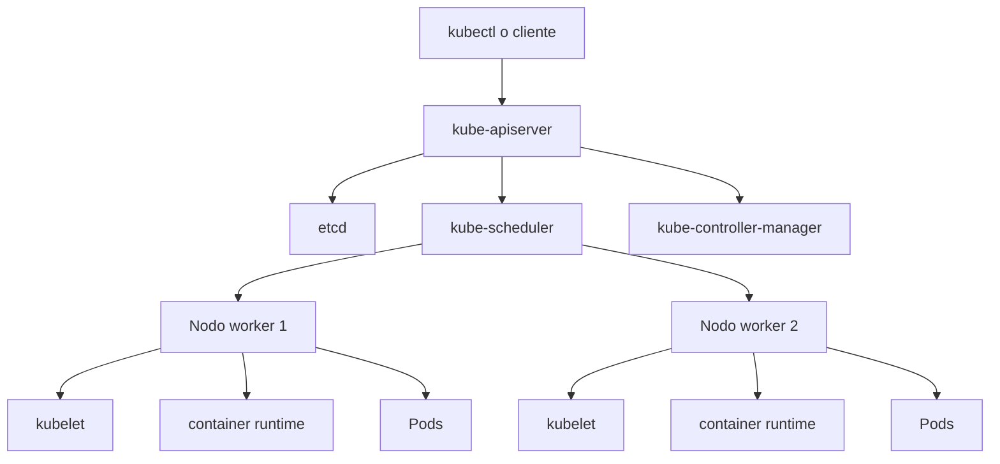
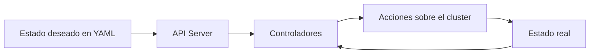
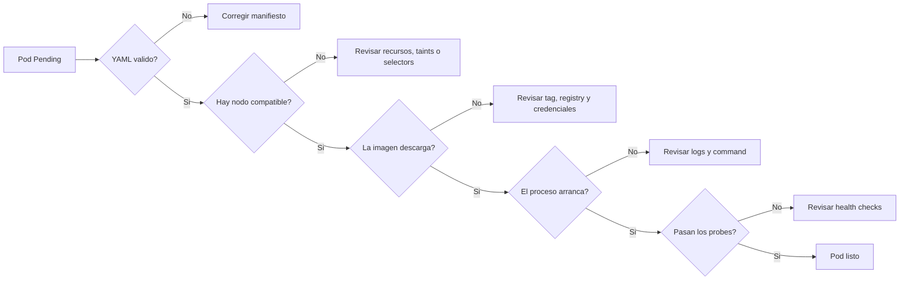

# Arquitectura del clúster

Kubernetes es un sistema distribuido. Entender su arquitectura ayuda a leer errores con menos frustración.

## Componentes del plano de control



### `kube-apiserver`

Es la puerta de entrada. `kubectl` y otros componentes hablan con esta API.

### `etcd`

Base de datos clave-valor donde Kubernetes guarda el estado del clúster.

### `kube-scheduler`

Decide en qué nodo debería ejecutarse cada pod.

### `kube-controller-manager`

Ejecuta controladores que comparan estado real y deseado.

## Componentes de los nodos

### `kubelet`

Agente del nodo que recibe instrucciones y gestiona pods.

### `container runtime`

Es quien realmente ejecuta los contenedores.

### `kube-proxy`

Participa en la conectividad de red de los services.

## Nodo, pod y clúster

- `cluster`: el conjunto completo
- `node`: una máquina de trabajo
- `pod`: la unidad mínima desplegable

## El bucle de reconciliación

Kubernetes funciona comparando:

- estado deseado, definido en YAML
- estado real, observado en el clúster

Cuando difieren, los controladores actúan.

## Bucle de reconciliacion



## Namespaces

Sirven para agrupar y aislar recursos lógicamente:

```bash
kubectl get namespaces
kubectl create namespace curso
```

Aplicar un recurso en un namespace:

```bash
kubectl apply -n curso -f deployment.yaml
```

## Etiquetas y selectores

Son esenciales para que los objetos se encuentren entre sí.

Ejemplo:

```yaml
labels:
  app: hola-nginx
  tier: web
```

Selector:

```yaml
selector:
  app: hola-nginx
```

## Flujo mental del scheduler

Cuando un pod no arranca, piensa:

1. La definición YAML es válida.
2. El scheduler encuentra nodo compatible.
3. La imagen puede descargarse.
4. El contenedor arranca.
5. Los probes pasan.



## Comandos útiles

```bash
kubectl cluster-info
kubectl get nodes
kubectl get namespaces
kubectl get events --sort-by=.metadata.creationTimestamp
```

## Qué mirar cuando algo falla

- Eventos del namespace
- `describe pod`
- imágenes y `imagePullPolicy`
- recursos solicitados
- tolerations y node selectors si existen
