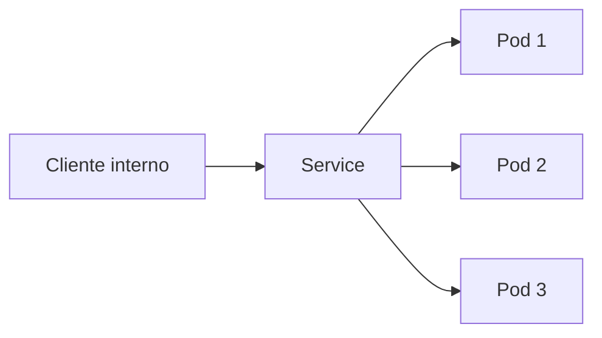
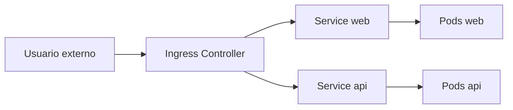
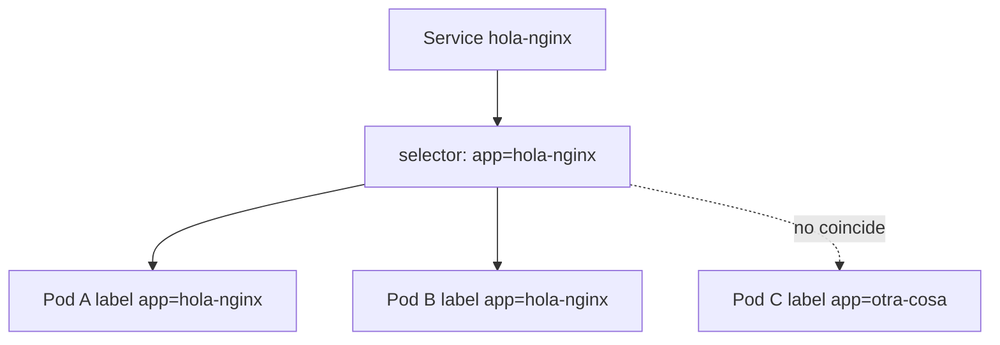

# Services, Ingress y red

En Kubernetes, los pods son efímeros. Por eso necesitamos mecanismos estables de descubrimiento y entrada de tráfico.

## Service

Es la forma básica de exponer un conjunto de pods mediante una identidad estable.

## Flujo de trafico con Service



## Tipos de service

### `ClusterIP`

Es el tipo por defecto. Solo accesible dentro del clúster.

### `NodePort`

Expone un puerto en cada nodo.

### `LoadBalancer`

Pide un balanceador externo cuando la plataforma lo soporta.

## Ejemplo básico

```yaml
apiVersion: v1
kind: Service
metadata:
  name: hola-nginx
spec:
  selector:
    app: hola-nginx
  ports:
    - port: 80
      targetPort: 80
```

## Selector correcto

Si el selector no coincide con las etiquetas del pod, el service no enruta a ningún endpoint.

Compruébalo con:

```bash
kubectl get endpoints hola-nginx
```

## Ingress

Sirve para exponer HTTP/HTTPS con reglas por host o path, normalmente a través de un controlador Ingress.

Ejemplo:

```yaml
apiVersion: networking.k8s.io/v1
kind: Ingress
metadata:
  name: web-ingress
spec:
  rules:
    - host: demo.local
      http:
        paths:
          - path: /
            pathType: Prefix
            backend:
              service:
                name: web-service
                port:
                  number: 80
```

## Entrada HTTP con Ingress



## DNS interno

Dentro del clúster, los servicios pueden resolverse por nombre:

```text
http://hola-nginx
http://hola-nginx.default.svc.cluster.local
```

## Relacion entre Service, selector y pods



## `port-forward`

Es una herramienta muy útil para desarrollo:

```bash
kubectl port-forward service/hola-nginx 8080:80
```

## Políticas de red

En clústeres que soportan `NetworkPolicy`, puedes restringir qué pods hablan con cuáles.

Es un tema importante de seguridad y segmentación.

## Ejemplos del repositorio

- `examples/k8s/hola-nginx/`
- `examples/k8s/ingress-demo/`

## Ejercicio sugerido

1. Despliega `ingress-demo`.
2. Revisa el service y sus endpoints.
3. Si tienes controlador Ingress, prueba el acceso por host.
4. Si no, usa `port-forward` como alternativa.
