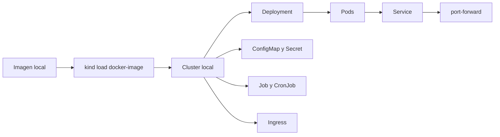
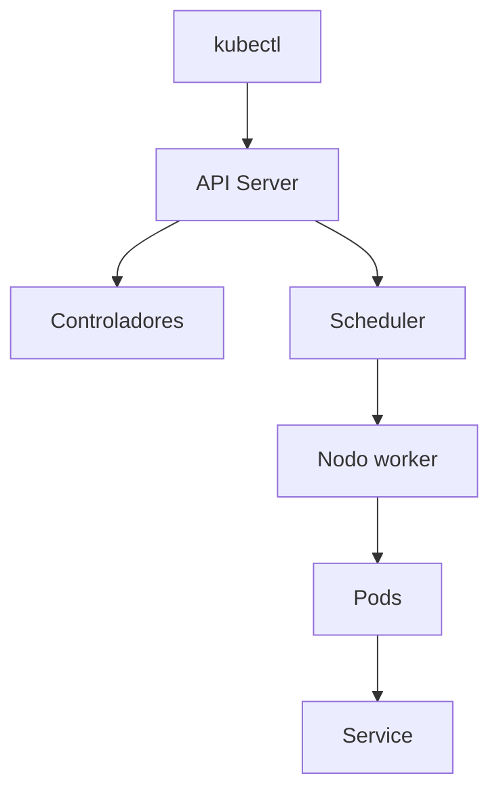
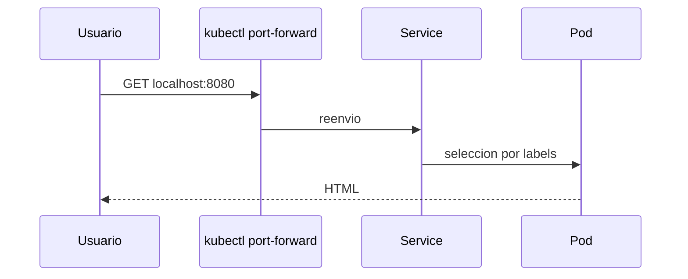
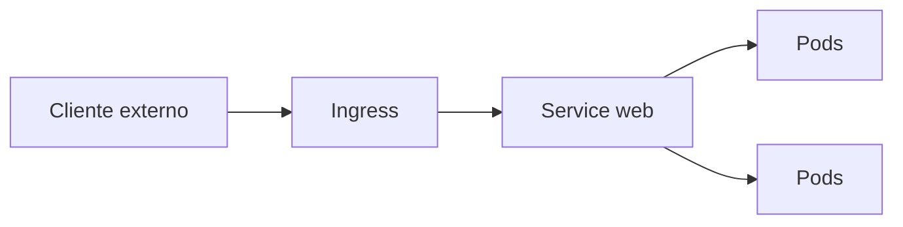
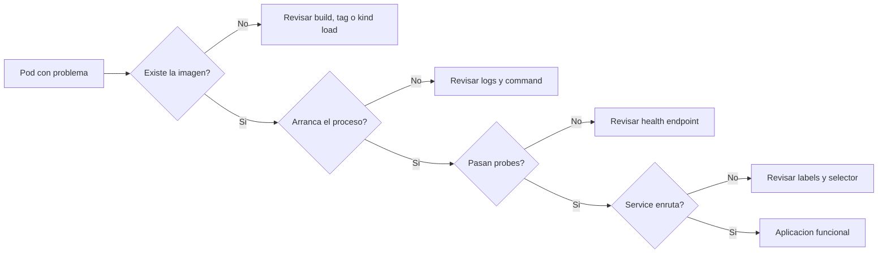

# Tutorial detallado de Kubernetes

Este tutorial toma los conceptos del curso y los convierte en un laboratorio guiado. La meta es construir un cluster local, desplegar aplicaciones, exponerlas y depurarlas.

## Objetivos

Al terminar deberias poder:

- Crear y revisar un cluster local.
- Desplegar `Deployment`, `Service`, `ConfigMap`, `Secret`, `Job` y `CronJob`.
- Cargar imagenes locales en `kind`.
- Exponer aplicaciones con `port-forward`.
- Leer eventos, logs y estados de rollout cuando algo falla.

## Requisitos

- `kubectl`
- `kind` o `minikube`
- Docker funcionando
- Este repositorio disponible en local

El tutorial asume `kind`. Si usas `minikube`, adapta los pasos equivalentes.

## Mapa del tutorial



## Paso 0: comprobar herramientas

```bash
kubectl version --client
kind version
docker --version
```

## Paso 1: crear un cluster local

Si todavia no tienes un cluster:

```bash
kind create cluster --name curso-k8s
```

Comprueba el estado:

```bash
kubectl cluster-info
kubectl get nodes
kubectl get namespaces
```

## Como pensar el cluster



Kubernetes no ejecuta comandos imperativos para cada contenedor. En su lugar, declaras el estado deseado y el sistema intenta alcanzarlo.

## Paso 2: construir y cargar la imagen `hola-nginx`

Construye la imagen local:

```bash
docker build -t hola-nginx:local examples/docker/hola-nginx
```

Carga la imagen en `kind`:

```bash
kind load docker-image hola-nginx:local --name curso-k8s
```

Este paso es importante porque el cluster local no ve automaticamente tus imagenes si no las cargas o publicas.

## Paso 3: desplegar `hola-nginx`

Aplica los manifiestos:

```bash
kubectl apply -f examples/k8s/hola-nginx/
```

Este laboratorio crea sus recursos en el namespace `hola-nginx-demo`.

Comprueba recursos:

```bash
kubectl get deployments -n hola-nginx-demo
kubectl get pods -n hola-nginx-demo
kubectl get services -n hola-nginx-demo
```

Inspecciona el deployment:

```bash
kubectl describe deployment hola-nginx -n hola-nginx-demo
```

## Paso 4: acceder con `port-forward`

Expone el servicio:

```bash
kubectl port-forward -n hola-nginx-demo service/hola-nginx 8080:80
```

En otra terminal:

```bash
curl -s http://localhost:8080
```

## Camino del trafico



## Paso 5: escalar y observar el rollout

Edita `examples/k8s/hola-nginx/deployment.yaml` y cambia:

```yaml
replicas: 2
```

por:

```yaml
replicas: 3
```

Aplica de nuevo:

```bash
kubectl apply -f examples/k8s/hola-nginx/deployment.yaml
kubectl rollout status deployment/hola-nginx -n hola-nginx-demo
kubectl get pods -n hola-nginx-demo
```

Tambien puedes ver el historial:

```bash
kubectl rollout history deployment/hola-nginx -n hola-nginx-demo
```

## Paso 6: desplegar la API Python en Kubernetes

Ahora unimos el bloque Docker con Kubernetes.

Construye la imagen:

```bash
docker build -t python-api:local examples/docker/python-api
```

Cargala en el cluster:

```bash
kind load docker-image python-api:local --name curso-k8s
```

Aplica los manifiestos:

```bash
kubectl apply -f examples/k8s/python-api/
```

Este ejemplo usa el namespace `python-api-demo`.

Comprueba el estado:

```bash
kubectl get deployments -n python-api-demo
kubectl get pods -n python-api-demo
kubectl get services -n python-api-demo
```

Haz `port-forward`:

```bash
kubectl port-forward -n python-api-demo service/python-api 8000:80
```

Pruebas:

```bash
curl -s http://localhost:8000/
curl -s http://localhost:8000/health
```

## Que aprender en este ejemplo

- La imagen local se reutiliza en Kubernetes.
- El `Service` apunta al puerto del contenedor.
- Las `readinessProbe` y `livenessProbe` usan `/health`.
- `requests` y `limits` introducen disciplina de recursos.

## Paso 7: ConfigMap y Secret

Aplica el ejemplo:

```bash
kubectl apply -f examples/k8s/configmap-secret/
```

Comprueba:

```bash
kubectl get configmaps -n config-demo
kubectl get secrets -n config-demo
kubectl get deployments -n config-demo
```

Expone el servicio:

```bash
kubectl port-forward -n config-demo service/env-demo 8081:80
```

Prueba:

```bash
curl -s http://localhost:8081
```

Observa que el contenedor recibe informacion desde:

- `ConfigMap` para configuracion normal
- `Secret` para datos sensibles

## Paso 8: Ingress

Aplica el ejemplo:

```bash
kubectl apply -f examples/k8s/ingress-demo/
```

Comprueba:

```bash
kubectl get ingress -n ingress-demo
kubectl get services -n ingress-demo
kubectl get pods -n ingress-demo
```

Este ejemplo requiere un controlador Ingress para funcionar de verdad por host HTTP. Si no lo tienes, usa `port-forward` al service:

```bash
kubectl port-forward -n ingress-demo service/ingress-demo 8082:80
```

y entiende el Ingress como manifiesto de enrutamiento.

## Vista mental de Service e Ingress



## Paso 9: Job y CronJob

Aplica el ejemplo:

```bash
kubectl apply -f examples/k8s/job-cronjob/
```

Revisa:

```bash
kubectl get jobs -n batch-demo
kubectl get cronjobs -n batch-demo
kubectl get pods -n batch-demo
```

Mira logs del Job:

```bash
kubectl logs -n batch-demo job/saludo-job
```

Aqui ves una diferencia importante:

- `Deployment` mantiene un servicio vivo.
- `Job` ejecuta una tarea hasta completarla.
- `CronJob` programa tareas recurrentes.

## Paso 10: depuracion guiada

Cuando un pod falle, sigue este orden dentro del namespace del laboratorio:

```bash
kubectl get pods -n <namespace>
kubectl describe pod -n <namespace> <pod_name>
kubectl logs -n <namespace> <pod_name>
kubectl get events -n <namespace> --sort-by=.metadata.creationTimestamp
```

### Casos tipicos

`ImagePullBackOff`

- Tag mal escrito
- Imagen no cargada en `kind`
- Registry inaccesible

`CrashLoopBackOff`

- Proceso principal falla
- Variables faltantes
- Puerto incorrecto
- Comando de arranque roto

`Pending`

- Recursos insuficientes
- PVC pendiente
- Restricciones de scheduling

## Flujo mental de diagnostico



## Paso 11: limpieza

Borra recursos de laboratorio:

```bash
kubectl delete -f examples/k8s/python-api/
kubectl delete -f examples/k8s/configmap-secret/
kubectl delete -f examples/k8s/ingress-demo/
kubectl delete -f examples/k8s/job-cronjob/
kubectl delete -f examples/k8s/hola-nginx/
```

Si quieres eliminar el cluster:

```bash
kind delete cluster --name curso-k8s
```

## Recorrido recomendado de practica

1. Crea el cluster.
2. Carga `hola-nginx:local`.
3. Despliega y prueba `hola-nginx`.
4. Escala replicas y observa el rollout.
5. Construye y despliega `python-api:local`.
6. Prueba `ConfigMap` y `Secret`.
7. Aplica `Job` y revisa logs.
8. Lee eventos y describe pods para entender el sistema.

## Ejercicios sugeridos

1. Cambia `replicas` en `python-api`.
2. Rompe a proposito el selector del service y corrige el error.
3. Cambia el path de la probe y observa el efecto.
4. Anade una variable nueva al `ConfigMap`.
5. Sustituye `port-forward` por una alternativa de exposicion local si tu cluster la soporta.

## Cierre

Si ya puedes recorrer este tutorial con soltura, el siguiente salto natural es combinar ambos mundos en una aplicacion mas grande o entrar en Helm, CI/CD e infraestructura declarativa.

## Siguientes módulos avanzados

Después de este tutorial, profundiza con:

- [Helm y plantillas](09-helm-y-plantillas.md)
- [Storage, PV y PVC](10-storage-pv-pvc.md)
- [Probes, recursos y scheduling](11-probes-recursos-y-scheduling.md)
- [Proyecto multiservicio](../04-proyecto-multiservicio.md)
