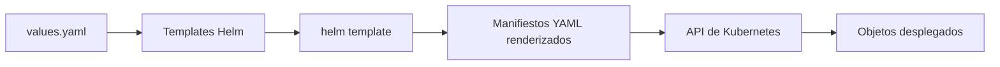
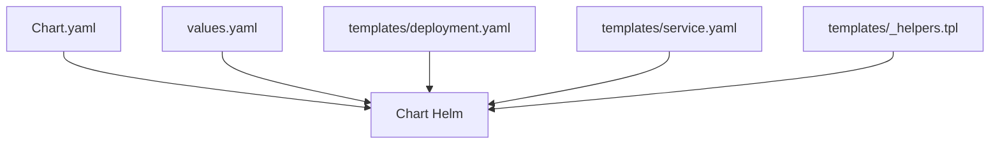

# Helm y plantillas

Helm es una herramienta de empaquetado para Kubernetes. Su utilidad principal aparece cuando dejas de gestionar uno o dos YAML sueltos y empiezas a necesitar versiones, parámetros, reutilización y despliegues repetibles.

## Qué problema resuelve Helm

Con manifiestos YAML simples, un caso pequeño es fácil de entender. El problema aparece cuando:

- quieres reutilizar la misma aplicación en varios entornos
- necesitas cambiar imagen, tag, réplicas o puertos sin duplicar archivos
- empiezas a tener varios recursos que deben mantenerse coherentes
- quieres instalar, actualizar y desinstalar una aplicación como una unidad

Helm resuelve eso empaquetando manifiestos parametrizados en un `chart`.

## Mapa mental



## Conceptos básicos

### Chart

Es el paquete Helm. Normalmente contiene:

- `Chart.yaml`
- `values.yaml`
- `templates/`

### Values

Son los valores de entrada que parametrizan las plantillas.

### Templates

Son archivos YAML con expresiones Helm, normalmente escritas con sintaxis de Go templates.

### Release

Es una instalación concreta de un chart dentro de un clúster.

Un mismo chart puede instalarse varias veces con valores distintos y nombres distintos.

## Cuándo usar Helm

Helm tiene sentido cuando:

- ya entiendes los manifiestos “a pelo”
- quieres reusar una aplicación con diferentes parámetros
- necesitas empaquetar una app con varios recursos
- quieres un flujo más limpio de `install`, `upgrade` y `rollback`

No es ideal como primer contacto absoluto con Kubernetes. Primero conviene entender bien:

- `Deployment`
- `Service`
- `ConfigMap`
- `Secret`

## Estructura mínima de un chart

En este repositorio tienes un ejemplo en:

- `examples/k8s/helm-demo/`

La estructura mínima de ese ejemplo es:

```text
examples/k8s/helm-demo/
├── Chart.yaml
├── values.yaml
└── templates/
    ├── _helpers.tpl
    ├── deployment.yaml
    └── service.yaml
```

## Diagrama de estructura



## Qué contiene `Chart.yaml`

Define metadatos del chart:

```yaml
apiVersion: v2
name: python-api-demo
description: Chart minimo para desplegar la API Python del curso
type: application
version: 0.1.0
appVersion: "0.1.0"
```

Campos importantes:

- `apiVersion`: versión del formato del chart
- `name`: nombre del chart
- `type`: normalmente `application`
- `version`: versión del chart
- `appVersion`: versión de la aplicación desplegada

## Qué contiene `values.yaml`

Aquí vive la parametrización principal. Por ejemplo:

```yaml
replicaCount: 2

image:
  repository: python-api
  tag: local
  pullPolicy: IfNotPresent
```

Esto permite cambiar parámetros sin reescribir la plantilla.

## Qué hace una plantilla

Ejemplo conceptual de `Deployment`:

```yaml
replicas: {{ .Values.replicaCount }}
image: "{{ .Values.image.repository }}:{{ .Values.image.tag }}"
```

Helm sustituye esos valores al renderizar el chart.

## Qué hace `_helpers.tpl`

Sirve para definir pequeñas funciones reutilizables. Por ejemplo, generar nombres consistentes:

```gotemplate
{{- define "python-api-demo.name" -}}
{{- .Chart.Name -}}
{{- end -}}
```

No es obligatorio, pero ayuda a evitar duplicación.

## Flujo de trabajo recomendado

### 1. Entender primero el YAML original

Antes de usar Helm, estudia el equivalente en:

- `examples/k8s/python-api/`

### 2. Renderizar sin instalar

Esta es una práctica muy importante:

```bash
helm template python-api-demo examples/k8s/helm-demo
```

Así ves el YAML final antes de enviarlo al clúster.

### 3. Cambiar valores

Por ejemplo:

```bash
helm template python-api-demo examples/k8s/helm-demo \
  --set replicaCount=3 \
  --set image.tag=dev
```

### 4. Instalar

Si ya tienes clúster y la imagen adecuada:

```bash
helm install python-api-demo examples/k8s/helm-demo
```

### 5. Actualizar

```bash
helm upgrade python-api-demo examples/k8s/helm-demo --set replicaCount=4
```

### 6. Desinstalar

```bash
helm uninstall python-api-demo
```

## Diferencia entre `helm template` e `helm install`

- `helm template`: solo renderiza manifiestos en local
- `helm install`: crea una release real en el clúster

Una buena disciplina es usar `helm template` primero casi siempre.

## Ejemplo guiado del repositorio

### Paso 1: revisar el chart

Abre:

- `examples/k8s/helm-demo/Chart.yaml`
- `examples/k8s/helm-demo/values.yaml`
- `examples/k8s/helm-demo/templates/deployment.yaml`
- `examples/k8s/helm-demo/templates/service.yaml`

### Paso 2: renderizar

```bash
helm template python-api-demo examples/k8s/helm-demo
```

### Paso 3: cambiar réplicas

```bash
helm template python-api-demo examples/k8s/helm-demo --set replicaCount=3
```

### Paso 4: cambiar imagen

```bash
helm template python-api-demo examples/k8s/helm-demo \
  --set image.repository=python-api \
  --set image.tag=local
```

### Paso 5: instalar en clúster local

Antes, asegúrate de tener la imagen disponible:

```bash
docker build -t python-api:local examples/docker/python-api
kind load docker-image python-api:local --name curso-k8s
```

Después instala:

```bash
helm install python-api-demo examples/k8s/helm-demo
kubectl get deployments
kubectl get services
```

Acceso local:

```bash
kubectl port-forward service/python-api-demo 8000:80
curl -s http://localhost:8000/health
```

## Qué aprender realmente con este ejemplo

- que Helm no sustituye a Kubernetes, lo empaqueta
- que primero hay que comprender el manifiesto final
- que los cambios de `values` deben ser fáciles y predecibles
- que un chart pequeño ya aporta orden sin ser complejo

## Errores frecuentes

### Plantilla demasiado abstracta

Si el chart es demasiado “inteligente”, cuesta más aprender y depurar.

### No revisar el render final

Muchas personas usan `helm install` sin mirar antes el YAML generado.

### Mezclar chart version y app version

No son exactamente lo mismo:

- el chart versiona el paquete
- `appVersion` representa la versión de la app

### Usar Helm sin dominar antes el YAML

Eso hace más difícil diagnosticar cualquier fallo posterior.

## Buenas prácticas iniciales

- Mantén el chart pequeño.
- Parametriza solo lo que tenga sentido.
- Renderiza siempre antes de instalar.
- Usa nombres y etiquetas consistentes.
- Documenta valores importantes.

## Siguiente paso

Helm tiene mucho más sentido cuando ya entiendes:

- almacenamiento y persistencia
- probes y recursos

Continúa con:

- [Storage, PV y PVC](10-storage-pv-pvc.md)
- [Probes, recursos y scheduling](11-probes-recursos-y-scheduling.md)
