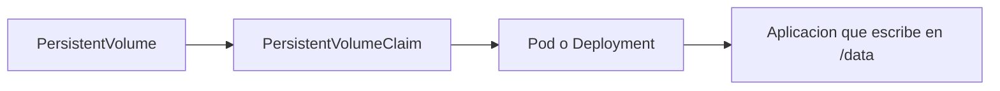
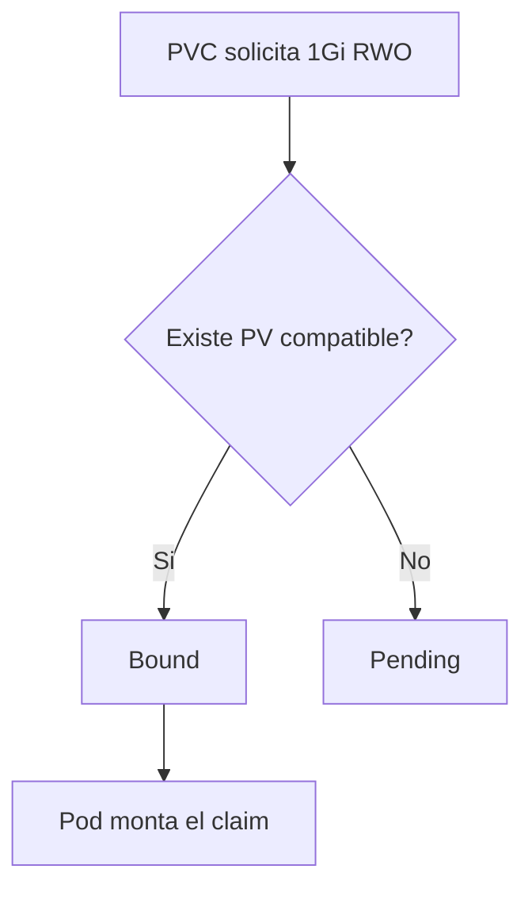
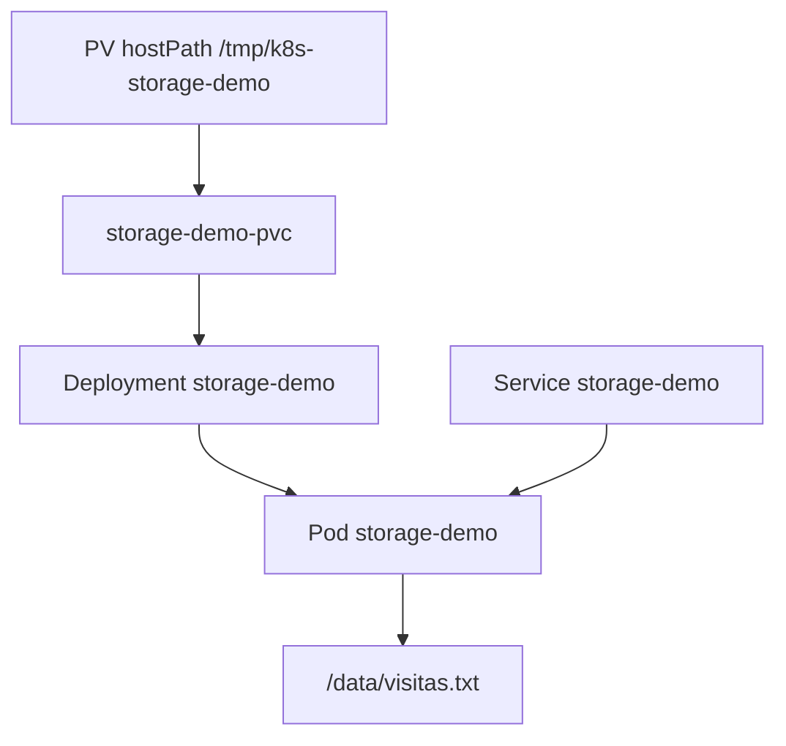

# Storage, PV y PVC

En Kubernetes, uno de los cambios más importantes respecto a Docker local es que los pods son efímeros y pueden moverse, reiniciarse o reemplazarse. Por eso la persistencia necesita una capa explícita.

## Qué problema queremos resolver

Cuando un pod se destruye:

- su filesystem efímero desaparece
- sus datos locales no deben asumirse permanentes
- una base de datos o un contador simple perdería su estado si no existe una estrategia de persistencia

## Modelo mental



## Conceptos fundamentales

### `emptyDir`

Es un volumen efímero ligado a la vida del pod.

Sirve para:

- archivos temporales
- cachés
- datos compartidos entre contenedores del mismo pod

No sirve para persistencia real entre recreaciones del pod.

### `PersistentVolume` (PV)

Representa almacenamiento disponible en el clúster.

### `PersistentVolumeClaim` (PVC)

Es la solicitud de almacenamiento hecha por una carga de trabajo.

El pod normalmente no “pide un PV” directamente. Pide un PVC, y Kubernetes intenta enlazarlo con un PV adecuado.

### `StorageClass`

Define cómo aprovisionar almacenamiento dinámicamente cuando la plataforma lo soporta.

## Flujo de unión PV/PVC



## Access modes

Los más comunes:

- `ReadWriteOnce`
- `ReadOnlyMany`
- `ReadWriteMany`

Para laboratorios locales, el caso más habitual es `ReadWriteOnce`.

## Reclaim policy

Indica qué pasa con el volumen cuando el claim se libera:

- `Retain`
- `Delete`
- `Recycle` en entornos antiguos o concretos

Para demos educativas, `Retain` puede ser útil porque permite ver persistencia más claramente.

## HostPath y limitaciones

En clústeres locales, un ejemplo didáctico frecuente es `hostPath`.

Ventajas:

- es simple
- no requiere una plataforma externa
- sirve para aprender

Limitaciones:

- no es una solución de producción general
- depende del nodo
- en clústeres multinodo puede introducir restricciones importantes

## Ejemplo del repositorio

Usa:

- `examples/k8s/storage-demo/pv.yaml`
- `examples/k8s/storage-demo/pvc.yaml`
- `examples/k8s/storage-demo/deployment.yaml`
- `examples/k8s/storage-demo/service.yaml`

Este ejemplo:

- crea un `PV` manual basado en `hostPath`
- enlaza un `PVC`
- monta `/data`
- ejecuta una app mínima que incrementa un contador guardado en disco

## Topología del ejemplo



## Flujo paso a paso

### Paso 1: aplicar almacenamiento

```bash
kubectl apply -f examples/k8s/storage-demo/pv.yaml
kubectl apply -f examples/k8s/storage-demo/pvc.yaml
kubectl get pv
kubectl get pvc
```

Comprueba que el claim pase a `Bound`.

### Paso 2: desplegar la app

```bash
kubectl apply -f examples/k8s/storage-demo/deployment.yaml
kubectl apply -f examples/k8s/storage-demo/service.yaml
kubectl get pods
```

### Paso 3: acceder localmente

```bash
kubectl port-forward service/storage-demo 8082:80
```

En otra terminal:

```bash
curl -s http://localhost:8082
curl -s http://localhost:8082
curl -s http://localhost:8082/health
```

El valor de visitas debería incrementarse.

### Paso 4: comprobar persistencia

Borra el deployment:

```bash
kubectl delete -f examples/k8s/storage-demo/deployment.yaml
kubectl apply -f examples/k8s/storage-demo/deployment.yaml
```

Vuelve a consultar:

```bash
curl -s http://localhost:8082
```

Si el almacenamiento quedó bien enlazado, el contador no debería reiniciarse a cero.

## Qué observar

- El pod es reemplazable.
- El dato vive fuera del filesystem efímero del contenedor.
- El claim abstrae a la aplicación de los detalles del almacenamiento físico.

## Comparación rápida de tipos de volumen

| Tipo | Persiste al recrear pod | Uso típico |
| --- | --- | --- |
| `emptyDir` | No | datos temporales |
| `configMap` | No, no como datos mutables | configuración en archivos |
| `secret` | No, no como almacenamiento de app | credenciales en archivos |
| `hostPath` | Sí, en demo local y con limitaciones | aprendizaje local |
| `PVC` sobre provisión real | Sí | aplicaciones con estado |

## Problemas frecuentes

### PVC en `Pending`

Suele indicar:

- no hay PV compatible
- no existe `StorageClass` válida
- la capacidad o access mode no coincide

Revisa:

```bash
kubectl describe pvc storage-demo-pvc
kubectl get pv
```

### La app pierde datos

Posibles causas:

- realmente estabas escribiendo fuera del volumen montado
- el pod no montó el PVC correcto
- el volumen era efímero

### El ejemplo funciona en un clúster local pero no es portable

Eso puede ocurrir con `hostPath`. Es normal en una demo educativa, pero hay que entender sus límites.

## Buenas prácticas iniciales

- Usa `PVC` como interfaz habitual desde la aplicación.
- Considera `hostPath` solo para demos o entornos concretos.
- Verifica siempre el path real donde escribe la app.
- Revisa `Bound` antes de asumir persistencia.

## Relación con otros módulos

Este bloque se conecta muy bien con:

- [ConfigMaps, Secrets y almacenamiento](05-configmaps-secrets-y-storage.md)
- [Probes, recursos y scheduling](11-probes-recursos-y-scheduling.md)
- [Tutorial detallado de Kubernetes](08-tutorial-kubernetes-paso-a-paso.md)
