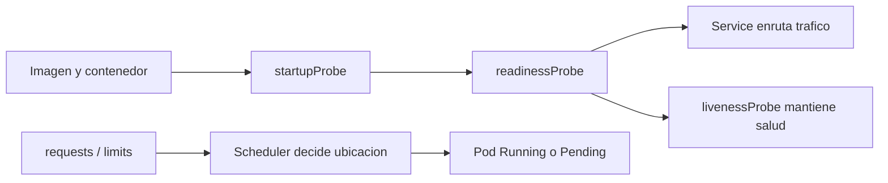
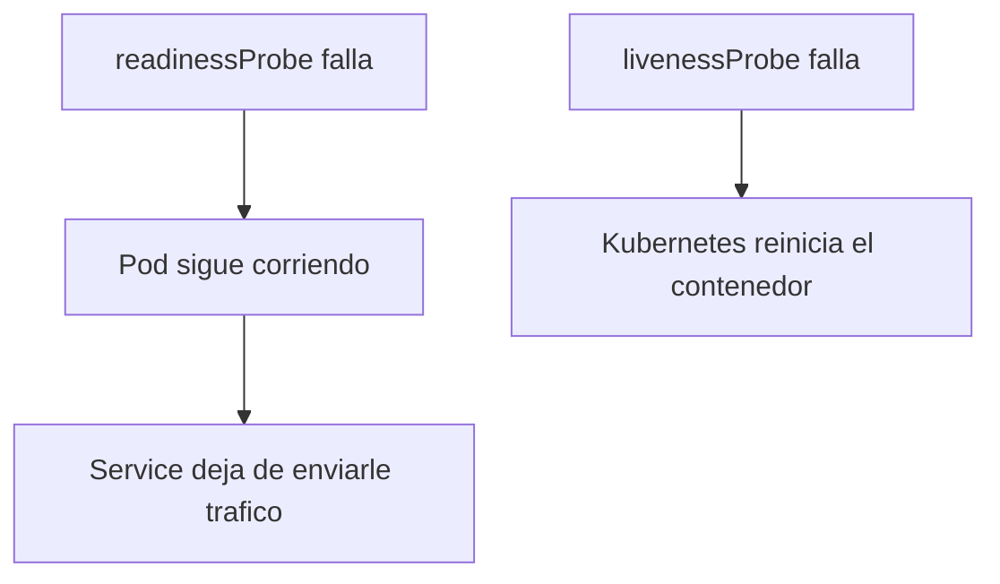
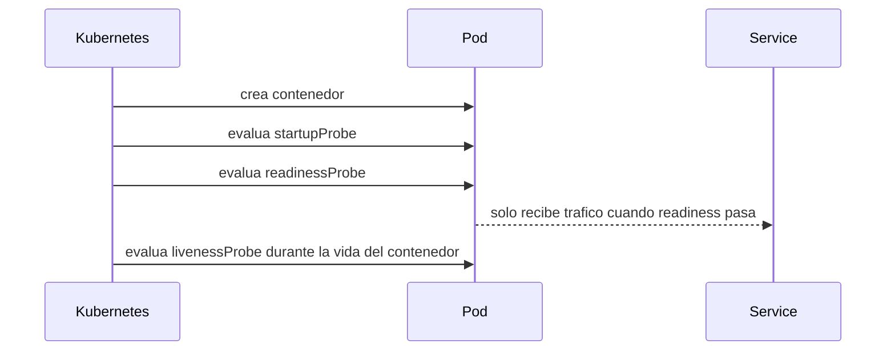

# Probes, recursos y scheduling

Cuando una aplicación ya no es un ejemplo trivial, Kubernetes necesita dos tipos de información importantes:

- cómo saber si la aplicación está viva y lista
- cuántos recursos necesita para poder planificarla y operarla

## Qué problema resuelve este bloque

Sin probes bien definidos:

- Kubernetes puede mandar tráfico a pods que aún no están listos
- puede reiniciar contenedores de forma incorrecta
- cuesta mucho distinguir entre “arranca lento” y “está roto”

Sin recursos declarados:

- el scheduler toma peores decisiones
- es más difícil entender por qué un pod no entra
- el comportamiento del clúster se vuelve menos predecible

## Mapa conceptual



## Probes: idea general

Hay tres probes principales.

### `startupProbe`

Sirve para aplicaciones que tardan en arrancar.

Mientras esta probe no pase, Kubernetes no aplica la lógica de `liveness` de la forma habitual.

### `readinessProbe`

Indica cuándo el pod está preparado para recibir tráfico.

Si falla:

- el pod puede seguir vivo
- pero el `Service` deja de enrutarle tráfico

### `livenessProbe`

Indica cuándo el contenedor está roto o atascado y debe reiniciarse.

Si falla repetidamente:

- el contenedor se reinicia

## Diferencia clave entre readiness y liveness



## Cuándo usar cada una

- `startupProbe`: apps con arranque lento
- `readinessProbe`: casi siempre que el servicio tenga que recibir tráfico
- `livenessProbe`: cuando puedas definir una señal razonable de salud real

## Recursos: idea general

### `requests`

Es la cantidad mínima que el scheduler usa para decidir dónde cabe el pod.

### `limits`

Es el techo máximo permitido para el contenedor, especialmente relevante en memoria y CPU.

Ejemplo:

```yaml
resources:
  requests:
    cpu: "100m"
    memory: "128Mi"
  limits:
    cpu: "300m"
    memory: "256Mi"
```

## Qué hace el scheduler con los requests

El scheduler mira, simplificando:

- qué nodos existen
- qué recursos libres tienen
- qué `requests` pide el pod

Si no hay hueco suficiente, el pod queda en `Pending`.

## Ejemplo del repositorio

Usa:

- `examples/k8s/probes-demo/deployment-ok.yaml`
- `examples/k8s/probes-demo/deployment-bad-readiness.yaml`
- `examples/k8s/probes-demo/deployment-bad-liveness.yaml`
- `examples/k8s/probes-demo/pod-unschedulable.yaml`
- `examples/k8s/probes-demo/service-ok.yaml`

## Qué demuestra cada manifiesto

### `deployment-ok.yaml`

Muestra:

- `startupProbe`
- `readinessProbe`
- `livenessProbe`
- recursos razonables

### `deployment-bad-readiness.yaml`

Muestra un pod que:

- está vivo
- pero no pasa `readiness`
- por tanto no debería recibir tráfico útil

### `deployment-bad-liveness.yaml`

Muestra un contenedor que:

- arranca
- pero falla `liveness`
- entra en reinicios

### `pod-unschedulable.yaml`

Muestra un recurso con `requests` demasiado altos para un clúster local típico, forzando un caso de `Pending`.

## Flujo de laboratorio

### Paso 1: despliegue correcto

```bash
kubectl apply -f examples/k8s/probes-demo/deployment-ok.yaml
kubectl apply -f examples/k8s/probes-demo/service-ok.yaml
kubectl get pods -w
```

Verás que el pod puede tardar un poco en quedar `Ready` debido a las probes de arranque.

### Paso 2: probar el servicio correcto

```bash
kubectl port-forward service/probes-ok 8083:80
```

En otra terminal:

```bash
curl -s http://localhost:8083
curl -s http://localhost:8083/health
curl -s http://localhost:8083/ready
```

### Paso 3: caso de readiness rota

```bash
kubectl apply -f examples/k8s/probes-demo/deployment-bad-readiness.yaml
kubectl get pods
kubectl describe pod -l app=probes-bad-readiness
```

Qué observar:

- el pod puede aparecer `Running`
- pero no queda `Ready`
- los eventos y el `describe` te explican por qué

### Paso 4: caso de liveness rota

```bash
kubectl apply -f examples/k8s/probes-demo/deployment-bad-liveness.yaml
kubectl get pods
kubectl describe pod -l app=probes-bad-liveness
kubectl logs -l app=probes-bad-liveness --tail=50
```

Qué observar:

- el pod entra en reinicios
- Kubernetes interpreta que el contenedor no está sano

### Paso 5: caso de scheduling fallido

```bash
kubectl apply -f examples/k8s/probes-demo/pod-unschedulable.yaml
kubectl get pods
kubectl describe pod unschedulable-demo
```

Qué observar:

- el pod queda en `Pending`
- el `describe` suele mostrar falta de CPU o memoria

## Secuencia de vida de una app con probes



## Buenas prácticas para probes

- No apuntes a una ruta inexistente.
- No uses una `livenessProbe` demasiado agresiva.
- Si la app tarda en arrancar, considera `startupProbe`.
- Separa, cuando tenga sentido, “estoy vivo” de “estoy listo”.

## Buenas prácticas para recursos

- Declara al menos `requests` razonables.
- Ajusta `limits` con cuidado, sobre todo memoria.
- No elijas números arbitrarios sin observar la app.
- En laboratorios locales, entiende que el nodo disponible suele ser pequeño.

## Errores frecuentes

### Pod `Running` pero no `Ready`

Suele indicar:

- problema en `readinessProbe`
- dependencia externa aún no disponible
- ruta o puerto incorrectos

### Reinicios continuos

Suele indicar:

- `livenessProbe` mal definida
- aplicación realmente fallando
- timing demasiado agresivo

### Pod `Pending`

Suele indicar:

- `requests` demasiado altos
- PVC pendiente
- restricciones de scheduling

## Qué mirar al depurar

Comandos más útiles:

```bash
kubectl get pods
kubectl describe pod <pod_name>
kubectl logs <pod_name>
kubectl get events --sort-by=.metadata.creationTimestamp
```

## Relación entre recursos y estabilidad

Sin recursos definidos, un clúster pequeño puede:

- sobreasignar CPU
- comportarse de forma menos predecible
- dificultar el diagnóstico

Con recursos demasiado grandes:

- el pod puede no planificarse nunca

## Qué aprender de este bloque

Si completas estos laboratorios y entiendes el resultado, ya deberías poder:

- distinguir `startup`, `readiness` y `liveness`
- leer un pod `Pending`
- interpretar un `CrashLoopBackOff`
- justificar por qué existen `requests` y `limits`

## Siguiente paso

Después de este bloque, Helm resulta más útil y más fácil de entender:

- [Helm y plantillas](09-helm-y-plantillas.md)
- [Tutorial detallado de Kubernetes](08-tutorial-kubernetes-paso-a-paso.md)
- [RBAC, NetworkPolicies y aislamiento](12-rbac-network-policies-y-aislamiento.md)
- [StatefulSet, HPA y patrones de escalado](13-statefulsets-hpa-y-patrones-de-escalado.md)
