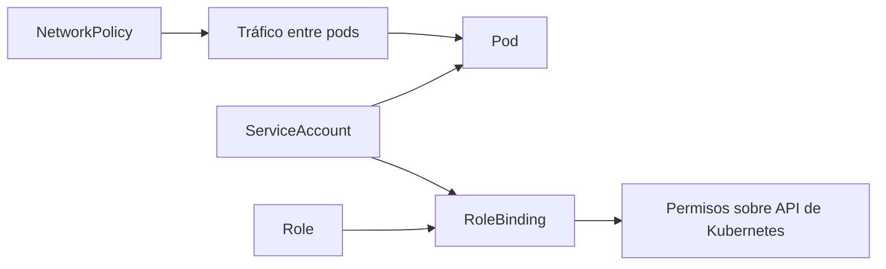
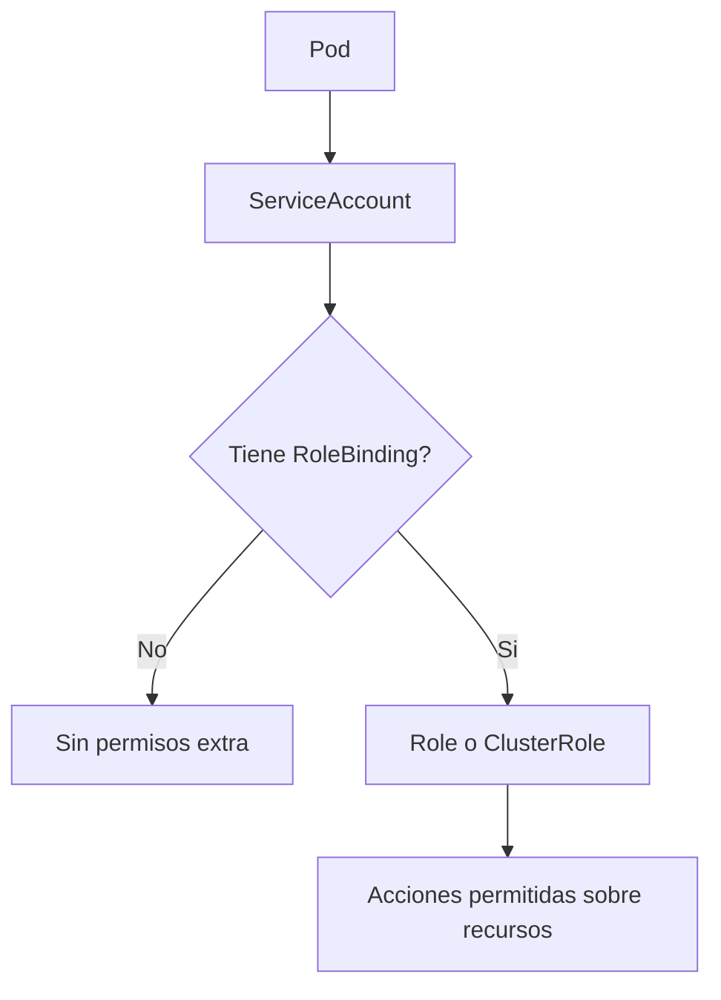
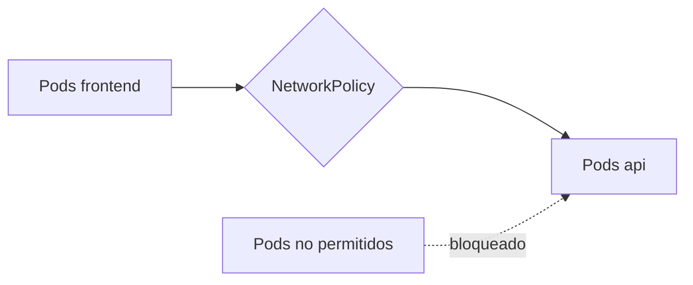

# RBAC, NetworkPolicies y aislamiento

Cuando Kubernetes deja de ser solo un laboratorio individual y pasa a parecerse más a una plataforma compartida, aparecen dos preguntas inevitables:

- quién puede hacer qué dentro del clúster
- quién puede hablar con quién dentro de la red

Este módulo introduce la base de ese salto hacia un nivel superior.

## Qué problema resuelve este bloque

Si no controlas permisos:

- cualquier workload puede acabar usando privilegios excesivos
- cuesta separar responsabilidades entre aplicaciones
- el clúster se vuelve más frágil y difícil de auditar

Si no controlas la red:

- todos los pods pueden hablar con todos
- no existe segmentación mínima
- un error o una intrusión se propagan con más facilidad

## Mapa conceptual



## Parte 1: RBAC

RBAC significa `Role-Based Access Control`.

Su objetivo es definir permisos en función de roles y relaciones explícitas.

## Componentes básicos de RBAC

### `ServiceAccount`

Es la identidad que usa un pod para interactuar con la API de Kubernetes.

### `Role`

Define permisos dentro de un namespace.

### `RoleBinding`

Asocia un `Role` con un usuario, grupo o `ServiceAccount`.

### `ClusterRole`

Define permisos a nivel de clúster o reutilizables en varios namespaces.

### `ClusterRoleBinding`

Asocia un `ClusterRole` con sujetos concretos.

## Principio clave: mínimo privilegio

Un workload debería tener:

- solo los permisos que necesita
- en el menor ámbito posible
- durante el menor tiempo posible

## Error común

Muchos equipos arrancan con permisos muy abiertos y luego ya no saben reducirlos. En formación conviene hacer lo contrario: empezar pequeño y ampliar solo si hace falta.

## Flujo mental de RBAC



## Ejemplo del repositorio: `rbac-demo`

Revisa:

- `examples/k8s/rbac-demo/namespace.yaml`
- `examples/k8s/rbac-demo/serviceaccount.yaml`
- `examples/k8s/rbac-demo/role.yaml`
- `examples/k8s/rbac-demo/rolebinding.yaml`
- `examples/k8s/rbac-demo/pod.yaml`

Este ejemplo muestra un pod que usa una `ServiceAccount` con permisos de solo lectura sobre pods y services del namespace `rbac-demo`.

## Qué significa “solo lectura”

Ejemplo típico:

```yaml
verbs:
  - get
  - list
  - watch
```

Eso es muy distinto de dar permisos de `create`, `update`, `patch` o `delete`.

## Flujo del laboratorio RBAC

### Paso 1: aplicar recursos

```bash
kubectl apply -f examples/k8s/rbac-demo/
kubectl get namespace rbac-demo
kubectl get sa -n rbac-demo
kubectl get role -n rbac-demo
kubectl get rolebinding -n rbac-demo
```

### Paso 2: inspeccionar el pod

```bash
kubectl get pod -n rbac-demo
kubectl describe pod rbac-reader -n rbac-demo
```

### Paso 3: revisar permisos

Puedes inspeccionar qué puede hacer la `ServiceAccount` con:

```bash
kubectl auth can-i list pods \
  --as=system:serviceaccount:rbac-demo:rbac-reader \
  -n rbac-demo
```

También puedes probar algo que no debería poder hacer:

```bash
kubectl auth can-i delete pods \
  --as=system:serviceaccount:rbac-demo:rbac-reader \
  -n rbac-demo
```

## Parte 2: NetworkPolicy

Las `NetworkPolicy` sirven para restringir tráfico entre pods cuando el clúster y su CNI las soportan.

Sin políticas, el comportamiento habitual es de red bastante abierta dentro del clúster.

## Qué controla una `NetworkPolicy`

Puede definir:

- qué tráfico entra a ciertos pods
- qué tráfico sale de ciertos pods
- desde qué labels, namespaces o rangos IP se permite ese tráfico

## Idea central

Una política no suele decir “conecta A con B” de forma abstracta. Más bien selecciona pods y define reglas de ingreso o egreso.

## Modelo mental de aislamiento



## Ejemplo del repositorio: `network-policy-demo`

Revisa:

- `examples/k8s/network-policy-demo/namespace.yaml`
- `examples/k8s/network-policy-demo/api-deployment.yaml`
- `examples/k8s/network-policy-demo/api-service.yaml`
- `examples/k8s/network-policy-demo/frontend-deployment.yaml`
- `examples/k8s/network-policy-demo/frontend-service.yaml`
- `examples/k8s/network-policy-demo/network-policy.yaml`

El ejemplo define una política para que solo los pods etiquetados como `tier=frontend` puedan entrar al servicio de la API.

## Importante

La efectividad real de `NetworkPolicy` depende del plugin de red del clúster. En algunos clústeres locales, la política puede aplicarse de forma limitada o no aplicarse en absoluto.

Aun así, el YAML y el razonamiento siguen siendo importantes.

## Flujo del laboratorio de red

### Paso 1: desplegar el entorno

```bash
kubectl apply -f examples/k8s/network-policy-demo/
kubectl get pods -n network-policy-demo
kubectl get svc -n network-policy-demo
kubectl get networkpolicy -n network-policy-demo
```

### Paso 2: revisar selección de pods

```bash
kubectl describe networkpolicy api-only-from-frontend -n network-policy-demo
```

### Paso 3: interpretar la política

Debes poder responder:

- qué pods están protegidos
- desde qué pods se permite tráfico
- qué labels activan o no activan el permiso

## Relación entre namespaces, labels y seguridad

La seguridad en Kubernetes no empieza solo con RBAC o solo con red. Suele combinar:

- namespaces
- labels consistentes
- service accounts dedicadas
- RBAC
- network policies

## Errores frecuentes

### Usar la service account por defecto para todo

Eso dificulta auditar y limitar permisos.

### Crear roles demasiado amplios

Dar permisos de escritura o borrado sin necesidad aumenta mucho el riesgo.

### Escribir una `NetworkPolicy` sin entender bien sus selectores

Si seleccionas los pods equivocados, puedes no proteger nada o bloquear más de lo esperado.

### Suponer que `NetworkPolicy` siempre funciona igual

Depende del entorno y del plugin de red.

## Buenas prácticas iniciales

- Crea service accounts específicas por workload importante.
- Empieza con permisos mínimos.
- Nombra roles y bindings de forma clara.
- Usa labels consistentes para segmentar tráfico.
- Documenta qué políticas son conceptuales y cuáles ya se verificaron en el clúster usado.

## Qué deberías poder hacer al terminar

- Explicar la diferencia entre `Role` y `ClusterRole`.
- Justificar por qué un pod necesita o no una `ServiceAccount`.
- Leer una `NetworkPolicy` y entender qué tráfico restringe.
- Detectar casos de permisos o red excesivamente abiertos.

## Siguiente paso

Este bloque conecta de forma natural con:

- [StatefulSet, HPA y patrones de escalado](13-statefulsets-hpa-y-patrones-de-escalado.md)
- [Entornos, CI/CD y GitOps](14-entornos-ci-cd-y-gitops.md)
