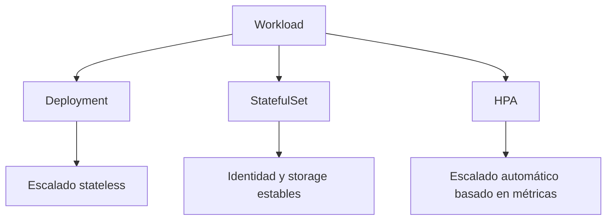
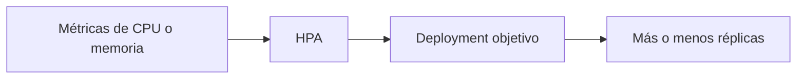

# StatefulSets, HPA y patrones de escalado

Hasta ahora el curso se ha centrado sobre todo en aplicaciones stateless desplegadas con `Deployment`. Ese es el punto de partida correcto, pero en un nivel superior necesitas distinguir mejor entre varios patrones de ejecución y escalado.

## Qué problema resuelve este bloque

No todas las cargas de trabajo son iguales.

Un `Deployment` funciona muy bien para:

- APIs
- frontends
- workers sin identidad fija

Pero no describe tan bien:

- nodos con identidad estable
- almacenamiento por réplica
- escalado automático según carga
- disponibilidad protegida durante cambios

## Mapa conceptual



## Parte 1: StatefulSet

Un `StatefulSet` se usa cuando cada réplica necesita:

- identidad estable
- nombre predecible
- volumen propio o persistente

Casos típicos:

- bases de datos
- brokers
- clusters distribuidos
- nodos que se identifican entre sí por nombre

## Diferencia rápida: Deployment vs StatefulSet

| Tema | Deployment | StatefulSet |
| --- | --- | --- |
| Identidad de pods | intercambiable | estable |
| Nombres | efímeros | ordenados y predecibles |
| Storage por réplica | no es su fuerte | sí |
| Caso típico | API, web | DB, broker, cluster |

## Headless Service

Un `StatefulSet` suele ir acompañado de un `Service` headless (`clusterIP: None`) para resolver pods individualmente.

## Ejemplo del repositorio: `scaling-demo`

Revisa:

- `examples/k8s/scaling-demo/headless-service.yaml`
- `examples/k8s/scaling-demo/statefulset.yaml`

Este ejemplo crea un `StatefulSet` pequeño con pods nombrados de forma estable:

- `demo-store-0`
- `demo-store-1`

## Qué aprender de este ejemplo

- la diferencia entre réplicas intercambiables y réplicas con identidad
- por qué un `StatefulSet` necesita un enfoque más estable de red y storage

## Parte 2: HPA

HPA significa `HorizontalPodAutoscaler`.

Su función es ajustar el número de réplicas automáticamente según métricas, normalmente CPU o memoria cuando el entorno lo soporta.

## Qué problema resuelve

Sin HPA:

- el número de réplicas es fijo
- puedes sobredimensionar
- o quedarte corto ante picos

Con HPA:

- Kubernetes puede aumentar o reducir réplicas dentro de un rango

## Requisitos importantes

Para que HPA funcione en la práctica suele hacer falta:

- métricas disponibles
- `metrics-server` u otra fuente compatible
- `requests` definidos

## Modelo mental de HPA



## Ejemplo del repositorio: `scaling-demo`

Revisa:

- `examples/k8s/scaling-demo/api-deployment.yaml`
- `examples/k8s/scaling-demo/api-service.yaml`
- `examples/k8s/scaling-demo/hpa.yaml`

Este ejemplo no garantiza autoscaling real en todos los clústeres locales, pero sí muestra:

- cómo se define el HPA
- qué recurso apunta
- qué métricas espera usar

## Parte 3: patrones de escalado

No todo escalado es “más réplicas”.

Hay al menos tres decisiones distintas:

### Escalado horizontal

Más pods.

### Escalado vertical

Más CPU o memoria por pod.

### Escalado estructural

Cambio en la arquitectura o distribución de responsabilidades.

Por ejemplo:

- separar frontend y API
- introducir caché
- introducir cola o worker

## Patrones operativos importantes

### Réplicas fijas con control manual

Útil para demos y entornos simples.

### Réplicas con HPA

Útil cuando la carga varía y tienes métricas.

### StatefulSet con crecimiento controlado

Útil para cargas con estado donde cada réplica no es sustituible sin más.

## Flujo del laboratorio `scaling-demo`

### Paso 1: revisar StatefulSet

```bash
kubectl apply -f examples/k8s/scaling-demo/headless-service.yaml
kubectl apply -f examples/k8s/scaling-demo/statefulset.yaml
kubectl get pods
```

Qué observar:

- nombres ordenados
- identidad estable

### Paso 2: revisar HPA

```bash
kubectl apply -f examples/k8s/scaling-demo/api-deployment.yaml
kubectl apply -f examples/k8s/scaling-demo/api-service.yaml
kubectl apply -f examples/k8s/scaling-demo/hpa.yaml
kubectl get hpa
```

En clústeres sin métricas, el HPA puede no estar plenamente operativo. Aun así, la definición sigue siendo útil para aprender el patrón.

## Relación con recursos

Sin `requests`, el HPA suele perder una de sus referencias más útiles.

Por eso el bloque de:

- [Probes, recursos y scheduling](11-probes-recursos-y-scheduling.md)

es una base muy importante para entender HPA.

## Errores frecuentes

### Usar Deployment donde realmente hace falta identidad estable

Eso suele generar problemas si el software asume nombres o discos predecibles.

### Suponer que StatefulSet es “Deployment pero más serio”

No es exactamente eso; responde a otro patrón.

### Declarar HPA sin métricas disponibles

El manifiesto puede existir, pero el comportamiento real no será el esperado.

### Escalar sin observar el componente con estado

Redis, brokers o bases de datos no se escalan igual que una API stateless.

## Buenas prácticas iniciales

- Usa `Deployment` por defecto para stateless.
- Usa `StatefulSet` cuando de verdad importe la identidad o el almacenamiento por réplica.
- No metas HPA demasiado pronto si aún no controlas recursos y observabilidad.
- Relaciona siempre escalado con la naturaleza del workload.

## Qué deberías poder hacer al terminar

- Explicar cuándo un `StatefulSet` tiene más sentido que un `Deployment`.
- Leer un `HPA` y entender a qué workload apunta.
- Relacionar `requests` con decisiones de escalado.
- Distinguir cargas stateless de cargas con estado.

## Siguiente paso

Este bloque prepara muy bien la entrada a:

- [Entornos, CI/CD y GitOps](14-entornos-ci-cd-y-gitops.md)
