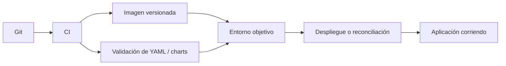
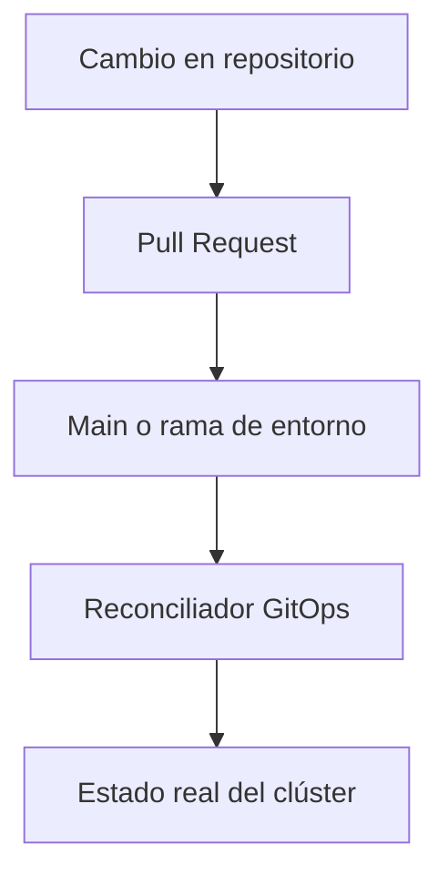

# Entornos, CI/CD y GitOps

Cuando el curso sube de nivel, ya no basta con saber escribir YAML o levantar un clúster local. También importa cómo mover cambios entre entornos, cómo validar antes de desplegar y cómo mantener trazabilidad.

## Qué problema resuelve este bloque

Sin una estrategia de entornos y automatización:

- los cambios se hacen de forma manual y frágil
- cuesta saber qué versión está desplegada
- el despliegue depende demasiado de memoria o terminales concretas
- la plataforma se vuelve menos reproducible

## Tres preguntas clave

Este bloque intenta responder tres preguntas:

1. Cómo organizar despliegues por entorno.
2. Cómo automatizar validación y build.
3. Cómo pensar un modelo más declarativo de promoción de cambios.

## Mapa conceptual

## Parte 1: entornos

Lo normal es separar al menos:

- desarrollo
- staging o demo
- producción

Esa separación puede reflejarse en:

- namespaces
- valores de Helm
- tags de imagen
- secrets y configuración

## Qué debería cambiar entre entornos

- número de réplicas
- recursos
- URLs o dominios
- flags de aplicación
- credenciales

## Qué no debería cambiar sin control

- el comportamiento esencial del software
- convenciones de nombres
- contrato de endpoints

## Estrategias habituales

### Estrategia 1: mismo chart, valores distintos

Muy común en Helm:

- `values-dev.yaml`
- `values-staging.yaml`
- `values-prod.yaml`

### Estrategia 2: namespaces por entorno

Útil para aislar recursos y facilitar limpieza.

### Estrategia 3: tags por promoción

Una imagen versionada pasa de `dev` a `staging` y luego a producción sin reconstruirla necesariamente.

## Parte 2: CI/CD

### CI

Se centra en validar y construir.

Ejemplos:

- lint
- parseo YAML
- build de imágenes
- render de charts
- tests básicos

### CD

Se centra en desplegar o promover cambios.

Ejemplos:

- actualizar imagen
- aplicar manifiestos
- instalar o actualizar chart

## Qué automatizar primero

No conviene empezar por lo más complejo. El orden razonable suele ser:

1. validar archivos
2. construir la imagen
3. renderizar manifests o charts
4. publicar artefactos
5. automatizar promoción

## Parte 3: GitOps

GitOps es una forma de pensar el despliegue donde:

- Git contiene el estado deseado
- un reconciliador aplica ese estado al clúster
- el clúster converge hacia lo declarado

## Modelo mental GitOps

## Qué aporta GitOps

- trazabilidad
- repetibilidad
- visibilidad de cambios
- menos “kubectl apply” manual y opaco

## Qué no debes asumir

GitOps no arregla mágicamente:

- malos manifiestos
- mala separación de entornos
- charts poco claros
- procesos confusos de versionado

Primero hace falta una base declarativa razonable.

## Relación con el material existente

En este repositorio, la progresión natural sería:

1. aprender YAML y recursos base
2. aprender Helm
3. definir un proyecto multi-servicio
4. validar build y render
5. pensar promoción de cambios por entorno

## Caso práctico mental con este repo

Imagina este flujo:

1. Cambias `examples/docker/fullstack-demo/api/app.py`.
2. CI construye una imagen nueva.
3. La imagen recibe un tag ligado al commit.
4. Se actualizan valores de entorno o chart.
5. Un flujo declarativo promueve ese cambio a un entorno demo.

## Organización recomendada del repositorio

A futuro, este curso puede crecer con:

- `docs/ci-cd/`
- `examples/helm/`
- `values-dev.yaml`, `values-demo.yaml`, `values-prod.yaml`
- workflows en `.github/workflows/`

## Errores frecuentes

### Mezclar desarrollo y despliegue manual sin trazabilidad

Luego nadie sabe qué versión está realmente corriendo.

### Usar tags ambiguos

Si solo existe `latest`, la promoción entre entornos se vuelve más confusa.

### Automatizar antes de estabilizar el ejemplo

CI/CD encima de ejemplos frágiles solo automatiza errores.

### Tratar GitOps como sustituto del entendimiento

GitOps es una capa de operación, no un reemplazo del modelo mental de Kubernetes.

## Buenas prácticas iniciales

- Usa tags de imagen claros.
- Separa valores por entorno.
- Haz que la validación mínima pase siempre antes del despliegue.
- Mantén manifiestos y charts legibles.
- Documenta el flujo de promoción.

## Qué deberías poder hacer al terminar

- Explicar la diferencia entre CI y CD.
- Justificar por qué conviene separar entornos.
- Entender por qué Helm ayuda a parametrizar despliegues.
- Explicar GitOps como modelo de reconciliación declarativa.

## Conexión con el bloque superior

Este módulo, junto con:

- [RBAC, NetworkPolicies y aislamiento](12-rbac-network-policies-y-aislamiento.md)
- [StatefulSet, HPA y patrones de escalado](13-statefulsets-hpa-y-patrones-de-escalado.md)

forma la base del salto desde “Kubernetes intermedio” hacia “temas de plataforma y operación”.
