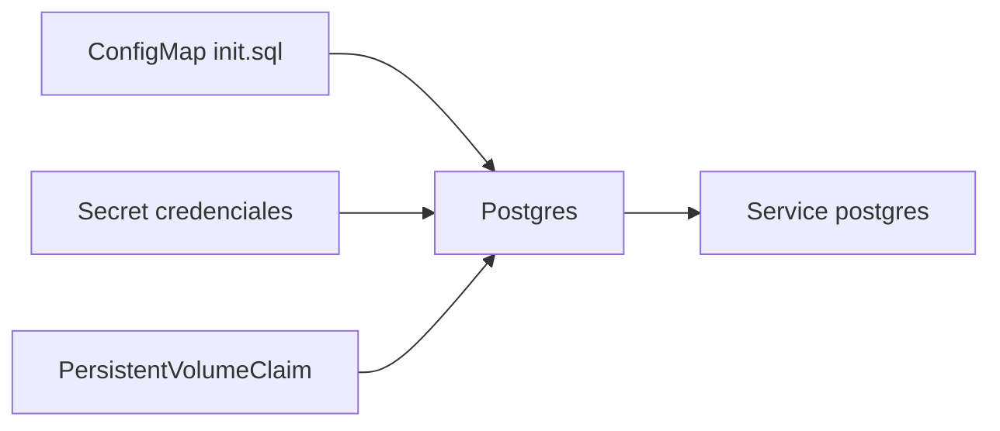

# Postgres, PVC e inicialización

Redis es excelente para demostrar conexión entre servicios y estado ligero, pero si quieres acercarte más a aplicaciones reales, antes o después tienes que tratar con una base de datos persistente. Este bloque usa PostgreSQL como siguiente escalón práctico.

## Qué problema resuelve este bloque

Este bloque cubre tres necesidades muy frecuentes:

- persistencia más realista que un contador en memoria o Redis
- inicialización controlada de esquema o datos básicos
- comprensión del ciclo de vida entre volumen, base de datos y aplicación

## Qué se practica aquí

- `PersistentVolumeClaim`
- `Secret` para credenciales
- `ConfigMap` con script de inicialización
- `Deployment` de PostgreSQL
- `Service` interno
- `readinessProbe` con `pg_isready`

## Mapa conceptual



## Cómo inicializa PostgreSQL en esta demo

La imagen oficial de PostgreSQL ejecuta scripts colocados en:

```text
/docker-entrypoint-initdb.d/
```

cuando el directorio de datos todavía está vacío.

Eso es importante porque:

- el script se ejecuta en la primera inicialización
- si el volumen ya contiene datos, no se repite automáticamente

## Ejemplo del repositorio

Revisa:

- `examples/k8s/postgres-demo/secret.yaml`
- `examples/k8s/postgres-demo/configmap.yaml`
- `examples/k8s/postgres-demo/pvc.yaml`
- `examples/k8s/postgres-demo/deployment.yaml`
- `examples/k8s/postgres-demo/service.yaml`

## Qué hace el ejemplo

- define usuario, password y nombre de base
- monta un `PVC` en `/var/lib/postgresql/data`
- monta `init.sql` desde `ConfigMap`
- expone PostgreSQL dentro del clúster con un `Service`

## Flujo del laboratorio

### Paso 1: aplicar recursos

```bash
kubectl apply -f examples/k8s/postgres-demo/
kubectl get pvc
kubectl get pods
kubectl get services
```

### Paso 2: comprobar readiness

```bash
kubectl describe pod -l app=postgres-demo
```

La readiness usa:

```bash
pg_isready
```

### Paso 3: port-forward para pruebas locales

```bash
kubectl port-forward service/postgres-demo 5432:5432
```

### Paso 4: probar con `psql`

Si tienes `psql` disponible:

```bash
PGPASSWORD=postgres-demo psql -h 127.0.0.1 -U curso -d curso_demo -c "SELECT * FROM demo_items;"
```

## Qué deberías observar

- el `PVC` mantiene los datos
- el script de inicialización carga datos semilla
- la base queda disponible por `Service`

## Advertencias importantes

- cambiar `init.sql` no vuelve a ejecutar el script sobre un volumen ya inicializado
- para repetir la inicialización debes limpiar el volumen o usar otra estrategia
- en producción, las migraciones suelen gestionarse con herramientas o jobs específicos, no solo con scripts de bootstrap

## Problemas frecuentes

### El pod no queda listo

Revisa:

- variables de entorno de PostgreSQL
- logs del contenedor
- permisos o estado del volumen

### Los datos no cambian aunque hayas editado `init.sql`

Si el volumen ya existía, la inicialización inicial ya pasó.

### El `PVC` queda en `Pending`

Revisa:

- storage class disponible
- capacidad solicitada
- compatibilidad del entorno local

## Relación con el resto del curso

Este bloque se conecta muy bien con:

- [Storage, PV y PVC](10-storage-pv-pvc.md)
- [Proyecto multiservicio](../04-proyecto-multiservicio.md)
- [StatefulSet, HPA y patrones de escalado](13-statefulsets-hpa-y-patrones-de-escalado.md)
