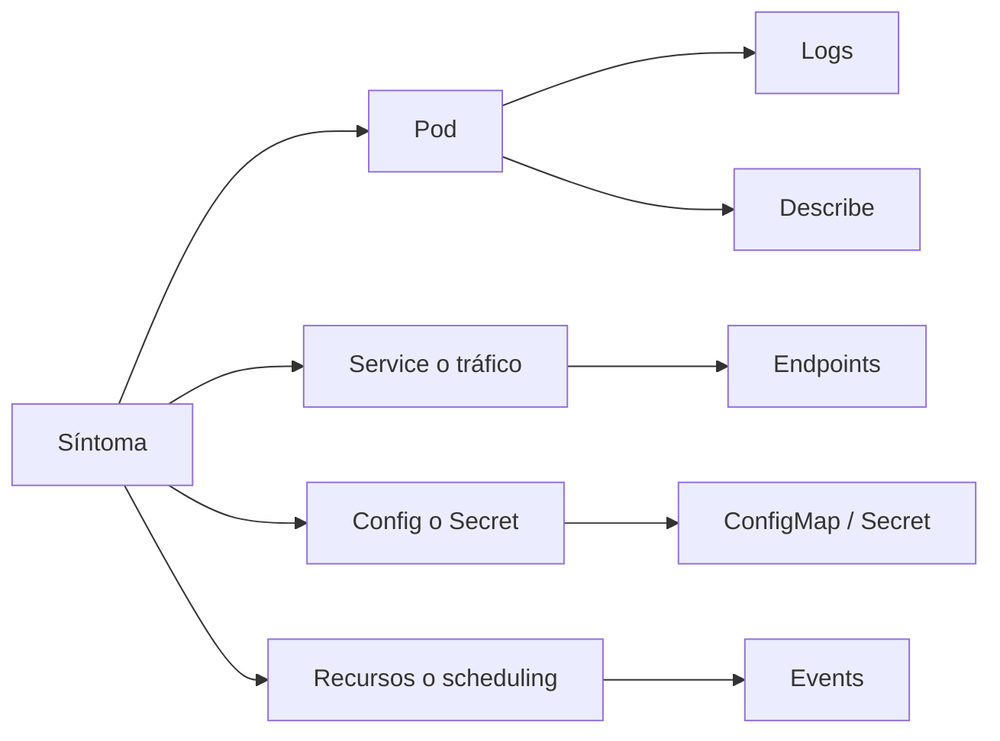

# Cookbook de troubleshooting

Este documento reúne recetas rápidas para depurar los fallos más frecuentes del repositorio. La idea no es sustituir la comprensión profunda, sino acelerar el diagnóstico cuando ya sabes qué componente mirar.

## Método general

Antes de entrar a un caso concreto, usa este orden:

1. `kubectl get pods`
2. `kubectl describe pod <pod>`
3. `kubectl logs <pod>`
4. `kubectl get events --sort-by=.metadata.creationTimestamp`
5. revisar `Service`, labels, configuración y probes

## Mapa de diagnóstico



## Receta 1: `ImagePullBackOff`

### Síntoma

El pod no arranca porque no consigue la imagen.

### Qué revisar

```bash
kubectl describe pod <pod_name>
```

### Causas típicas

- tag mal escrita
- imagen no cargada en `kind`
- registry inaccesible
- `imagePullPolicy` incompatible con el flujo local

### En este repo

Suele afectar a:

- `examples/k8s/python-api/`
- `examples/k8s/fullstack-demo/`

### Solución típica

```bash
docker build -t python-api:local examples/docker/python-api
kind load docker-image python-api:local --name curso-k8s
```

## Receta 2: `CrashLoopBackOff`

### Síntoma

El contenedor arranca y cae continuamente.

### Qué revisar

```bash
kubectl logs <pod_name>
kubectl describe pod <pod_name>
```

### Causas típicas

- comando de arranque roto
- dependencia externa caída
- variables ausentes
- `livenessProbe` mal definida

### En este repo

Útil practicarlo con:

- `examples/k8s/probes-demo/deployment-bad-liveness.yaml`

## Receta 3: pod `Running` pero no `Ready`

### Síntoma

El pod existe, pero no recibe tráfico.

### Qué revisar

```bash
kubectl describe pod <pod_name>
```

### Causas típicas

- `readinessProbe` rota
- la app aún no terminó de arrancar
- dependencia no disponible

### En este repo

Útil practicarlo con:

- `examples/k8s/probes-demo/deployment-bad-readiness.yaml`

## Receta 4: pod `Pending`

### Síntoma

No llega a ejecutarse en ningún nodo.

### Qué revisar

```bash
kubectl describe pod <pod_name>
kubectl get events --sort-by=.metadata.creationTimestamp
```

### Causas típicas

- `requests` demasiado altos
- PVC pendiente
- restricciones de scheduling

### En este repo

Útil practicarlo con:

- `examples/k8s/probes-demo/pod-unschedulable.yaml`

## Receta 5: el `Service` no enruta

### Síntoma

La app existe, pero el service no responde o no tiene endpoints.

### Qué revisar

```bash
kubectl get svc
kubectl get endpoints <service_name>
kubectl describe service <service_name>
```

### Causas típicas

- selector no coincide
- puerto incorrecto
- pods no listos

### En este repo

Puedes simular este tipo de fallo cambiando labels en:

- `examples/k8s/hola-nginx/`
- `examples/k8s/fullstack-demo/`

## Receta 6: la API falla por configuración

### Síntoma

El deployment está arriba, pero la app responde con error o no conecta a otro servicio.

### Qué revisar

```bash
kubectl get configmaps
kubectl get secrets
kubectl describe deployment <name>
kubectl logs <pod_name>
```

### Causas típicas

- nombre de `ConfigMap` o `Secret` mal escrito
- variable ausente
- host o password incorrectos

### En este repo

Casos claros:

- `examples/k8s/configmap-secret/`
- `examples/k8s/fullstack-demo/`
- `examples/k8s/postgres-demo/`

## Receta 7: Redis o Postgres no responden

### Síntoma

La API falla aunque el pod principal parezca sano.

### Qué revisar

```bash
kubectl get pods
kubectl logs -l app=redis
kubectl logs -l app=postgres-demo
kubectl describe pod -l app=redis
```

### Causas típicas

- password incorrecta
- servicio con nombre equivocado
- base aún no lista
- PVC en mal estado

## Receta 8: Ingress no enruta

### Síntoma

El `Ingress` existe, pero no llega tráfico.

### Qué revisar

```bash
kubectl get ingress
kubectl describe ingress <ingress_name>
kubectl get svc
```

### Causas típicas

- no hay controlador Ingress
- el backend del service es incorrecto
- host no coincide

### En este repo

Casos:

- `examples/k8s/ingress-demo/`
- `examples/k8s/fullstack-demo/`

## Receta 9: Helm renderiza algo inesperado

### Qué revisar

```bash
helm template <release> <chart>
helm lint <chart>
```

### Causas típicas

- valor mal sobrescrito
- nombre inesperado por `Release.Name`
- plantilla con indentación incorrecta

### En este repo

- `examples/k8s/helm-demo/`
- `examples/helm/fullstack-demo/`

## Checklist final

- la imagen existe
- el pod arranca
- las probes son correctas
- el `Service` selecciona los pods esperados
- la configuración externa está presente
- el componente de datos responde
- el entorno soporta la capacidad avanzada usada
