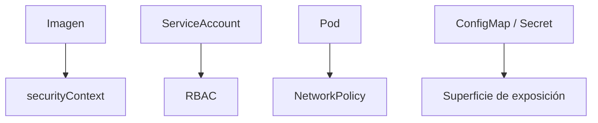

# Seguridad aplicada y hardening

La seguridad en Kubernetes no empieza con una herramienta avanzada, sino con decisiones pequeñas y repetibles sobre imágenes, permisos, configuración y exposición.

## Qué cubre este bloque

- hardening básico de imágenes y manifiestos
- service accounts dedicadas
- RBAC mínimo
- `NetworkPolicy`
- revisión de secretos y exposición

## Mapa de hardening



## Capa 1: imagen

Checklist básica:

- imagen base confiable
- tamaño razonable
- sin secretos embebidos
- dependencias mínimas
- proceso principal claro

## Capa 2: manifiesto

Checklist básica:

- `ServiceAccount` explícita cuando tenga sentido
- recursos definidos
- probes razonables
- puertos correctos
- separación de config y secretos

## Capa 3: permisos

Preguntas útiles:

- este workload realmente necesita acceder a la API de Kubernetes
- necesita leer pods o modificar recursos
- puede vivir con permisos por defecto mínimos

## Capa 4: red

Preguntas útiles:

- qué workloads deberían hablar entre sí
- qué tráfico es realmente necesario
- qué pods deben quedar aislados

## Ejemplos del repositorio

- `examples/k8s/rbac-demo/`
- `examples/k8s/network-policy-demo/`
- `examples/k8s/fullstack-demo/`

## Hardening mínimo recomendado para este repo

### Para APIs

- definir `readiness` y `liveness`
- declarar recursos
- mover credenciales a `Secret`
- usar una service account dedicada si el pod necesita permisos

### Para frontends

- no exponer más puertos de los necesarios
- usar `Service` claros
- revisar la cadena frontend -> backend

### Para datos

- passwords en `Secret`
- persistencia explícita si el estado importa
- limitar exposición externa

## Sobre `securityContext`

Muchos equipos introducen `runAsNonRoot`, `readOnlyRootFilesystem` y otras restricciones, pero no todas las imágenes de demo están listas para ello.

Por eso la recomendación educativa aquí es:

1. entender primero la intención
2. endurecer después donde la imagen lo soporte

## Snippet de referencia

```yaml
securityContext:
  runAsNonRoot: true
  allowPrivilegeEscalation: false
  readOnlyRootFilesystem: true
```

## Riesgos típicos que sí puedes detectar ya

- `Secret` reemplazada por valor plano en `ConfigMap`
- service account por defecto reutilizada para todo
- permisos de borrado o escritura innecesarios
- pods abiertos sin segmentación

## Checklist rápida de revisión

- la app usa `Secret` para credenciales
- existe separación por labels y namespaces
- el workload no tiene más permisos de los necesarios
- el tráfico está documentado y, cuando aplique, restringido

## Siguiente paso

Combina este bloque con:

- [RBAC, NetworkPolicies y aislamiento](12-rbac-network-policies-y-aislamiento.md)
- [Observabilidad práctica](18-observabilidad-practica.md)
