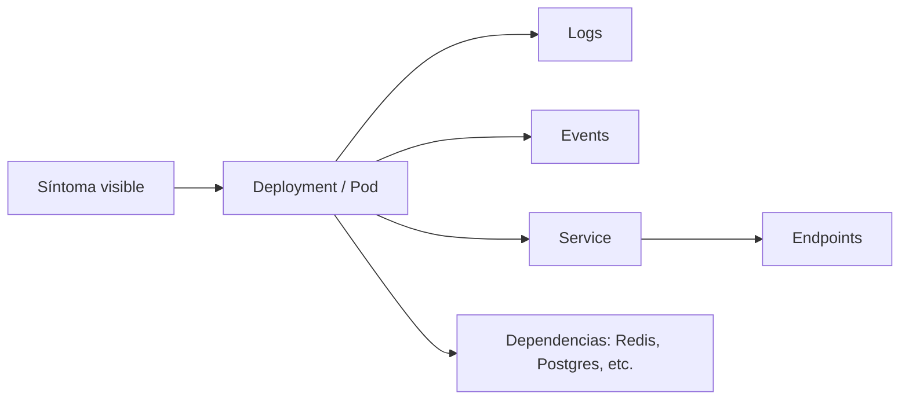

# Observabilidad práctica

En un curso práctico, la observabilidad no debería sentirse como una herramienta externa misteriosa, sino como una disciplina de lectura del sistema.

## Qué cubre este bloque

- lectura de logs
- eventos y `describe`
- estado de rollouts
- síntomas más comunes
- métricas mínimas cuando el clúster las soporta

## Punto de partida

La observabilidad práctica empieza con preguntas concretas:

- el pod está arriba
- está listo
- recibe tráfico
- puede conectar con sus dependencias
- está reiniciándose

## Comandos base

```bash
kubectl get pods
kubectl get events --sort-by=.metadata.creationTimestamp
kubectl describe pod <pod>
kubectl logs <pod>
kubectl logs -f <pod>
kubectl rollout status deployment/<name>
```

## Observabilidad por capas



## Casos del repositorio donde practicar

- `examples/k8s/fullstack-demo/`
- `examples/k8s/python-api/`
- `examples/k8s/postgres-demo/`
- `examples/k8s/probes-demo/`

## Patrón práctico para `fullstack-demo`

### Si el frontend carga pero el contador no funciona

Revisa:

```bash
kubectl get pods
kubectl logs -l app=api
kubectl logs -l app=redis
kubectl get svc
```

### Si la API no queda lista

Revisa:

```bash
kubectl describe pod -l app=api
kubectl logs -l app=api
```

### Si PostgreSQL no inicializa

Revisa:

```bash
kubectl describe pod -l app=postgres-demo
kubectl logs -l app=postgres-demo
kubectl get pvc
```

## Métricas básicas

Si el clúster tiene `metrics-server`:

```bash
kubectl top pods
kubectl top nodes
```

Estas métricas ayudan a conectar:

- consumo real
- `requests`
- decisiones de escalado

## Qué deberías observar

- frecuencia de reinicios
- eventos de probes
- saturación de recursos
- ausencia de endpoints
- diferencias entre “pod vivo” y “servicio funcional”

## Checklist operativa mínima

- el workload existe
- el pod corre
- la readiness pasa
- el service tiene endpoints
- la dependencia externa responde
- los logs confirman el comportamiento esperado

## Siguiente paso

Este bloque combina muy bien con:

- [Cookbook de troubleshooting](16-cookbook-de-troubleshooting.md)
- [StatefulSet, HPA y patrones de escalado](13-statefulsets-hpa-y-patrones-de-escalado.md)
