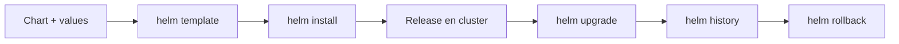

# Helm tutorial paso a paso

Este tutorial toma Helm ya no como concepto aislado, sino como herramienta practica para renderizar, instalar, actualizar y revertir despliegues del propio curso.

## Objetivo

Que puedas recorrer el flujo completo:

1. leer un chart
2. renderizarlo
3. cambiar valores
4. instalarlo
5. actualizarlo
6. hacer rollback

## Que ejemplos usaremos

- `examples/k8s/helm-demo/` como chart minimo
- `examples/helm/python-api/` como chart intermedio
- `examples/helm/fullstack-demo/` como chart multi-servicio

## Mapa del flujo Helm



## Paso 1: inspeccionar un chart minimo

Empieza por:

```bash
tree examples/k8s/helm-demo
```

Piezas clave:

- `Chart.yaml`
- `values.yaml`
- `templates/deployment.yaml`
- `templates/service.yaml`

## Paso 2: renderizar sin instalar

```bash
helm template python-api-demo examples/k8s/helm-demo
```

Esto te deja ver YAML final sin tocar el cluster.

Preguntas utiles:

- que nombre final tendra el `Deployment`
- de donde sale la imagen
- cuantas replicas generara

## Paso 3: aplicar un override simple

```bash
helm template python-api-demo examples/k8s/helm-demo --set replicaCount=3
```

Aqui aparece uno de los motivos fuertes para usar Helm: cambiar parametros sin duplicar manifiestos.

## Paso 4: pasar a un chart mas completo

Ahora usa:

```bash
helm template python-api examples/helm/python-api
```

Este chart ya incorpora:

- `ConfigMap`
- `Deployment`
- `Service`
- `Ingress` opcional
- `readinessProbe`
- `livenessProbe`
- `resources`

## Paso 5: render por entorno

```bash
helm template python-api-dev examples/helm/python-api -f examples/helm/python-api/values-dev.yaml
helm template python-api-demo examples/helm/python-api -f examples/helm/python-api/values-demo.yaml
helm template python-api-prod examples/helm/python-api -f examples/helm/python-api/values-prod.yaml
```

Que deberias comparar:

- replicas
- host del `Ingress`
- recursos
- valor de `APP_ENV`

## Paso 6: instalar en cluster local

Construye la imagen:

```bash
docker build -t python-api:local examples/docker/python-api
```

Si usas `kind`:

```bash
kind load docker-image python-api:local --name curso-k8s
```

Instala:

```bash
helm install python-api examples/helm/python-api -f examples/helm/python-api/values-dev.yaml
```

Verifica:

```bash
kubectl get deployments
kubectl get services
kubectl get pods
```

## Paso 7: probar la aplicacion

```bash
kubectl port-forward service/python-api-python-api 8000:80
curl -s http://localhost:8000/
curl -s http://localhost:8000/health
```

Nota: el nombre exacto del `Service` depende del release y del chart.

## Paso 8: actualizar una release

```bash
helm upgrade python-api examples/helm/python-api --set image.tag=0.2.0
```

O con archivo:

```bash
helm upgrade python-api examples/helm/python-api -f examples/helm/python-api/values-demo.yaml
```

Verifica rollout:

```bash
kubectl rollout status deployment/python-api-python-api
```

## Paso 9: inspeccionar historial

```bash
helm history python-api
```

Esto te dice que revisiones hubo y facilita entender que cambio.

## Paso 10: hacer rollback

```bash
helm rollback python-api 1
```

Este es uno de los beneficios mas visibles para alguien que viene de YAML suelto.

## Paso 11: pasar al chart multi-servicio

Renderiza el chart principal:

```bash
helm template fullstack-dev examples/helm/fullstack-demo -f examples/helm/fullstack-demo/values-dev.yaml
```

Observa que ahora Helm ya coordina varios recursos:

- `ConfigMap`
- `Secret`
- `Deployment` de API
- `Deployment` web
- `Deployment` de Redis
- `Service`
- `Ingress` opcional

## Cuando usar `helm template`, `install` y `upgrade`

### `helm template`

Para estudiar, depurar y validar.

### `helm install`

Para crear una release nueva.

### `helm upgrade`

Para cambiar una existente de forma controlada.

## Errores frecuentes

### Ir directo a `helm install`

Primero conviene renderizar y leer.

### Meter demasiada logica en templates

Helm ayuda mucho, pero un chart demasiado ingenioso cuesta mas de aprender.

### No separar values por entorno

Luego terminas editando a mano lo que deberia vivir en overrides.

### No saber que release esta corriendo

Por eso `helm list` y `helm history` importan.

## Flujo recomendado en este repositorio

1. chart minimo en `examples/k8s/helm-demo/`
2. chart intermedio en `examples/helm/python-api/`
3. chart multi-servicio en `examples/helm/fullstack-demo/`
4. publicacion y promocion con CI/CD

## Siguiente paso

Cuando Helm ya no te resulta ajeno, el siguiente salto natural es entender como se conecta con versionado, promotion y release control:

- [Publicacion, promocion y releases](../ci-cd/03-publicacion-promocion-y-releases.md)
