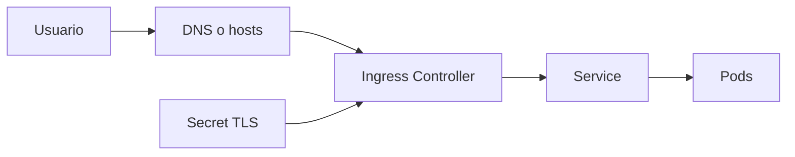

# Ingress, TLS y exposicion avanzada

Exponer una aplicacion no es solo abrir un puerto. Tambien importa como termina TLS, como se enruta el trafico y como reduces errores de configuracion entre hostnames, servicios y certificados.

## Que problema resuelve este bloque

Sin una estrategia de exposicion:

- el trafico entra sin cifrado
- varios servicios compiten por el mismo punto de entrada
- cuesta escalar de una demo local a un dominio mas realista

## Mapa conceptual



## Capas a entender

### Hostname

Define a que dominio responde el `Ingress`.

### TLS

Define con que certificado se cifra el trafico.

### Reglas HTTP

Definen a que `Service` se envia cada ruta o host.

## Ejemplo base del repositorio

Revisa:

- `examples/k8s/ingress-tls-demo/`

Ese directorio muestra:

- `Deployment`
- `Service`
- `Ingress`
- `Secret` TLS de ejemplo

## Patrón habitual

1. una aplicacion escucha en un puerto interno
2. un `Service` la agrupa
3. un `Ingress` publica rutas o dominios
4. un secreto o emisor gestiona TLS

## Ejemplo de Ingress con TLS

```yaml
tls:
  - hosts:
      - tls-demo.local
    secretName: tls-demo-cert
```

## Opciones para los certificados

### Secret manual

Util para demos o entornos muy controlados.

### cert-manager

Util cuando quieres automatizar emision y renovacion.

### Wildcard corporativo

Comun en plataformas internas.

## Rutas y multiples servicios

Un `Ingress` puede enrutar por:

- host
- path

Por ejemplo:

- `/api` hacia la API
- `/` hacia frontend

## Buenas practicas iniciales

- activa redireccion HTTPS cuando el controlador lo soporte
- usa nombres de `Service` claros
- separa bien rutas y puertos
- documenta que controlador se espera

## Errores frecuentes

### El `Ingress` existe pero no responde

Revisa:

- si el controlador esta instalado
- si el hostname resuelve
- si el `Service` tiene endpoints

### El certificado existe pero el navegador falla

Puede ser:

- certificado invalido
- hostname incorrecto
- secreto mal referenciado

### La app responde por `port-forward` pero no por `Ingress`

Suele indicar que el problema esta entre:

- `Ingress`
- `Service`
- DNS o hostname

## Flujo de verificacion

```bash
kubectl get ingress
kubectl describe ingress tls-demo
kubectl get secret tls-demo-cert
kubectl get svc
kubectl get endpoints
```

## Relacion con otras capas del curso

- [Services, Ingress y red](06-services-ingress-y-red.md)
- [Cookbook de troubleshooting](16-cookbook-de-troubleshooting.md)
- [Observabilidad practica](18-observabilidad-practica.md)

## Siguiente paso

Cuando el trafico de entrada ya esta claro, el siguiente salto puede ir por dos caminos:

- [Gateway API y HTTPRoute](34-gateway-api-y-httproute.md)
- [GitOps: Argo CD y Flux](21-gitops-intro-argocd-y-flux.md)
