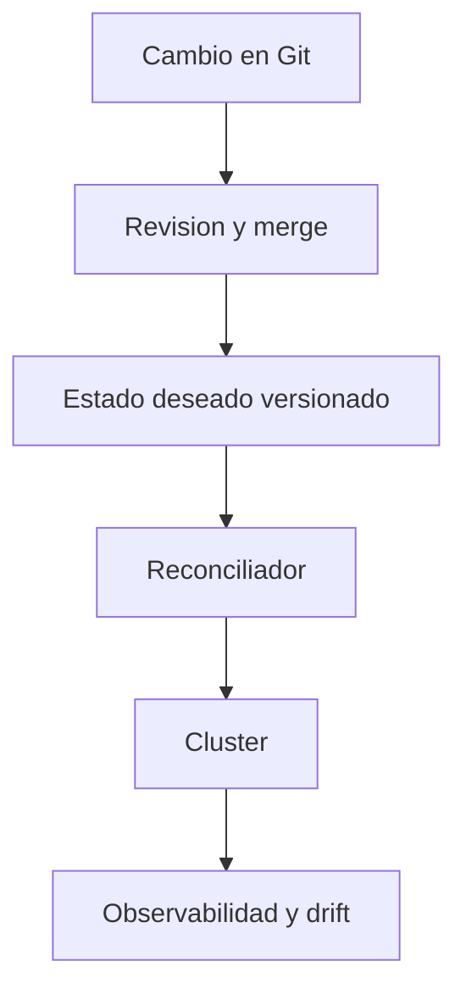

# GitOps: Argo CD y Flux

GitOps no es una herramienta concreta, sino una forma de operar Kubernetes donde Git actua como fuente de verdad del estado deseado.

## Que problema resuelve este bloque

Sin GitOps, muchas plataformas acaban dependiendo de:

- `kubectl apply` manual
- cambios no trazados
- diferencias entre lo que Git declara y lo que el cluster tiene

## Mapa conceptual

## Idea central

La plataforma no se actualiza porque alguien "recuerda" que comando lanzar, sino porque el reconciliador detecta un cambio declarado y converge hacia el.

## Dos herramientas muy conocidas

### Argo CD

Muy popular por:

- interfaz visual clara
- modelo de `Application`
- buena experiencia para revisar sincronizacion y drift

### Flux

Muy valorado por:

- integracion declarativa muy limpia
- modelo fuerte basado en controladores
- uso frecuente en equipos que ya piensan todo como recursos Kubernetes

## Ejemplos del repositorio

Revisa:

- `examples/k8s/gitops-demo/argocd-application.yaml`
- `examples/k8s/gitops-demo/flux-gitrepository.yaml`
- `examples/k8s/gitops-demo/flux-kustomization.yaml`

No son un stack completo listo para cualquier cluster, sino plantillas de referencia para estudiar el modelo.

## Patrón comun de GitOps

1. una rama o carpeta representa un entorno
2. los charts o manifiestos viven en Git
3. una herramienta observa ese origen
4. el cluster converge hacia lo declarado

## Donde encaja Helm

Helm y GitOps no compiten necesariamente.

De hecho, una combinacion muy comun es:

- Helm como empaquetado
- Git como versionado de valores
- Argo CD o Flux como reconciliador

## Ejemplo mental con este repositorio

1. publicas `fullstack-api:1.3.0`
2. actualizas `values-demo.yaml`
3. haces merge
4. el reconciliador detecta el cambio
5. sincroniza la release del entorno `demo`

## Drift y reconciliacion

Si alguien toca el cluster a mano, GitOps intenta corregir esa divergencia.

Eso ayuda a responder:

- quien cambio que
- cuando
- desde donde

## Errores frecuentes

### Pensar que GitOps sustituye la validacion

No. Primero hay que tener manifests o charts sanos.

### Guardar secretos reales en texto plano en Git

GitOps no elimina la necesidad de una estrategia de secretos.

### Multiplicar ramas sin convencion

GitOps mejora mucho cuando los entornos y paths son claros.

## Buenas practicas iniciales

- un path o rama por entorno
- tags de imagen inmutables
- charts o manifests faciles de renderizar localmente
- CI previa a cualquier reconciliacion

## Que deberias poder explicar al terminar

- la diferencia entre CI/CD clasica y GitOps
- por que Git sigue siendo la fuente de verdad
- como Helm puede convivir con Argo CD o Flux

## Siguiente paso

Cuando GitOps ya no suena abstracto, conviene reforzar la parte operativa con metricas y dashboards:

- [Prometheus, Grafana y metricas](22-observabilidad-con-prometheus-y-grafana.md)
- [Argo CD practico: app-of-apps y sync](27-argocd-practico-app-of-apps-y-sync.md)
