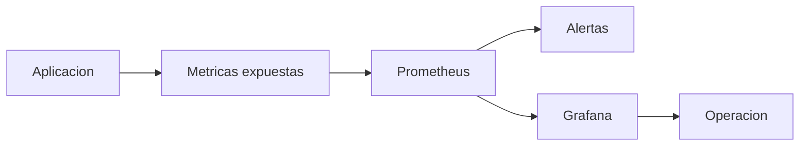

# Prometheus, Grafana y metricas

Logs y eventos son el primer nivel de observabilidad. El siguiente salto es medir el sistema de forma continua y visualizar tendencias.

## Que problema resuelve este bloque

Sin metricas:

- sabes que algo fallo, pero no siempre cuando empezo
- cuesta comparar rendimiento entre despliegues
- no tienes base clara para autoscaling o capacidad

## Mapa conceptual

## Piezas principales

### Exportacion de metricas

La app o un exporter expone datos, normalmente en HTTP.

### Prometheus

Raspa endpoints y almacena series temporales.

### Grafana

Visualiza dashboards y ayuda a leer tendencias.

## Ejemplo del repositorio

Revisa:

- `examples/k8s/prometheus-demo/service-monitor.yaml`
- `examples/k8s/prometheus-demo/prometheus-values.yaml`
- `examples/k8s/prometheus-demo/grafana-values.yaml`

## Que es un `ServiceMonitor`

Cuando usas Prometheus Operator, el `ServiceMonitor` describe como descubrir y raspar metricas de un `Service`.

## Que observar al principio

- reinicios de pods
- consumo de CPU y memoria
- latencia de la API
- tasa de errores
- replicas disponibles

## Relacion con HPA

Aunque el HPA basico suele empezar con CPU o memoria, una observabilidad mejor ayuda a decidir:

- si las `requests` son razonables
- si las replicas estan infra o sobre dimensionadas

## Buenas practicas iniciales

- dashboards pequenos y legibles
- naming consistente en metricas
- separar metricas de aplicacion y metricas de plataforma
- no depender de una sola grafica

## Errores frecuentes

### Instalar Prometheus antes de entender logs y eventos

Primero hacen falta reflejos basicos de diagnostico.

### Medir mucho y leer poco

La observabilidad util no es la mas ruidosa, sino la mas accionable.

### No relacionar metricas con despliegues

Un dashboard gana mucho valor cuando sabes que version se desplego y cuando.

## Flujo de aprendizaje recomendado

1. logs y `describe`
2. rollout y estado de pods
3. metricas basicas
4. dashboards
5. alertas y capacidad

## Enlace con el material existente

- [Observabilidad practica](18-observabilidad-practica.md)
- [StatefulSet, HPA y patrones de escalado](13-statefulsets-hpa-y-patrones-de-escalado.md)

## Siguiente paso

Si ya mides, el siguiente salto de gobernanza es controlar que se puede desplegar y bajo que reglas:

- [Policies con Gatekeeper y Kyverno](23-policies-con-gatekeeper-y-kyverno.md)
- [Observabilidad completa con Prometheus y Grafana](28-observabilidad-stack-completo.md)
