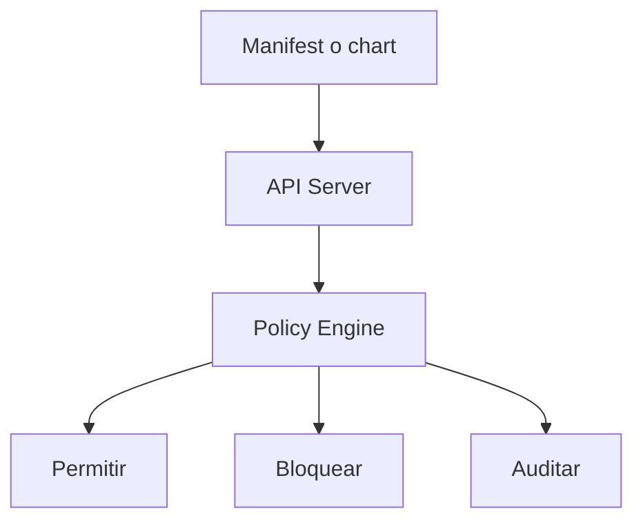

# Policies con Gatekeeper y Kyverno

Cuando un repositorio crece, llega un punto en el que ya no basta con pedir buenas practicas: conviene poder expresarlas como reglas verificables.

## Que problema resuelve este bloque

Sin politicas:

- cada equipo aplica criterios distintos
- se cuelan contenedores sin recursos o con imagenes ambiguas
- la seguridad depende demasiado de memoria humana

## Mapa conceptual

## Dos familias populares

### Kyverno

Ventajas didacticas:

- se escribe en YAML parecido al resto de Kubernetes
- es muy legible para quien ya entiende recursos basicos

### Gatekeeper

Ventajas:

- integra Open Policy Agent
- muy usado para gobierno mas formal
- expresivo para restricciones complejas

## Ejemplos del repositorio

Revisa:

- `examples/k8s/policy-demo/kyverno-require-resources.yaml`
- `examples/k8s/policy-demo/gatekeeper-template.yaml`
- `examples/k8s/policy-demo/gatekeeper-constraint.yaml`
- `examples/k8s/policy-demo/violating-pod.yaml`

## Reglas utiles para empezar

- no permitir imagenes con `latest`
- exigir `requests` y `limits`
- exigir `runAsNonRoot`
- bloquear `hostPath` salvo excepciones

## Cuando introducir politicas

No conviene empezar por aqui en un curso basico. Primero hace falta comprender:

- `Deployment`
- `Service`
- `ConfigMap`
- `Secret`
- recursos y probes

## Modelo mental

Las politicas no sustituyen documentacion ni CI, pero ayudan a que el cluster no acepte configuraciones claramente malas.

## Errores frecuentes

### Intentar resolver todo con una policy

Las politicas son una red, no el sistema entero.

### Bloquear demasiado pronto

En entornos de aprendizaje o equipos nuevos, a veces conviene empezar auditando antes de denegar.

### Escribir reglas que nadie entiende

Una policy buena tambien debe ser explicable.

## Flujo de adopcion recomendado

1. documentar la buena practica
2. validarla en CI cuando sea posible
3. auditarla con policy engine
4. bloquear solo cuando el equipo ya la domina

## Conexion con otros modulos

- [Seguridad aplicada y hardening](17-seguridad-aplicada-y-hardening.md)
- [Cookbook de troubleshooting](16-cookbook-de-troubleshooting.md)
- [Seguridad de contenedores y hardening](../docker/09-seguridad-de-contenedores-y-hardening.md)

## Siguiente paso

Despues de politicas y gobierno, el siguiente tema avanzado que suele aparecer en plataformas grandes es la gestion del trafico este-oeste:

- [Introduccion a service mesh](24-service-mesh-introduccion.md)
