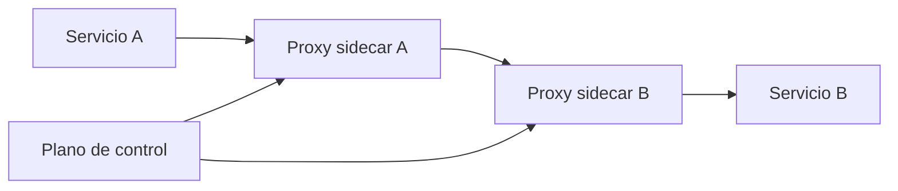

# Introduccion a service mesh

Un service mesh es una capa adicional para controlar trafico, identidad y observabilidad entre servicios. No es necesario para aprender Kubernetes, pero conviene saber cuando aparece y cuando no aporta lo suficiente.

## Que problema resuelve este bloque

En aplicaciones distribuidas mas grandes, a veces quieres:

- TLS entre servicios
- politicas de trafico avanzadas
- canary y routing por porcentaje
- telemetria estandarizada

## Mapa conceptual

## Que suele aportar un mesh

- mTLS entre workloads
- retries y timeouts declarativos
- observabilidad de llamadas
- balanceo y split de trafico

## Que coste introduce

- mas recursos
- mas CRDs y complejidad operativa
- debugging adicional
- nueva curva de aprendizaje

## Cuando no hace falta

Para la mayoria de laboratorios de este repositorio:

- `Service`
- `Ingress`
- buenas probes
- logs y metricas

suelen ser suficientes.

## Cuando empieza a tener sentido

- muchos microservicios
- requisitos de seguridad de trafico interno
- despliegues canary o blue/green frecuentes
- necesidad de telemetria uniforme entre equipos

## Ejemplo del repositorio

Revisa:

- `examples/k8s/service-mesh-demo/gateway.yaml`
- `examples/k8s/service-mesh-demo/virtualservice.yaml`
- `examples/k8s/service-mesh-demo/destinationrule.yaml`

Son recursos de referencia para estudiar el modelo, no un stack mesh completo listo para cualquier cluster local.

## Errores frecuentes

### Instalar un mesh demasiado pronto

Puede ocultar problemas basicos que todavia deberias saber resolver con Kubernetes puro.

### Confundir `Ingress` con mesh

Se relacionan, pero resuelven capas distintas.

### Pensar que un mesh arregla arquitectura deficiente

Puede mejorar trafico y observabilidad, pero no sustituye buen diseno de servicios.

## Como conectar este tema con el curso

Secuencia razonable:

1. Docker y Compose
2. Kubernetes base
3. Helm, storage, seguridad, observabilidad
4. CI/CD y GitOps
5. Service mesh solo como extension avanzada

## Siguiente paso

Si este modulo te ayuda a entender por que aparecen capas mas sofisticadas de trafico y despliegue, los siguientes enlaces encajan muy bien:

- [Gateway API y HTTPRoute](34-gateway-api-y-httproute.md)
- [Progressive delivery con Argo Rollouts](35-progressive-delivery-con-argo-rollouts.md)
