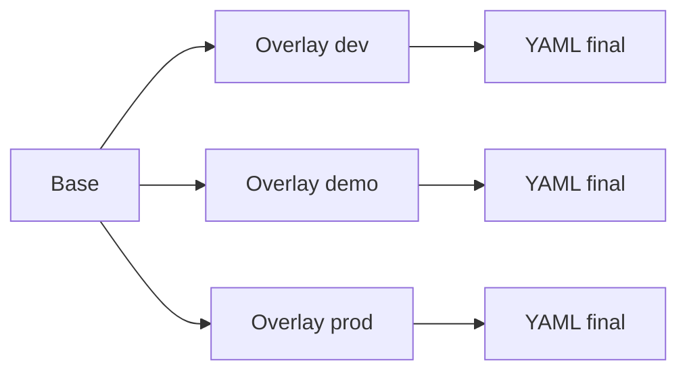

# Kustomize: bases y overlays

Helm no es la unica forma de parametrizar despliegues. `Kustomize` ofrece otra estrategia muy util, especialmente cuando quieres partir de manifiestos legibles y aplicar diferencias por entorno sin introducir un motor de templates.

## Que problema resuelve este bloque

Sin una capa como `Kustomize`, es facil caer en:

- copiar y pegar YAML por entorno
- divergencias entre `dev`, `demo` y `prod`
- parches manuales dificiles de seguir

## Mapa conceptual



## Idea central

`Kustomize` no te pide escribir placeholders como Helm. Trabaja sobre recursos ya existentes y aplica:

- parches
- cambios de imagen
- nombres
- etiquetas
- replicas

## Estructura tipica

En este repositorio tienes:

- `examples/k8s/kustomize-demo/base/`
- `examples/k8s/kustomize-demo/overlays/dev/`
- `examples/k8s/kustomize-demo/overlays/demo/`
- `examples/k8s/kustomize-demo/overlays/prod/`

## Que contiene la base

La base representa lo comun:

- `Deployment`
- `Service`
- `ConfigMap`

La idea es que sea lo bastante estable como para reutilizarse en varios entornos.

## Que hacen los overlays

Los overlays aplican diferencias como:

- namespace
- replicas
- valores de entorno
- imagen y tag
- recursos

## Comandos importantes

### Renderizar

```bash
kubectl kustomize examples/k8s/kustomize-demo/overlays/dev
```

### Aplicar

```bash
kubectl apply -k examples/k8s/kustomize-demo/overlays/dev
```

### Borrar

```bash
kubectl delete -k examples/k8s/kustomize-demo/overlays/dev
```

## Diferencia mental con Helm

### Helm

- usa templates
- genera YAML a partir de valores
- facilita empaquetado y releases

### Kustomize

- parte de YAML existente
- aplica transformaciones y parches
- encaja muy bien en flujos GitOps sencillos

## Cuando `Kustomize` brilla

- cuando quieres manifiestos base muy legibles
- cuando los cambios por entorno son acotados
- cuando prefieres overlays a templates

## Cuando Helm sigue siendo mejor

- cuando necesitas empaquetado reutilizable
- cuando quieres `helm upgrade`, historial y rollback
- cuando la parametrizacion es mas rica

## Ejercicio sugerido

1. Renderiza el overlay `dev`.
2. Renderiza el overlay `prod`.
3. Compara replicas, entorno e imagen.
4. Explica que cambia sin tocar la base.

## Conexiones importantes

- `Kustomize` convive muy bien con GitOps.
- En este repositorio tambien aparece en el flujo end-to-end con `kind`.

## Siguiente paso

Despues de dominar overlays, el siguiente salto practico suele ser automatizar certificados y TLS:

- [cert-manager y TLS automatizado](26-cert-manager-y-tls-automatizado.md)
