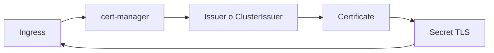

# cert-manager y TLS automatizado

Un `Ingress` con TLS manual sirve para aprender, pero se queda corto en cuanto quieres renovar certificados, separar emisores y reducir trabajo repetitivo.

## Que problema resuelve este bloque

Sin `cert-manager`:

- los certificados se gestionan a mano
- renovar TLS se vuelve tedioso
- la relacion entre dominio, `Ingress` y secreto es mas fragil

## Mapa conceptual



## Idea central

`cert-manager` introduce recursos declarativos como:

- `Issuer`
- `ClusterIssuer`
- `Certificate`

Con ellos, el cluster puede encargarse de pedir, renovar y mantener certificados.

## Ejemplo del repositorio

Revisa:

- `examples/k8s/cert-manager-demo/`

Ese directorio incluye:

- `ClusterIssuer` local auto-firmado
- `ClusterIssuer` de Let's Encrypt staging
- `Certificate`
- `Ingress`
- `Deployment` y `Service`

## Dos rutas utiles para aprender

### Ruta 1: self-signed local

Buena para cluster local y para comprender el flujo completo sin depender de DNS publico.

### Ruta 2: Let's Encrypt staging

Buena para acercarte a un entorno mas realista sin ir directo a produccion.

## Flujo recomendado

1. instalar `cert-manager`
2. aplicar un `ClusterIssuer`
3. crear un `Certificate`
4. referenciar el secreto TLS desde el `Ingress`
5. verificar el estado del certificado

## Comandos utiles

```bash
kubectl get clusterissuer
kubectl get certificate -A
kubectl describe certificate python-api-tls
kubectl get secret python-api-tls
```

## Errores frecuentes

### El `Ingress` existe pero no aparece el secreto TLS

Suele indicar:

- issuer mal nombrado
- `cert-manager` no instalado
- desafio HTTP01 sin controlador adecuado

### El certificado queda en `False`

Revisa:

- eventos del `Certificate`
- `Order` y `Challenge`
- DNS o path de validacion

### Querer usar Let's Encrypt real demasiado pronto

Staging suele ser mejor para aprender sin limites de emision.

## Conexiones importantes

- [Ingress, TLS y exposicion avanzada](20-ingress-tls-y-exposicion-avanzada.md)
- [Cookbook de troubleshooting](16-cookbook-de-troubleshooting.md)

## Siguiente paso

Cuando el despliegue ya usa entornos, overlays, Helm y TLS automatizado, el siguiente salto natural es GitOps mas operativo:

- [Argo CD practico: app-of-apps y sync](27-argocd-practico-app-of-apps-y-sync.md)
