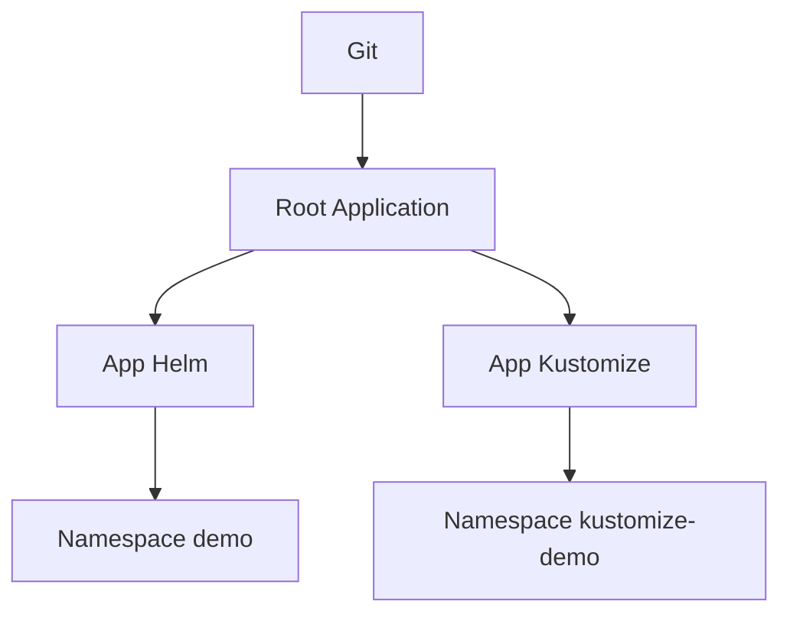

# Argo CD practico: app-of-apps y sync

La introduccion a GitOps explica la idea. Este bloque baja esa idea a una estructura mas operativa usando Argo CD y un patron muy comun: `app-of-apps`.

## Que problema resuelve este bloque

En cuanto un entorno tiene varias aplicaciones, hace falta una forma clara de:

- agruparlas
- sincronizarlas
- controlar namespaces y proyectos
- evitar que cada app se gestione como una isla

## Mapa conceptual



## Patron `app-of-apps`

Una aplicacion raiz apunta a un directorio de Git que contiene otras `Application` de Argo CD.

Eso permite:

- versionar el arbol de aplicaciones
- centralizar sincronizacion
- mantener una estructura mas clara por entorno

## Ejemplo del repositorio

Revisa:

- `examples/k8s/argocd-practical-demo/root-application.yaml`
- `examples/k8s/argocd-practical-demo/project.yaml`
- `examples/k8s/argocd-practical-demo/applications/`

El ejemplo mezcla dos estilos utiles:

- una app desplegada con Helm
- otra desplegada con `Kustomize`

## Por que es util esta combinacion

Porque refleja muy bien lo que pasa en equipos reales:

- no todo vive en Helm
- no todo vive en overlays
- GitOps necesita convivir con varias estrategias

## Flujo recomendado

1. instalar Argo CD
2. crear el `AppProject`
3. aplicar la `Root Application`
4. observar como aparecen las apps hijas
5. sincronizar y revisar drift

## Comandos utiles

```bash
kubectl apply -n argocd -f examples/k8s/argocd-practical-demo/project.yaml
kubectl apply -n argocd -f examples/k8s/argocd-practical-demo/root-application.yaml
kubectl get applications -n argocd
```

## Que debes adaptar siempre

Los ejemplos del repositorio usan `repoURL` de muestra. Antes de aplicarlos, adapta:

- URL real del repositorio
- rama objetivo
- namespaces de destino
- paths

## Errores frecuentes

### La root app sincroniza pero las hijas fallan

Suele ser un problema de:

- path incorrecto
- namespace inexistente
- repoURL sin acceso

### El chart renderiza en local pero Argo CD falla

Revisa:

- `valueFiles`
- permisos del proyecto
- diferencias entre entorno local y cluster

### Demasiada magia en una sola aplicacion raiz

El patron ayuda mucho, pero conviene que el arbol siga siendo legible.

## Conexiones importantes

- [GitOps: Argo CD y Flux](21-gitops-intro-argocd-y-flux.md)
- [Kustomize: bases y overlays](25-kustomize-bases-y-overlays.md)
- [Publicacion, promocion y releases](../ci-cd/03-publicacion-promocion-y-releases.md)

## Siguiente paso

Una vez GitOps es operativo, conviene reforzar la lectura del sistema con una capa mas completa de metricas, alertas y dashboards:

- [Observabilidad completa con Prometheus y Grafana](28-observabilidad-stack-completo.md)
