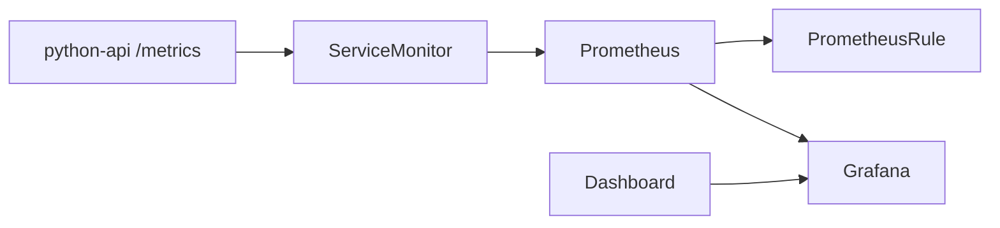

# Observabilidad completa con Prometheus y Grafana

La observabilidad basica del curso ya cubre logs, `describe` y metricas introductorias. Este bloque da el siguiente paso: una pila minima pero coherente de Prometheus, Grafana, reglas y dashboards.

## Que problema resuelve este bloque

Sin una pila mas completa:

- ves sintomas, pero no tendencias
- cuesta relacionar despliegues con rendimiento
- el autoscaling y la capacidad se apoyan en intuicion mas que en datos

## Mapa conceptual



## Piezas del ejemplo

Revisa:

- `examples/k8s/observability-stack-demo/kube-prometheus-stack-values.yaml`
- `examples/k8s/observability-stack-demo/python-api-service-monitor.yaml`
- `examples/k8s/observability-stack-demo/python-api-prometheus-rule.yaml`
- `examples/k8s/observability-stack-demo/grafana-dashboard-python-api.yaml`

## Base del laboratorio

La `python-api` del repositorio ya expone:

- `/health`
- `/metrics`

Eso permite conectar el ejemplo con una app pequena y visible, en lugar de depender de una aplicacion externa.

## Flujo recomendado

1. instalar `kube-prometheus-stack`
2. desplegar `python-api`
3. aplicar `ServiceMonitor`
4. aplicar `PrometheusRule`
5. cargar dashboard en Grafana

## Instalacion orientativa

```bash
helm repo add prometheus-community https://prometheus-community.github.io/helm-charts
helm repo update
helm upgrade --install observability prometheus-community/kube-prometheus-stack \
  -n observability \
  --create-namespace \
  -f examples/k8s/observability-stack-demo/kube-prometheus-stack-values.yaml
```

## Que observar

- si Prometheus descubre el `ServiceMonitor`
- si la serie `python_api_requests_total` aparece
- si la alerta cambia de estado
- si el dashboard refleja trafico o ausencia de trafico

## Errores frecuentes

### El `ServiceMonitor` existe pero no hay metricas

Revisa:

- selector del `Service`
- nombre del puerto
- path `/metrics`

### Grafana esta arriba pero sin dashboard

Suele faltar:

- etiqueta esperada por el sidecar
- namespace correcto
- formato valido del JSON del dashboard

### La regla de Prometheus no parece evaluarse

Comprueba:

- que Prometheus ve la `PrometheusRule`
- que la expresion usa labels coherentes

## Conexiones importantes

- [Observabilidad practica](18-observabilidad-practica.md)
- [Prometheus, Grafana y metricas](22-observabilidad-con-prometheus-y-grafana.md)
- [CI end-to-end con kind](../ci-cd/04-ci-end-to-end-con-kind.md)
