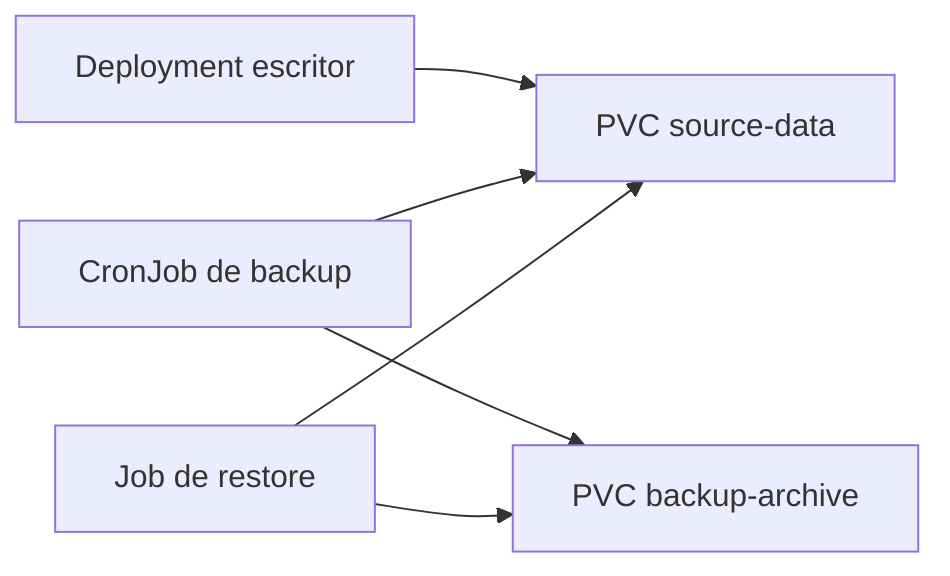

# Backup, restore y disaster recovery

Cuando un curso llega a despliegues reales, tarde o temprano aparece una pregunta incomoda: que pasa si el pod arranca bien pero los datos importantes se pierden.

Este modulo introduce una idea simple pero decisiva: en Kubernetes no basta con poder volver a crear el manifiesto. Tambien hay que saber que datos respaldar, como restaurarlos y cuanto tiempo estas dispuesto a perder en una incidencia.

## Que problema resuelve este bloque

Sin una estrategia minima de backup y restore:

- puedes recrear `Deployments`, pero no recuperar datos
- confundes "infraestructura declarativa" con "aplicacion recuperable"
- descubres tarde que una base de datos o un volumen persistente no tenia plan de salida

## Vocabulario minimo

### RPO

`RPO` (`Recovery Point Objective`) es cuanto dato aceptas perder.

Ejemplo:

- si haces backup cada 6 horas, tu peor caso puede ser perder hasta 6 horas de cambios

### RTO

`RTO` (`Recovery Time Objective`) es cuanto tardas en volver a dar servicio.

Ejemplo:

- si puedes restaurar en 10 minutos, tu `RTO` es mucho mejor que si necesitas reconstruir todo a mano durante una hora

### Backup logico y backup fisico

- un backup logico exporta el contenido en un formato interpretable, como un `pg_dump`
- un backup fisico copia datos tal como estan en disco o a nivel de snapshot

Ambos sirven, pero no responden al mismo problema.

## Que hay que respaldar en Kubernetes

No todo lo importante vive en el mismo sitio.

### Manifiestos y configuracion declarativa

Si tus YAML, charts o overlays ya viven en Git, una parte de la recuperacion ya esta resuelta.

Eso cubre:

- `Deployment`
- `Service`
- `Ingress`
- `ConfigMap`
- `Role`, `RoleBinding` y otras piezas declarativas

### Datos persistentes

Aqui entran:

- `PersistentVolumeClaim`
- directorios montados por aplicaciones stateful
- bases de datos
- colas o caches que no quieras perder

### Secretos y credenciales

Si los secretos se crean a mano en el cluster y no existe otra fuente de verdad, la recuperacion queda incompleta.

Por eso este modulo conecta bien con:

- [Postgres, PVC e inicializacion](15-postgres-pvc-y-inicializacion.md)
- [External Secrets y Secret Stores](30-external-secrets-y-secret-stores.md)

## Mapa mental del laboratorio



La idea del ejemplo es deliberadamente sencilla:

- una app escribe datos en un volumen
- un `CronJob` empaqueta ese volumen periodicamente
- un `Job` de restore recupera el ultimo backup dentro del mismo laboratorio

No es un sistema enterprise, pero si un buen modelo mental para entender el flujo completo.

## Estrategias tipicas

### Solo manifiestos

Es el punto de partida mas barato.

Sirve para:

- aplicaciones stateless
- ejemplos de laboratorio
- infraestructura base que puedes reconstruir sin datos historicos

No sirve por si sola para:

- bases de datos
- ficheros subidos por usuarios
- cualquier sistema con estado relevante

### Copia periodica de volumen

Es la estrategia que modela este repositorio en `examples/k8s/backup-demo/`.

Ventajas:

- facil de entender
- reusable con `CronJob`
- no depende de una herramienta de backup externa

Limites:

- no garantiza consistencia transaccional de una base de datos activa
- no saca el backup fuera del cluster
- no cifra ni rota backups por si mismo

### Backup logico de base de datos

Para `Postgres`, `MySQL` o similares suele ser preferible:

- pausar escrituras si hace falta
- ejecutar `dump`
- guardar el artefacto fuera del nodo o del cluster

Ese salto suele ser mas robusto que copiar el directorio de datos en caliente.

### Snapshot o backup off-cluster

En entornos reales quieres ademas:

- copia fuera del cluster
- versionado o retencion
- pruebas periodicas de restore

Un backup no probado sigue siendo una apuesta.

## Ejemplo del repositorio

Revisa:

- `examples/k8s/backup-demo/namespace.yaml`
- `examples/k8s/backup-demo/source-pvc.yaml`
- `examples/k8s/backup-demo/backup-pvc.yaml`
- `examples/k8s/backup-demo/writer-deployment.yaml`
- `examples/k8s/backup-demo/backup-cronjob.yaml`
- `examples/k8s/backup-demo/restore-job.yaml`

## Recorrido recomendado

### 1. Crear el laboratorio

```bash
kubectl apply -f examples/k8s/backup-demo/namespace.yaml
kubectl apply -f examples/k8s/backup-demo/source-pvc.yaml
kubectl apply -f examples/k8s/backup-demo/backup-pvc.yaml
kubectl apply -f examples/k8s/backup-demo/writer-deployment.yaml
kubectl apply -f examples/k8s/backup-demo/backup-cronjob.yaml
```

### 2. Comprobar que la app escribe datos

```bash
kubectl get pods -n backup-demo
kubectl logs -n backup-demo deploy/backup-writer
```

### 3. Lanzar un backup inmediato

En vez de esperar a la proxima ventana del `CronJob`, puedes forzar una ejecucion:

```bash
kubectl create job \
  --from=cronjob/backup-archive \
  backup-now \
  -n backup-demo
```

### 4. Verificar que aparecio un artefacto

```bash
kubectl exec -n backup-demo deploy/backup-writer -- ls -lah /data
kubectl get jobs -n backup-demo
```

Para inspeccionar el volumen de backups puedes crear un pod temporal o revisar los logs del job.

### 5. Restaurar el ultimo backup

```bash
kubectl apply -f examples/k8s/backup-demo/restore-job.yaml
kubectl logs -n backup-demo job/backup-restore
```

El `Job` descomprime el backup mas reciente en `/source/restore`.

## Que debes observar

- que el volumen fuente contiene datos nuevos con el tiempo
- que el `CronJob` genera archivos `.tgz`
- que el `Job` de restore localiza el ultimo backup y lo expande
- que restore no significa solo "desplegar YAML", sino recuperar estado util

## Errores frecuentes

### El `PVC` no enlaza

Revisa:

- si existe clase de almacenamiento por defecto
- si el cluster local soporta `PersistentVolumeClaim`

### El `CronJob` corre pero no aparece ningun backup

Suele indicar:

- ruta de montaje incorrecta
- comando `tar` mal construido
- volumen de destino sin permisos o sin espacio

### El restore no recupera nada

Comprueba:

- que al menos exista un backup previo
- que el patron `*.tgz` encuentre archivos
- que el directorio de destino exista o se cree antes de extraer

## Que no hace este ejemplo

Este laboratorio no pretende resolver:

- backup consistente de `Postgres` bajo carga real
- backup cifrado
- exportacion a S3, GCS o almacenamiento externo
- politicas de retencion o borrado automatico

Lo que si hace es darte una base clara para pensar mejor la operacion.

## Conexiones importantes

- [Storage, PV y PVC](10-storage-pv-pvc.md)
- [StatefulSet, HPA y patrones de escalado](13-statefulsets-hpa-y-patrones-de-escalado.md)
- [Postgres, PVC e inicializacion](15-postgres-pvc-y-inicializacion.md)
- [Cookbook de troubleshooting](16-cookbook-de-troubleshooting.md)
