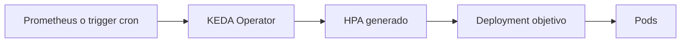

# KEDA y event-driven autoscaling

El `HPA` clasico cubre muy bien CPU y memoria. El problema aparece cuando quieres escalar por algo que no vive dentro del pod:

- trafico observado en Prometheus
- mensajes pendientes en una cola
- franjas horarias
- eventos de sistemas externos

Aqui entra KEDA.

## Que problema resuelve este bloque

KEDA (`Kubernetes Event-driven Autoscaling`) actua como puente entre:

- una fuente de eventos o metricas
- y el mecanismo de escalado de Kubernetes

Eso permite escalar por señales mas cercanas al negocio o a la operacion real.

## Mapa conceptual



## Piezas principales

### `ScaledObject`

Es el recurso mas comun de KEDA. Define:

- que workload vas a escalar
- que triggers vas a usar
- cuantos replicas minimas y maximas permites

### Trigger

Un trigger es la fuente de señal:

- `cron`
- `prometheus`
- `rabbitmq`
- `kafka`
- `redis`
- y muchos mas

### HPA generado por KEDA

KEDA no reemplaza todo el modelo de autoscaling de Kubernetes. Normalmente crea y gestiona un `HPA` para el workload objetivo.

## Cuando usar KEDA y cuando no

Usalo cuando el escalado dependa de:

- trabajo pendiente
- ventanas horarias
- metricas externas
- sistemas desacoplados por eventos

No hace falta introducirlo si:

- solo escalas por CPU o memoria
- el entorno aun es demasiado pequeno para justificar otro operador

## Instalacion orientativa

Antes de aplicar los CRDs del ejemplo instala KEDA:

```bash
helm repo add kedacore https://kedacore.github.io/charts
helm repo update
helm install keda kedacore/keda -n keda --create-namespace
```

## Ejemplo del repositorio

Revisa:

- `examples/k8s/keda-demo/namespace.yaml`
- `examples/k8s/keda-demo/deployment.yaml`
- `examples/k8s/keda-demo/service.yaml`
- `examples/k8s/keda-demo/service-monitor.yaml`
- `examples/k8s/keda-demo/scaledobject-cron.yaml`
- `examples/k8s/keda-demo/scaledobject-prometheus.yaml`
- `examples/k8s/keda-demo/traffic-generator-deployment.yaml`

El ejemplo trae dos recorridos separados.

Importante:

- no apliques los dos `ScaledObject` a la vez sobre el mismo `Deployment`

## Demo 1: escalado por horario con `cron`

Este es el laboratorio mas facil de entender.

### Flujo

1. desplegar app y servicio
2. aplicar `ScaledObject` con trigger `cron`
3. dejar que KEDA ajuste replicas segun la franja definida

### Comandos

```bash
kubectl apply -f examples/k8s/keda-demo/namespace.yaml
kubectl apply -f examples/k8s/keda-demo/deployment.yaml
kubectl apply -f examples/k8s/keda-demo/service.yaml
kubectl apply -f examples/k8s/keda-demo/scaledobject-cron.yaml
```

### Que observar

```bash
kubectl get scaledobject -n keda-demo
kubectl get hpa -n keda-demo
kubectl get deploy -n keda-demo
```

La idea pedagogica aqui es clara:

- KEDA puede llevar el workload a `0`
- y reactivarlo en una ventana definida

## Demo 2: escalado por metrica externa con Prometheus

Este recorrido conecta con el bloque de observabilidad del repositorio.

### Dependencias previas

Necesitas:

- KEDA instalado
- una pila Prometheus operativa
- el `ServiceMonitor` para que la `python-api` sea scrapeada

### Flujo

1. desplegar app y `Service`
2. aplicar `ServiceMonitor`
3. aplicar `ScaledObject` tipo `prometheus`
4. generar trafico
5. observar como KEDA ajusta replicas

### Comandos

```bash
kubectl apply -f examples/k8s/keda-demo/namespace.yaml
kubectl apply -f examples/k8s/keda-demo/deployment.yaml
kubectl apply -f examples/k8s/keda-demo/service.yaml
kubectl apply -f examples/k8s/keda-demo/service-monitor.yaml
kubectl apply -f examples/k8s/keda-demo/scaledobject-prometheus.yaml
kubectl apply -f examples/k8s/keda-demo/traffic-generator-deployment.yaml
```

### Verificaciones utiles

```bash
kubectl get scaledobject -n keda-demo
kubectl get hpa -n keda-demo
kubectl describe scaledobject -n keda-demo python-api-keda-prometheus
kubectl get deploy -n keda-demo
```

### Ajustes que pueden variar por entorno

En este ejemplo hay dos parametros que a veces conviene retocar:

- `serverAddress`, porque el servicio real de Prometheus puede cambiar segun el nombre del release
- `query`, porque si tu cluster scrapea varias aplicaciones con la misma metrica puede interesarte filtrar por labels

La version del repositorio usa una consulta simple para que el laboratorio sea facil de leer.

## Matiz importante del ejemplo con Prometheus

Este laboratorio usa una metrica scrapeada desde los pods.

Eso implica algo importante:

- si escalas a `0`, la metrica puede desaparecer porque ya no hay pods exponiendola

Por eso el ejemplo de Prometheus deja `minReplicaCount: 1`.

Si quieres un laboratorio que si baje a `0`, el trigger `cron` es mucho mas directo.

## Errores frecuentes

### No existe el `ScaledObject`

Normalmente significa que KEDA aun no esta instalado o sus CRDs no estan disponibles.

### KEDA crea el `HPA` pero no escala

Revisa:

- que el query de Prometheus devuelva un unico valor
- que el `serverAddress` apunte al servicio correcto
- que realmente exista trafico
- que el `threshold` no sea demasiado alto

### Se aplican dos `ScaledObject` sobre el mismo `Deployment`

No es una buena idea para este laboratorio. Usa uno u otro recorrido, no ambos a la vez.

### El trigger `cron` no hace lo esperado

Comprueba:

- `timezone`
- expresiones `start` y `end`
- que `start` y `end` no coincidan

## Conexiones importantes

- [StatefulSet, HPA y patrones de escalado](13-statefulsets-hpa-y-patrones-de-escalado.md)
- [Observabilidad practica](18-observabilidad-practica.md)
- [Prometheus, Grafana y metricas](22-observabilidad-con-prometheus-y-grafana.md)
- [Observabilidad completa con Prometheus y Grafana](28-observabilidad-stack-completo.md)
