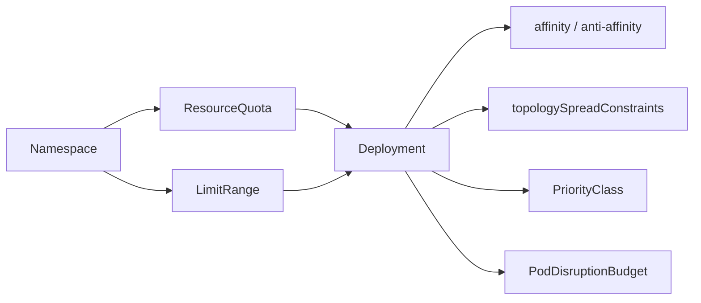

# Disponibilidad, scheduling avanzado y cuotas

Cuando una aplicacion ya expone `readiness`, tiene recursos definidos y despliega varias replicas, aparece una pregunta nueva:

- como evitar que todas las replicas queden demasiado juntas
- como protegerlas durante tareas de mantenimiento
- como impedir que un namespace consuma mas cluster del razonable

Este modulo cubre ese salto.

## Que problema resuelve este bloque

El scheduling basico te dice si un pod cabe o no.

El scheduling de plataforma y las cuotas responden a preguntas mas operativas:

- que replicas no deberian vivir en el mismo nodo
- cuantas puedo perder a la vez durante una interrupcion voluntaria
- que workloads deben tener mas prioridad
- cuanto puede consumir un equipo dentro de su namespace

## Mapa conceptual



## De los recursos al placement

En el modulo de probes y recursos vimos:

- `requests`
- `limits`
- pods `Pending`

Eso explica si un pod puede planificarse.

Ahora vamos un paso mas alla:

- `affinity` y `anti-affinity` orientan donde conviene ubicar pods
- `topologySpreadConstraints` reparten replicas por dominios de fallo
- `PodDisruptionBudget` protege disponibilidad durante mantenimientos
- `PriorityClass` expresa importancia relativa
- `ResourceQuota` y `LimitRange` ponen limites al namespace

## `affinity` y `anti-affinity`

Sirven para influir en la ubicacion.

### `podAntiAffinity`

Es muy util cuando no quieres demasiadas replicas iguales en el mismo nodo.

Ejemplo conceptual:

```yaml
affinity:
  podAntiAffinity:
    preferredDuringSchedulingIgnoredDuringExecution:
      - weight: 100
        podAffinityTerm:
          topologyKey: kubernetes.io/hostname
          labelSelector:
            matchLabels:
              app: spread-demo
```

Idea clave:

- `preferred...` intenta repartir, pero no bloquea si el cluster es pequeno
- `required...` puede dejar pods en `Pending` si no hay nodos suficientes

## `topologySpreadConstraints`

Kubernetes documenta este recurso como una forma de repartir pods entre dominios de fallo como nodos o zonas.

En laboratorio local solemos usar `kubernetes.io/hostname`.

Ejemplo:

```yaml
topologySpreadConstraints:
  - maxSkew: 1
    topologyKey: kubernetes.io/hostname
    whenUnsatisfiable: ScheduleAnyway
    labelSelector:
      matchLabels:
        app: spread-demo
```

Lectura rapida:

- `maxSkew: 1` intenta que el reparto no se desequilibre demasiado
- `ScheduleAnyway` evita bloquear el despliegue en un cluster pequeno
- con un solo nodo no veras reparto real, pero si dejas expresada la intencion

## `PodDisruptionBudget`

Un `PodDisruptionBudget` no evita caidas por crash ni por fallo fisico del nodo.

Lo que protege son interrupciones voluntarias:

- `drain`
- actualizaciones de nodos
- operaciones de mantenimiento respetuosas con la politica

Ejemplo:

```yaml
apiVersion: policy/v1
kind: PodDisruptionBudget
metadata:
  name: spread-demo-pdb
spec:
  minAvailable: 2
  selector:
    matchLabels:
      app: spread-demo
```

Si tienes 3 replicas, este `PDB` dice:

- no me dejes caer por debajo de 2 pods disponibles durante una eviccion voluntaria

## `PriorityClass`

`PriorityClass` expresa la importancia relativa de un pod frente a otros.

No es un sustituto de buen capacity planning.

Se usa para:

- distinguir workloads mas importantes
- permitir preemption en escenarios concretos
- evitar que todo tenga la misma prioridad operativa

Ejemplo:

```yaml
apiVersion: scheduling.k8s.io/v1
kind: PriorityClass
metadata:
  name: platform-medium
value: 100000
globalDefault: false
description: Prioridad media para servicios internos importantes.
```

Buena practica:

- define pocas clases y con semantica clara
- no conviertas todos los deployments en "criticos"

## `ResourceQuota` y `LimitRange`

Estos dos recursos viven en el namespace y se complementan.

### `LimitRange`

Sirve para:

- poner limites minimos o maximos
- inyectar requests o limits por defecto si el pod no los declara

### `ResourceQuota`

Sirve para:

- limitar consumo agregado por namespace
- limitar numero de objetos
- evitar que un equipo monopolice el cluster

Ejemplo de pareja comun:

```yaml
apiVersion: v1
kind: LimitRange
metadata:
  name: team-a-defaults
spec:
  limits:
    - type: Container
      defaultRequest:
        cpu: 100m
        memory: 128Mi
      default:
        cpu: 250m
        memory: 256Mi
---
apiVersion: v1
kind: ResourceQuota
metadata:
  name: team-a-quota
spec:
  hard:
    pods: "6"
    requests.cpu: "1000m"
    requests.memory: 1Gi
```

Lectura operativa:

- `LimitRange` ayuda a que no entren pods sin recursos
- `ResourceQuota` controla la suma total del namespace

## Ejemplo del repositorio

Revisa:

- `examples/k8s/scheduling-policy-demo/namespace.yaml`
- `examples/k8s/scheduling-policy-demo/priorityclass.yaml`
- `examples/k8s/scheduling-policy-demo/limitrange.yaml`
- `examples/k8s/scheduling-policy-demo/resourcequota.yaml`
- `examples/k8s/scheduling-policy-demo/deployment.yaml`
- `examples/k8s/scheduling-policy-demo/pdb.yaml`
- `examples/k8s/scheduling-policy-demo/pod-defaults.yaml`
- `examples/k8s/scheduling-policy-demo/pod-overquota.yaml`

## Flujo de laboratorio

### Paso 1: crear namespace y politicas base

```bash
kubectl apply -f examples/k8s/scheduling-policy-demo/namespace.yaml
kubectl apply -f examples/k8s/scheduling-policy-demo/priorityclass.yaml
kubectl apply -f examples/k8s/scheduling-policy-demo/limitrange.yaml
kubectl apply -f examples/k8s/scheduling-policy-demo/resourcequota.yaml
```

Comprueba:

```bash
kubectl get ns scheduling-demo
kubectl get limitrange,resourcequota -n scheduling-demo
kubectl get priorityclass platform-medium
```

### Paso 2: desplegar la aplicacion con reparto y prioridad

```bash
kubectl apply -f examples/k8s/scheduling-policy-demo/deployment.yaml
kubectl apply -f examples/k8s/scheduling-policy-demo/pdb.yaml
kubectl -n scheduling-demo rollout status deployment/spread-demo
```

Comprueba:

```bash
kubectl get pods -n scheduling-demo -o wide
kubectl get pdb -n scheduling-demo
kubectl describe deploy -n scheduling-demo spread-demo
```

Si tu cluster solo tiene un nodo:

- el deployment sigue siendo valido
- pero no veras reparto real entre nodos
- la `anti-affinity` y el spread estan configurados para no bloquear el laboratorio

### Paso 3: observar defaults de `LimitRange`

```bash
kubectl apply -f examples/k8s/scheduling-policy-demo/pod-defaults.yaml
kubectl get pod -n scheduling-demo defaults-demo -o yaml
```

Busca en la salida:

- `resources.requests`
- `resources.limits`

La idea es ver que el namespace puede inyectar defaults aunque el YAML del pod no los declare.

### Paso 4: forzar un rechazo por cuota

```bash
kubectl apply -f examples/k8s/scheduling-policy-demo/pod-overquota.yaml
```

Deberias ver un error parecido a:

- el namespace supera `requests.cpu`
- o supera `requests.memory`

Eso te enseña que una cuota no solo es documentacion: la API puede rechazar el recurso.

## Como leer este laboratorio

Este bloque no intenta mostrar una app mas compleja.

Su valor esta en enseñar decisiones de plataforma que suelen pasar desapercibidas:

- reparto
- prioridad
- proteccion frente a mantenimiento
- presupuesto de recursos por namespace

## Errores frecuentes

### `requiredDuringScheduling...` en un cluster demasiado pequeno

Si fuerzas `required` y no tienes nodos suficientes:

- el pod puede quedarse en `Pending`

Para laboratorio didactico, `preferred` suele ser mejor primer paso.

### Pensar que un `PDB` evita cualquier caida

No.

Un `PDB` protege frente a interrupciones voluntarias, no frente a todos los fallos posibles.

### Cuota que rechaza pods "sin motivo"

Suele pasar cuando:

- el namespace ya esta consumiendo recursos por otros workloads
- el pod nuevo no declara recursos y el admission controller aplica defaults
- se olvida revisar la suma total y solo se mira el manifiesto aislado

### Poner prioridad alta a todo

Si todo es prioritario:

- nada lo es de verdad
- complicas preemption y diagnostico

## Que aprender de este bloque

Al terminar deberias poder:

- distinguir placement, prioridad y proteccion ante evicciones
- explicar la diferencia entre `LimitRange` y `ResourceQuota`
- justificar por que una politica "blanda" es mejor que una "dura" en un cluster de laboratorio
- leer un rechazo de quota sin asumir que Kubernetes "esta roto"

## Conexiones importantes

- [Probes, recursos y scheduling](11-probes-recursos-y-scheduling.md)
- [StatefulSet, HPA y patrones de escalado](13-statefulsets-hpa-y-patrones-de-escalado.md)
- [Seguridad aplicada y hardening](17-seguridad-aplicada-y-hardening.md)
- [Backup, restore y disaster recovery](29-backup-restore-y-disaster-recovery.md)

## Lecturas oficiales

- [Pod Topology Spread Constraints](https://kubernetes.io/docs/concepts/scheduling-eviction/topology-spread-constraints/)
- [Specifying a Disruption Budget for your Application](https://kubernetes.io/docs/tasks/run-application/configure-pdb/)
- [Pod Priority and Preemption](https://kubernetes.io/docs/concepts/scheduling-eviction/pod-priority-preemption/)
- [Resource Quotas](https://kubernetes.io/docs/concepts/policy/resource-quotas/)
- [Limit Ranges](https://kubernetes.io/docs/concepts/policy/limit-range/)
