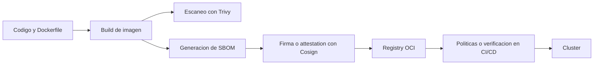

# Supply chain, Trivy, SBOM y firma

La seguridad de Kubernetes no termina en `RBAC`, `NetworkPolicy` o `securityContext`.

Antes de desplegar, hay otra cadena que importa mucho:

- que construyes
- que dependencias contiene
- que has escaneado
- que artefacto firmas
- que verifica la plataforma antes de aceptar la imagen

Ese recorrido se suele llamar software supply chain.

## Que problema resuelve este bloque

Sin una minima disciplina de supply chain:

- puedes desplegar imagenes con vulnerabilidades conocidas sin darte cuenta
- cuesta saber exactamente que componentes entraron en una release
- no tienes una forma clara de demostrar que una imagen viene de tu pipeline

## Mapa conceptual



## Pieza 1: escanear la imagen

El primer paso razonable es no publicar a ciegas.

`Trivy` se usa mucho porque permite:

- escanear imagenes
- escanear filesystem o repositorios
- generar SBOM
- volver a escanear un SBOM ya generado

### Flujo minimo

Usa una imagen del propio repo:

```bash
docker build -t python-api:docs-supplychain examples/docker/python-api
trivy image python-api:docs-supplychain
```

Que mirar en la salida:

- severidad de hallazgos
- paquetes vulnerables
- sistema base de la imagen

La idea pedagogica no es llegar a "cero findings" a cualquier precio, sino aprender a:

- ver que entra en la imagen
- distinguir una alerta real de una dependencia arrastrada
- decidir si bloqueas, corriges o aceptas con contexto

## Pieza 2: generar un SBOM

Un `SBOM` (`Software Bill of Materials`) describe componentes del artefacto.

No sustituye al escaneo, pero mejora trazabilidad.

La documentacion oficial de Trivy permite generarlo con el mismo comando base de escaneo usando `--format`.

### Ejemplo con SPDX JSON

```bash
trivy image \
  --format spdx-json \
  --output sbom-python-api.spdx.json \
  python-api:docs-supplychain
```

### Reescanear el SBOM

```bash
trivy sbom sbom-python-api.spdx.json
```

Esto es util porque separa dos momentos:

- generar inventario
- volver a evaluarlo despues

## Pieza 3: firmar la imagen

Escanear responde "que contiene".

Firmar responde "quien produjo este artefacto" o "que pipeline lo emitio".

`Cosign` permite dos recorridos comunes:

- firma con clave gestionada por ti
- firma keyless basada en identidad OIDC

La documentacion oficial de Sigstore describe el modelo keyless como firma asociada a identidad y registrada en el transparency log de Rekor.

## Firma minima con clave propia

Si ya tienes la imagen subida a un registry OCI:

```bash
export IMAGE=ghcr.io/tu-org/python-api:1.0.0
cosign generate-key-pair
cosign sign --key cosign.key $IMAGE
cosign verify --key cosign.pub $IMAGE
```

Importante:

- `Cosign` firma artefactos accesibles en registry
- en un laboratorio 100% local suele hacer falta un registry local o remoto de pruebas

## Attestations

Ademas de una firma simple, `Cosign` puede adjuntar metadata verificable.

Ejemplo generico:

```bash
cosign attest --key cosign.key --type custom --predicate predicate.json $IMAGE
```

Eso abre la puerta a publicar:

- metadata de build
- evidencia de pipeline
- referencias a SBOM

## Donde entra Kubernetes

Kubernetes por si solo no te obliga a escanear ni a firmar.

Ese control suele entrar por:

- CI/CD
- admission policies
- verificaciones en GitOps o en pipelines de release

Relacion practica con este repo:

- [Seguridad aplicada y hardening](17-seguridad-aplicada-y-hardening.md) protege el runtime
- [Policies con Gatekeeper y Kyverno](23-policies-con-gatekeeper-y-kyverno.md) introduce gobierno declarativo
- este modulo protege la cadena anterior al despliegue

## Flujo minimo recomendado para este repositorio

Sin volver el curso innecesariamente pesado, una ruta muy razonable seria:

1. construir la imagen de `examples/docker/python-api`
2. escanearla con `Trivy`
3. generar `SBOM`
4. publicar la imagen versionada
5. firmarla con `Cosign`
6. verificar la firma en CI o antes de promoverla

## Que no resuelve este bloque

No cubre por si solo:

- gestion de secretos en Git
- rotacion de credenciales de runtime
- politicas de admission completas

Para eso combinarias este bloque con:

- [External Secrets y Secret Stores](30-external-secrets-y-secret-stores.md)
- [Policies con Gatekeeper y Kyverno](23-policies-con-gatekeeper-y-kyverno.md)
- [Publicacion, promocion y releases](../ci-cd/03-publicacion-promocion-y-releases.md)

## Errores frecuentes

### Firmar un tag mutable y olvidarte del digest

Si una etiqueta cambia con el tiempo:

- la trazabilidad se vuelve peor

En entornos serios conviene pensar en digests y no solo en tags humanos.

### Creer que `SBOM` equivale a escaneo de vulnerabilidades

No es lo mismo.

- el `SBOM` es inventario
- el escaneo es evaluacion sobre ese inventario

### Guardar `cosign.key` dentro del repositorio

Eso rompe el objetivo de la firma.

Si usas claves autogestionadas:

- mantenlas fuera del repo
- o usa KMS / keyless segun tu entorno

### Querer resolver supply chain solo dentro del cluster

La mayor parte del valor aparece antes:

- build
- scan
- sign
- verify

## Que aprender de este bloque

Al terminar deberias poder:

- explicar la diferencia entre escanear, inventariar y firmar
- generar un `SBOM` de una imagen del curso
- justificar por que una firma aporta confianza operativa
- conectar supply chain con CI/CD y con politicas de plataforma

## Conexiones importantes

- [Seguridad aplicada y hardening](17-seguridad-aplicada-y-hardening.md)
- [Policies con Gatekeeper y Kyverno](23-policies-con-gatekeeper-y-kyverno.md)
- [Publicacion, promocion y releases](../ci-cd/03-publicacion-promocion-y-releases.md)
- [Workflows del repositorio](../ci-cd/02-workflows-del-repo.md)

## Lecturas oficiales

- [Trivy: container image target](https://trivy.dev/docs/latest/guide/target/container_image/)
- [Trivy: SBOM](https://trivy.dev/docs/latest/supply-chain/sbom/)
- [Sigstore Cosign: signing overview](https://docs.sigstore.dev/cosign/signing/overview/)
- [Sigstore Cosign: signing containers](https://docs.sigstore.dev/cosign/signing/signing_with_containers/)
- [Sigstore Cosign: verify](https://docs.sigstore.dev/cosign/verifying/verify/)
