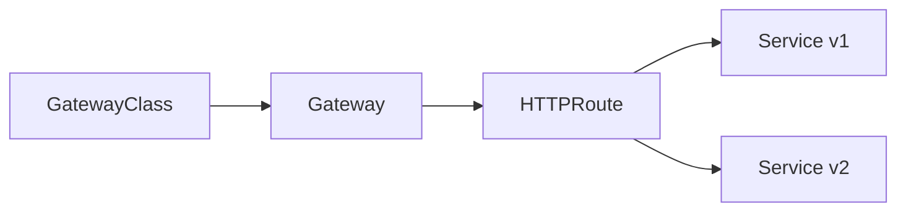

# Gateway API y HTTPRoute

Durante mucho tiempo, `Ingress` fue la puerta de entrada HTTP mas comun en Kubernetes.

Sigue siendo util, pero cuando la plataforma crece suelen aparecer necesidades mas finas:

- separar mejor infraestructura y routing de aplicacion
- delegar rutas a distintos equipos sin mezclar todo en un solo recurso
- repartir trafico entre backends con mas expresividad

Aqui entra `Gateway API`.

## Que problema resuelve este bloque

`Ingress` resuelve bastante bien el caso basico:

- publicar hostnames
- enrutar por paths
- terminar TLS

`Gateway API` intenta hacer eso con un modelo mas modular y extensible.

## Mapa conceptual



## Piezas principales

### `GatewayClass`

Describe una clase de Gateway implementada por un controlador.

Equivale a decir:

- que tipo de dataplane o controlador tengo disponible

### `Gateway`

Representa el punto de entrada que escucha trafico.

Equivale a decir:

- donde entra el trafico
- en que puerto
- con que protocolo

### `HTTPRoute`

Define reglas HTTP y backends.

Equivale a decir:

- que host o path va a que servicio
- como se reparte trafico

### `ReferenceGrant`

Aparece cuando quieres referencias seguras entre namespaces.

Para el laboratorio de este repo no hace falta porque todo vive en el mismo namespace.

## Diferencia mental frente a `Ingress`

Con `Ingress`, muchas veces un solo recurso mezcla:

- entrada
- routing
- detalles del controlador

Con `Gateway API`, el modelo separa mejor:

- infraestructura compartida
- ownership de rutas
- acoplamiento entre equipos y aplicaciones

## Lo importante hoy

La documentacion oficial de Gateway API presenta `Gateway`, `GatewayClass`, `HTTPRoute` y `ReferenceGrant` dentro del Standard Channel, y recomienda empezar instalando CRDs y un controlador compatible.

Eso implica dos prerequisitos:

1. tener CRDs de Gateway API
2. tener un controlador que implemente esa API

## Flujo minimo antes de probar

### Paso 1: revisar si tu cluster ya lo soporta

```bash
kubectl get gatewayclass
```

Si no existe ningun `GatewayClass`, no basta con aplicar YAMLs:

- te faltan CRDs
- o te falta un controlador compatible

### Paso 2: instalar CRDs y controlador

La guia oficial de Gateway API recomienda instalar el bundle standard y despues un controlador compatible.

Como los nombres y modos de instalacion cambian segun implementacion, en este curso la recomendacion es:

- seguir la guia oficial
- elegir el controlador que ya encaje con tu laboratorio local o tu plataforma

## Ejemplo del repositorio

Revisa:

- `examples/k8s/gateway-api-demo/namespace.yaml`
- `examples/k8s/gateway-api-demo/deployment-v1.yaml`
- `examples/k8s/gateway-api-demo/deployment-v2.yaml`
- `examples/k8s/gateway-api-demo/service-v1.yaml`
- `examples/k8s/gateway-api-demo/service-v2.yaml`
- `examples/k8s/gateway-api-demo/gateway.yaml`
- `examples/k8s/gateway-api-demo/httproute-simple.yaml`
- `examples/k8s/gateway-api-demo/httproute-split.yaml`

## Que demuestra este laboratorio

### `httproute-simple.yaml`

Muestra el caso mas directo:

- un `HTTPRoute`
- un backend
- un hostname

### `httproute-split.yaml`

Muestra un caso mas interesante:

- el mismo punto de entrada
- dos backends
- pesos diferentes entre versiones

Esto conecta con una idea muy util:

- repartir trafico sirve para migraciones, canaries o mitigacion de incidentes

## Flujo de laboratorio

### Paso 1: preparar namespace y backends

```bash
kubectl apply -f examples/k8s/gateway-api-demo/namespace.yaml
kubectl apply -f examples/k8s/gateway-api-demo/deployment-v1.yaml
kubectl apply -f examples/k8s/gateway-api-demo/deployment-v2.yaml
kubectl apply -f examples/k8s/gateway-api-demo/service-v1.yaml
kubectl apply -f examples/k8s/gateway-api-demo/service-v2.yaml
```

### Paso 2: ajustar `gatewayClassName`

Antes de aplicar el `Gateway`, abre:

- `examples/k8s/gateway-api-demo/gateway.yaml`

y cambia `gatewayClassName` para que coincida con la salida de:

```bash
kubectl get gatewayclass
```

### Paso 3: crear el `Gateway`

```bash
kubectl apply -f examples/k8s/gateway-api-demo/gateway.yaml
kubectl get gateway -n gateway-demo
kubectl describe gateway -n gateway-demo app-gateway
```

### Paso 4: probar una ruta simple

```bash
kubectl apply -f examples/k8s/gateway-api-demo/httproute-simple.yaml
kubectl get httproute -n gateway-demo
kubectl describe httproute -n gateway-demo python-api-simple
```

### Paso 5: probar reparto de trafico

```bash
kubectl apply -f examples/k8s/gateway-api-demo/httproute-split.yaml
kubectl describe httproute -n gateway-demo python-api-split
```

La guia oficial de `HTTPRoute` documenta precisamente que los `backendRefs` aceptan pesos relativos para repartir trafico entre servicios.

## Como leer el ejemplo de split

En el manifiesto de split:

- `python-api-v1` recibe la mayor parte
- `python-api-v2` recibe una parte menor

No es un controlador de rollout por si solo.

Es un primitivo de routing que despues puedes usar para:

- pruebas controladas
- canaries manuales
- migraciones graduales

## Errores frecuentes

### El `Gateway` no queda admitido

Suele indicar:

- `gatewayClassName` incorrecto
- controlador no instalado
- CRDs ausentes

### `HTTPRoute` existe pero no adjunta al `Gateway`

Revisa:

- `parentRefs`
- namespace
- hostname
- compatibilidad del listener

### Aplicar el laboratorio sin comprobar el controlador

`Gateway API` no es solo un conjunto de YAMLs.

Necesita una implementacion real detras.

## Que aprender de este bloque

Al terminar deberias poder:

- explicar la diferencia entre `Ingress` y `Gateway API`
- distinguir `GatewayClass`, `Gateway` y `HTTPRoute`
- entender por que el split por pesos es util en cambios graduales
- leer mejor si el problema esta en la ruta o en el controlador

## Conexiones importantes

- [Services, Ingress y red](06-services-ingress-y-red.md)
- [Ingress, TLS y exposicion avanzada](20-ingress-tls-y-exposicion-avanzada.md)
- [Introduccion a service mesh](24-service-mesh-introduccion.md)
- [Disponibilidad, scheduling y cuotas](32-disponibilidad-scheduling-y-cuotas.md)

## Lecturas oficiales

- [Gateway API: Getting started](https://gateway-api.sigs.k8s.io/guides/getting-started/introduction/)
- [Gateway API: HTTP routing](https://gateway-api.sigs.k8s.io/guides/user-guides/http-routing/)
- [Gateway API: HTTP traffic splitting](https://gateway-api.sigs.k8s.io/guides/user-guides/traffic-splitting/)
- [HTTPRoute reference](https://gateway-api.sigs.k8s.io/reference/api-types/httproute/)
