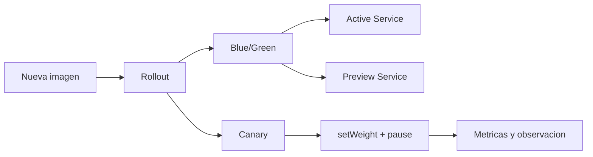

# Progressive delivery con Argo Rollouts

Un `Deployment` nativo con `RollingUpdate` es suficiente para muchos casos.

Pero cuando una actualizacion ya no es "cambio la imagen y cruzo los dedos", aparecen preguntas mas delicadas:

- cuanto trafico recibe la nueva version
- cuanto tiempo observo antes de seguir
- como hago preview antes de promover
- como aborto sin improvisar

Ese es el territorio de progressive delivery.

## Que problema resuelve este bloque

La documentacion oficial de Argo Rollouts presenta el controlador como una extension de Kubernetes para estrategias avanzadas como:

- `blue-green`
- `canary`
- analisis y promotion/rollback mas controlados

La motivacion oficial tambien es clara:

- un `RollingUpdate` nativo tiene poco control sobre el blast radius
- no controla el flujo de trafico fino
- no automatiza bien verificaciones mas profundas

## Mapa conceptual



## Que es Argo Rollouts

Segun la documentacion oficial:

- es un controlador Kubernetes
- introduce CRDs propias
- soporta `blue-green`, `canary`, analisis y traffic shaping con varios providers

Importante:

- no necesitas Argo CD para usar Argo Rollouts

## Dos estrategias clave

### `blue-green`

Mantienes:

- una version activa
- una version preview

Cuando la nueva version esta lista:

- promueves el `Service` activo
- y la version anterior se retira con un retraso controlado

### `canary`

La nueva version recibe:

- una fraccion del trafico o de las replicas
- pausas intermedias
- observacion antes de seguir

Sin traffic manager externo, la propia documentacion de Argo Rollouts explica que el peso se aproxima por numero de replicas.

## Cuando usarlo y cuando no

Usalo cuando:

- una actualizacion tiene impacto relevante
- quieres observar comportamiento antes de promover
- ya tienes metricas o señales de salud razonables

No lo introduzcas demasiado pronto si todavia faltan bases:

- probes correctas
- observabilidad minima
- pipeline estable

La guia de buenas practicas de Argo Rollouts recomienda usarlo para despliegues relativamente breves, no para convivencias de versiones durante dias o semanas.

## Prerrequisitos

### Controlador

La guia rapida oficial muestra este flujo:

```bash
kubectl create namespace argo-rollouts
kubectl apply -n argo-rollouts -f https://github.com/argoproj/argo-rollouts/releases/latest/download/install.yaml
```

### Plugin opcional

El plugin `kubectl argo rollouts` no es obligatorio, pero mejora mucho la experiencia para:

- ver estado
- promover
- abortar
- seguir el avance

## Ejemplo del repositorio

Revisa:

- `examples/k8s/argo-rollouts-demo/namespace.yaml`
- `examples/k8s/argo-rollouts-demo/bluegreen-active-service.yaml`
- `examples/k8s/argo-rollouts-demo/bluegreen-preview-service.yaml`
- `examples/k8s/argo-rollouts-demo/rollout-bluegreen.yaml`
- `examples/k8s/argo-rollouts-demo/canary-service.yaml`
- `examples/k8s/argo-rollouts-demo/rollout-canary.yaml`

## Que demuestra cada recorrido

### Recorrido `blue-green`

Muestra:

- `activeService`
- `previewService`
- cambio controlado del `Service`
- `scaleDownDelaySeconds`

### Recorrido `canary`

Muestra:

- `setWeight`
- `pause`
- progresion declarativa paso a paso

## Flujo de laboratorio: blue-green

### Paso 1: desplegar recursos base

```bash
kubectl apply -f examples/k8s/argo-rollouts-demo/namespace.yaml
kubectl apply -f examples/k8s/argo-rollouts-demo/bluegreen-active-service.yaml
kubectl apply -f examples/k8s/argo-rollouts-demo/bluegreen-preview-service.yaml
kubectl apply -f examples/k8s/argo-rollouts-demo/rollout-bluegreen.yaml
```

Comprueba:

```bash
kubectl get rollout -n rollouts-demo
kubectl get svc -n rollouts-demo
kubectl get pods -n rollouts-demo
```

### Paso 2: lanzar una nueva revision

Actualiza la imagen:

```bash
kubectl patch rollout rollouts-bluegreen-demo \
  -n rollouts-demo \
  --type=json \
  -p='[{"op":"replace","path":"/spec/template/spec/containers/0/image","value":"argoproj/rollouts-demo:yellow"}]'
```

Que observar:

- el `previewService` apunta a la nueva revision
- el `activeService` sigue en la version estable
- tras `autoPromotionSeconds`, el servicio activo cambia

### Paso 3: mirar el cambio de servicios

```bash
kubectl get svc -n rollouts-demo -o yaml
kubectl describe rollout -n rollouts-demo rollouts-bluegreen-demo
```

Si tienes el plugin:

```bash
kubectl argo rollouts get rollout rollouts-bluegreen-demo -n rollouts-demo --watch
```

## Flujo de laboratorio: canary

### Paso 1: desplegar servicio y rollout

```bash
kubectl apply -f examples/k8s/argo-rollouts-demo/canary-service.yaml
kubectl apply -f examples/k8s/argo-rollouts-demo/rollout-canary.yaml
```

### Paso 2: provocar una nueva version

```bash
kubectl patch rollout rollouts-canary-demo \
  -n rollouts-demo \
  --type=json \
  -p='[{"op":"replace","path":"/spec/template/spec/containers/0/image","value":"argoproj/rollouts-demo:yellow"}]'
```

### Paso 3: observar los pasos

```bash
kubectl describe rollout -n rollouts-demo rollouts-canary-demo
kubectl get rs,pods -n rollouts-demo
```

Si tienes el plugin:

```bash
kubectl argo rollouts get rollout rollouts-canary-demo -n rollouts-demo --watch
```

## Matiz importante del canary basico

En este laboratorio no usamos un traffic manager externo.

Eso significa:

- el peso del canary es una aproximacion por replicas
- con 5 replicas, 20% equivale aproximadamente a 1 pod
- para porcentajes mas finos, hace falta integrar ingress controller o mesh compatible

## Interaccion con HPA

La documentacion oficial de Argo Rollouts advierte que `HPA` en canary es mas complejo porque hay dos grupos activos de pods:

- estable
- canary

Por eso conviene:

- entender primero el canary simple
- y despues mezclarlo con autoscaling solo cuando ya tengas clara la operacion

## Errores frecuentes

### Pensar que Argo Rollouts sustituye probes y observabilidad

No.

Si la app no expone buena salud o no tienes metricas utiles:

- progressive delivery pierde gran parte de su valor

### Mantener previews durante demasiado tiempo

La guia de buenas practicas desaconseja usar Rollouts para convivencias largas de versiones.

### Esperar precision total de trafico sin traffic routing

Sin integration con ingress o mesh:

- el reparto se aproxima por replicas

## Que aprender de este bloque

Al terminar deberias poder:

- distinguir `blue-green` y `canary`
- leer un `Rollout` sin confundirlo con un `Deployment`
- explicar por que progressive delivery necesita buenas metricas
- decidir cuando un rolling update nativo ya no es suficiente

## Conexiones importantes

- [Workloads y actualizaciones](04-workloads-y-actualizaciones.md)
- [Observabilidad practica](18-observabilidad-practica.md)
- [Gateway API y HTTPRoute](34-gateway-api-y-httproute.md)
- [GitOps: Argo CD y Flux](21-gitops-intro-argocd-y-flux.md)

## Lecturas oficiales

- [Argo Rollouts overview](https://argo-rollouts.readthedocs.io/en/stable/)
- [Getting started](https://argo-rollouts.readthedocs.io/en/stable/getting-started/)
- [BlueGreen strategy](https://argo-rollouts.readthedocs.io/en/stable/features/bluegreen/)
- [Canary strategy](https://argo-rollouts.readthedocs.io/en/stable/features/canary/)
- [Best practices](https://argo-rollouts.readthedocs.io/en/stable/best-practices/)
- [HPA support](https://argo-rollouts.readthedocs.io/en/stable/features/hpa-support/)
