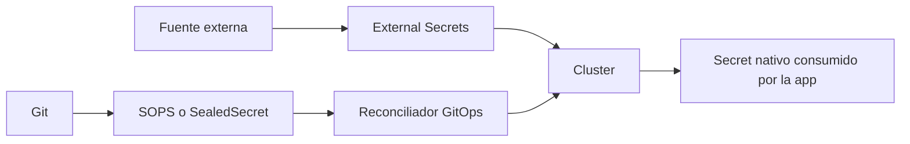

# SOPS, Sealed Secrets y GitOps seguro

Ya hemos visto dos ideas importantes del curso:

- GitOps quiere que el estado deseado viva en Git
- los secretos no deberian vivir en texto plano en ese mismo repositorio

El problema aparece justo ahi:

- como versionar secretos sin publicarlos en claro
- como reconciliarlos sin que el controlador de GitOps vea mas de la cuenta
- cuando usar cifrado en Git y cuando usar sincronizacion desde fuera

## Que problema resuelve este bloque

Cuando un equipo adopta GitOps, suele caer en uno de estos errores:

- guardar `Secret` en claro en el repo
- usar plugins que inyectan secretos demasiado pronto
- mezclar todas las estrategias sin saber que riesgo resuelve cada una

Este modulo ordena ese mapa.

## Mapa conceptual



## La recomendacion importante

La documentacion oficial de Argo CD distingue dos formas generales de gestionar secretos en GitOps:

- poblar secretos en el cluster de destino
- inyectarlos durante la generacion de manifests

Y hace una recomendacion muy clara:

- preferir gestion en el cluster de destino

La razon es sencilla:

- Argo CD no necesita ver el secreto en claro
- se reduce el riesgo de fuga
- las rotaciones quedan menos acopladas al sync de una app

Eso encaja muy bien con dos patrones del curso:

- `External Secrets`
- `Sealed Secrets`

## Donde encaja `SOPS`

`SOPS` tambien permite guardar secretos cifrados en Git, pero el modelo cambia segun la herramienta que reconcilia.

Con Flux, la documentacion oficial explica que Flux puede descifrar secretos bajo demanda justo antes de aplicarlos.

Eso significa:

- el repositorio guarda ciphertext
- el cluster o el reconciliador dispone de la clave de descifrado
- los workloads siguen consumiendo `Secret` nativos

## `SOPS`: idea base

Segun la documentacion oficial de SOPS:

- permite cifrar ficheros YAML, JSON y otros formatos
- soporta `age`, PGP y varios KMS cloud
- recomienda `age` por encima de PGP cuando sea posible

La idea practica es:

1. escribes un `Secret` normal
2. lo cifras con `SOPS`
3. Git almacena la version cifrada
4. un reconciliador o un paso controlado lo descifra en el momento adecuado

## `Sealed Secrets`: idea base

La documentacion oficial de Sealed Secrets lo presenta con dos piezas:

- un controlador en cluster
- la utilidad cliente `kubeseal`

`kubeseal` usa criptografia asimetrica para cifrar un secreto de modo que:

- solo el controlador del cluster objetivo pueda descifrarlo

Eso tiene una consecuencia importante:

- un `SealedSecret` no es portable entre clusters arbitrarios
- esta ligado al certificado del controlador que lo va a abrir

## `External Secrets`: idea base

`External Secrets` resuelve otro problema:

- no quieres meter el valor cifrado en Git
- quieres que Git solo describa de donde vendra el secreto

En ese caso:

- Git guarda referencias
- el operador sincroniza el valor desde una fuente externa o compartida

## Elegir bien entre los tres

### Usa `SOPS` cuando

- tu flujo GitOps ya encaja bien con Flux
- quieres versionar el manifiesto cifrado en Git
- aceptas gestionar claves de descifrado o integrarte con KMS

### Usa `Sealed Secrets` cuando

- quieres un recurso Kubernetes cifrado en Git
- prefieres cifrado unidireccional para el cluster destino
- te encaja operar un controlador dedicado para abrir esos secretos

### Usa `External Secrets` cuando

- el valor real debe vivir fuera de Git
- ya tienes una fuente de verdad externa o compartida
- necesitas rotacion sin rehacer ciphertext en el repo

## Comparacion mental rapida

- `SOPS`: Git guarda secretos cifrados; alguien con la clave adecuada puede descifrarlos.
- `Sealed Secrets`: Git guarda secretos sellados para un cluster concreto.
- `External Secrets`: Git guarda referencias, no el secreto.

## Ejemplos del repositorio

Revisa:

- `examples/k8s/sops-demo/`
- `examples/k8s/sealed-secrets-demo/`
- `examples/k8s/external-secrets-demo/`

Los dos primeros ejemplos son didacticos y muestran forma y flujo.

Importante:

- los archivos cifrados del ejemplo son plantillas ilustrativas
- debes regenerarlos con tus propias claves o con el certificado real de tu cluster

## Flujo 1: `SOPS` con `age`

### Paso 1: preparar un `Secret` plano

Usa:

- `examples/k8s/sops-demo/secret-plain.example.yaml`

### Paso 2: crear o elegir un destinatario `age`

La documentacion oficial de SOPS explica que `age` es la opcion recomendada frente a PGP cuando sea posible.

### Paso 3: cifrar el manifiesto

Ejemplo orientativo:

```bash
export SOPS_AGE_RECIPIENTS="age1reemplaza-por-tu-clave-publica"
sops encrypt --age "$SOPS_AGE_RECIPIENTS" \
  examples/k8s/sops-demo/secret-plain.example.yaml \
  > examples/k8s/sops-demo/secret.enc.yaml
```

### Paso 4: verificar la forma del fichero

El repo incluye:

- `examples/k8s/sops-demo/secret.enc.example.yaml`

No es un secreto reutilizable tal cual.

Sirve para estudiar:

- donde viven los valores `ENC[...]`
- el bloque `sops:`
- que aspecto tiene un `Secret` cifrado antes de reconciliarlo

### Paso 5: descifrado controlado

En local, para comprobarlo:

```bash
sops -d examples/k8s/sops-demo/secret.enc.yaml | kubectl apply -f -
```

Con Flux, la idea es que el reconciliador haga ese descifrado en el cluster segun su configuracion y su clave.

## Flujo 2: `Sealed Secrets`

### Paso 1: instalar el controlador

Sigue las instrucciones de la release oficial del proyecto y comprueba que el controlador esta listo.

### Paso 2: obtener el certificado publico

La documentacion oficial de Sealed Secrets explica dos rutas:

- `kubeseal` puede pedirlo al controlador en tiempo real
- o puedes guardarlo offline con `kubeseal --fetch-cert`

Ejemplo:

```bash
kubeseal --fetch-cert > sealed-secrets.cert
```

### Paso 3: sellar un `Secret`

Usa:

- `examples/k8s/sealed-secrets-demo/secret-plain.example.yaml`

Ejemplo orientativo:

```bash
kubeseal --cert sealed-secrets.cert -o yaml \
  < examples/k8s/sealed-secrets-demo/secret-plain.example.yaml \
  > examples/k8s/sealed-secrets-demo/sealedsecret.yaml
```

### Paso 4: estudiar la forma del recurso

El repo incluye:

- `examples/k8s/sealed-secrets-demo/sealedsecret.example.yaml`

Sirve para ver:

- `apiVersion: bitnami.com/v1alpha1`
- `kind: SealedSecret`
- `encryptedData`
- `template`

## Que aporta Flux aqui

La documentacion de Flux sobre secretos distingue varias estrategias y explica dos ideas utiles:

- los operadores de descifrado como Sealed Secrets encajan bien con GitOps
- Flux tambien puede descifrar `SOPS` sin controladores adicionales

Eso deja una comparativa muy clara:

- `SOPS` con Flux reduce controladores extra
- `Sealed Secrets` introduce un controlador especifico pero mantiene el secreto sellado para el cluster

## Que aporta Argo CD aqui

La documentacion oficial de Argo CD insiste en que la gestion de secretos en el cluster de destino tiene ventajas fuertes:

- mejor seguridad
- menor acoplamiento entre rotacion de secretos y sync de aplicaciones

Por eso, en un stack con Argo CD, la ruta mas natural del curso es:

- `Sealed Secrets`
- `External Secrets`

y no tanto plugins que inyecten secretos durante render.

## Errores frecuentes

### Pensar que `SOPS` y `Sealed Secrets` hacen lo mismo

No exactamente.

- `SOPS` cifra archivos
- `Sealed Secrets` sella secretos para un cluster concreto

### Poner la clave de descifrado junto al ciphertext

La documentacion de seguridad de Flux lo advierte de forma muy sensata:

- no co-localices ciphertext y claves que permitan escalar privilegios

### Intentar reutilizar un `SealedSecret` en otro cluster

No funcionara si el certificado del controlador es distinto.

### Usar plugins de generacion en Argo CD sin entender el riesgo

Argo CD avisa de que los manifests generados con secretos inyectados pueden quedar en claro en caches internas como Redis.

## Que aprender de este bloque

Al terminar deberias poder:

- distinguir `SOPS`, `Sealed Secrets` y `External Secrets`
- explicar por que Argo CD recomienda poblar secretos en el cluster destino
- justificar cuando Flux + `SOPS` simplifica el stack
- saber por que un `SealedSecret` esta ligado al cluster que lo abre

## Conexiones importantes

- [External Secrets y Secret Stores](30-external-secrets-y-secret-stores.md)
- [GitOps: Argo CD y Flux](21-gitops-intro-argocd-y-flux.md)
- [Seguridad aplicada y hardening](17-seguridad-aplicada-y-hardening.md)
- [Supply chain, Trivy, SBOM y firma](33-supply-chain-trivy-sbom-y-firma.md)

## Lecturas oficiales

- [SOPS docs](https://getsops.io/docs/)
- [Flux: Manage Kubernetes secrets with SOPS](https://fluxcd.io/flux/guides/mozilla-sops/)
- [Flux: Secrets Management](https://fluxcd.io/flux/security/secrets-management/)
- [Argo CD: Secret Management](https://argo-cd.readthedocs.io/en/stable/operator-manual/secret-management/)
- [Bitnami Sealed Secrets](https://github.com/bitnami/sealed-secrets)
