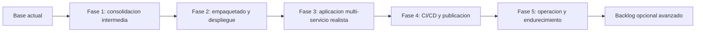
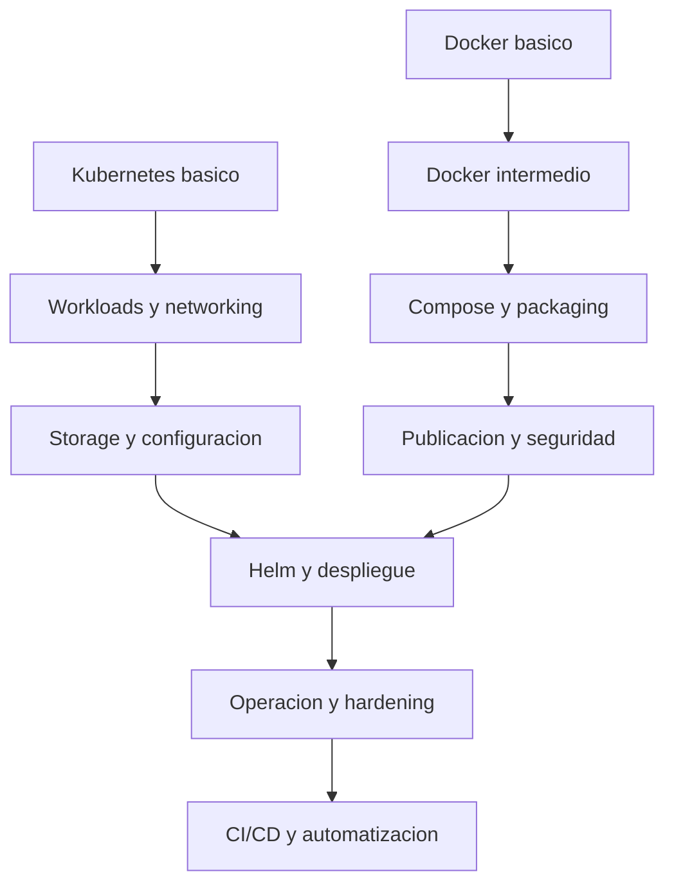
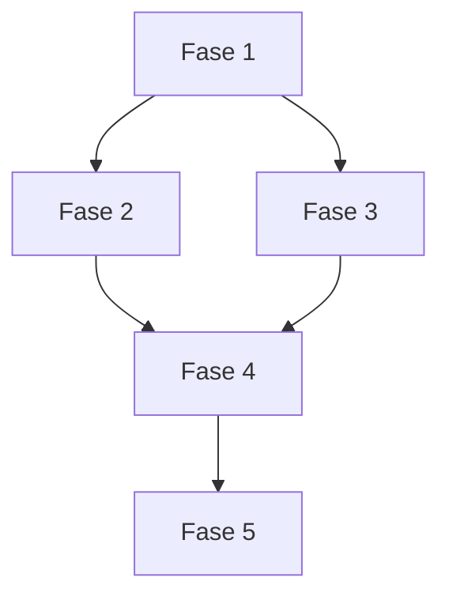
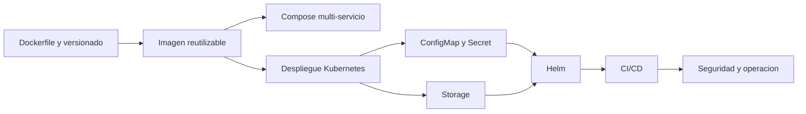

# Plan de expansión

Este documento convierte las ideas pendientes del repositorio en una hoja de ruta mucho más detallada. La intención no es solo listar temas futuros, sino definir cómo crecer el curso de forma pedagógica, técnica y operativamente coherente.

## Propósito del plan

Este plan existe para resolver cinco necesidades concretas:

- Priorizar qué contenido aporta más valor en cada etapa.
- Evitar que el curso crezca de forma desordenada.
- Conectar teoría, ejemplos y validación práctica.
- Mantener una experiencia consistente para quien estudia el repositorio.
- Definir un estándar de calidad para nuevos módulos, laboratorios y automatizaciones.

## Visión del repositorio

La visión de largo plazo es que este repositorio evolucione desde un tutorial introductorio hacia un curso práctico, progresivo y reutilizable sobre:

- Docker como herramienta de empaquetado, ejecución y desarrollo local.
- Kubernetes como plataforma declarativa para despliegue y operación.
- Flujos reales de ingeniería: versionado, CI/CD, observabilidad y seguridad.
- Materiales auxiliares que ayuden a experimentar, verificar y automatizar.

## Resultado esperado

Si el plan se ejecuta bien, el repositorio debería permitir tres recorridos distintos:

1. Un recorrido rápido para entender conceptos y completar laboratorios básicos.
2. Un recorrido intermedio para desplegar aplicaciones reales en local.
3. Un recorrido avanzado para acercarse a prácticas de plataforma y operación.

## Alcance

### Sí entra en el alcance

- Documentación progresiva.
- Ejemplos locales ejecutables.
- Tutoriales paso a paso.
- Manifiestos y charts.
- Notebooks de apoyo.
- Automatización mínima de validación.
- Checklists operativas y de seguridad.

### No entra por ahora

- Producción cloud específica de un proveedor.
- Infraestructura compleja con Terraform o Pulumi como eje principal.
- Operación multi-cluster avanzada.
- Certificaciones oficiales o preparación de examen.
- Service Mesh completo como bloque central.

## Estado actual del repositorio

Hoy el repositorio ya tiene:

- Temario base de Docker y Kubernetes.
- Tutorial detallado de Docker.
- Tutorial detallado de Kubernetes.
- Ejemplos de `nginx`, API Python, Docker Compose, ConfigMap, Secret, Ingress, Job y CronJob.
- Un proyecto multiservicio con frontend, API y Redis en Compose y en Kubernetes.
- Notebooks de utilidades.
- Diagramas Mermaid en módulos clave.
- Una bitácora, changelog y una primera estructura de roadmap.

## Inventario actual por categoría

### Documentación

- Fundamentos de Docker.
- Fundamentos de Kubernetes.
- Módulos intermedios sobre arquitectura, redes, storage y troubleshooting.
- Tutoriales guiados de Docker y Kubernetes.

### Ejemplos Docker

- `fullstack-demo`
- `hola-nginx`
- `python-api`
- `compose-web-api`

### Ejemplos Kubernetes

- `fullstack-demo`
- `hola-nginx`
- `python-api`
- `configmap-secret`
- `ingress-demo`
- `job-cronjob`

### Utilidades

- Generador simple de Dockerfiles.
- Generador simple de manifiestos Kubernetes.
- Planificador simple de recursos.

## Perfiles de usuario del curso

### Perfil A: desarrollador que empieza

Necesita:

- entender imágenes y contenedores
- ejecutar un servicio local
- construir un `Dockerfile`
- desplegar algo pequeño en Kubernetes

### Perfil B: desarrollador con Docker que quiere Kubernetes

Necesita:

- conectar el modelo mental Docker -> Kubernetes
- entender `Deployment`, `Service`, `ConfigMap`, `Secret` e `Ingress`
- depurar pods y rollouts

### Perfil C: perfil más cercano a plataforma

Necesita:

- storage
- empaquetado con Helm
- CI/CD
- validación y troubleshooting
- seguridad básica y hardening

## Principios de diseño del curso

### 1. Continuidad pedagógica

Cada bloque debe tener un puente claro desde el bloque anterior. El alumno no debería sentir que cambia de nivel o de abstracción sin preparación suficiente.

### 2. Equilibrio entre explicación y ejecución

Todo concepto importante debería estar reforzado por al menos una de estas piezas:

- un ejemplo
- un ejercicio
- una verificación
- un diagrama

### 3. Reutilización de activos

Siempre que sea posible:

- la misma aplicación debe reaparecer en más de un contexto
- un ejemplo Docker debe evolucionar a Compose y luego a Kubernetes
- un notebook debe apoyar contenido ya existente, no duplicarlo sin necesidad

### 4. Progresión por capas

El repositorio debe poder recorrerse en capas:

- capa básica
- capa intermedia
- capa operativa

### 5. Orientación a diagnóstico

No basta con mostrar “cómo funciona”; el curso debe enseñar qué revisar cuando no funciona.

### 6. Portabilidad

Los laboratorios deberían poder ejecutarse en local con el mínimo posible de dependencias adicionales.

## Estándar de calidad para cada módulo

Un módulo nuevo se considera de buena calidad cuando incluye la mayoría de estos elementos:

- objetivo de aprendizaje
- contexto o motivación
- explicación conceptual
- comandos o YAML relevantes
- ejemplo reutilizable
- pasos de validación
- errores frecuentes
- enlaces al resto del temario
- diagrama Mermaid si la arquitectura lo justifica

## Plantilla recomendada para futuros módulos

Cada módulo nuevo debería seguir una estructura parecida a esta:

1. Qué problema resuelve
2. Conceptos principales
3. Ejemplo mínimo
4. Ejemplo del repositorio
5. Verificación
6. Errores frecuentes
7. Ejercicios sugeridos
8. Siguiente paso

## Plantilla recomendada para futuros ejemplos

Cada directorio de ejemplo debería tender a incluir:

- `README.md`
- archivos de build o manifiestos
- comandos de ejecución
- endpoint o prueba visible
- sección de troubleshooting mínimo

## Mapa general del crecimiento

## Mapa de capacidades objetivo

## Prioridades estratégicas

Orden recomendado de crecimiento:

1. Completar piezas intermedias que ya aparecen insinuadas en el curso.
2. Añadir un puente fuerte entre ejemplos simples y una aplicación multi-servicio realista.
3. Incorporar Helm como capa natural de empaquetado.
4. Añadir CI/CD para validar y publicar.
5. Cerrar con seguridad, operación y endurecimiento.

## Secuencia pedagógica recomendada

La expansión debería respetar esta secuencia:

1. Primero consolidar el lenguaje común del alumno.
2. Luego hacer que los ejemplos sean más reales.
3. Después enseñar empaquetado y despliegue repetible.
4. Más tarde automatizar.
5. Finalmente endurecer y operar.

## Fase 1: consolidación intermedia

Esta fase completa los huecos más evidentes del material actual.

### Objetivo pedagógico

Hacer que el curso cubra bien el salto entre “hola mundo” y “primer caso real” sin exigir todavía un ecosistema demasiado grande.

### Preguntas que esta fase debe responder

- Qué problema resuelve Helm frente a YAML suelto.
- Cómo persistir datos en Kubernetes.
- Qué diferencia hay entre `readiness`, `liveness` y `startup`.
- Cómo influyen `requests` y `limits` en scheduling y estabilidad.
- Cómo organizar mejor config, secretos y recursos.

### Entregables documentales

- Módulo de Helm y plantillas.
- Módulo práctico de `PersistentVolumeClaim` y almacenamiento.
- Laboratorio de probes, `requests`, `limits` y debugging.
- Profundización en redes y persistencia en Docker con ejercicios extra.
- Ampliación de notebooks para generar `ConfigMap`, `Secret` y `PVC`.

### Entregables técnicos

- Un chart mínimo de Helm.
- Un ejemplo de PVC con volumen montado.
- Un laboratorio con una probe correcta y otra rota a propósito.
- Un ejemplo con recursos insuficientes para mostrar causas de `Pending`.

### Archivos o áreas a añadir

- `docs/kubernetes/09-helm-y-plantillas.md`
- `docs/kubernetes/10-storage-pv-pvc.md`
- `docs/kubernetes/11-probes-recursos-y-scheduling.md`
- `examples/k8s/storage-demo/`
- `examples/k8s/helm-demo/`
- `examples/k8s/probes-demo/`
- `notebooks/04_generador_configmaps_y_secrets.ipynb`
- `notebooks/05_generador_pvc_y_resources.ipynb`

### Ejemplos mínimos previstos

#### `storage-demo`

Debe mostrar:

- un `PVC`
- un `Deployment` que monta `/data`
- un flujo básico para escribir y comprobar persistencia

#### `helm-demo`

Debe mostrar:

- `Chart.yaml`
- `values.yaml`
- plantilla de `Deployment`
- plantilla de `Service`
- override simple de imagen y réplicas

#### `probes-demo`

Debe mostrar:

- `readinessProbe`
- `livenessProbe`
- un ejemplo que falle
- comandos para observar efectos

### Riesgos de esta fase

- Introducir Helm demasiado pronto y confundir al perfil básico.
- Explicar storage sin un caso visible de persistencia.
- Hablar de `requests` y `limits` de forma demasiado abstracta.

### Mitigaciones

- Mantener Helm primero como una capa sencilla de parametrización.
- Asociar storage a un ejemplo visible, no solo a definiciones.
- Mostrar fallos observables con `kubectl describe`, `events` y `logs`.

### Criterios de aceptación

- Existe al menos un ejemplo funcional de almacenamiento persistente.
- Existe una introducción clara a Helm con chart mínimo.
- El alumno puede identificar la diferencia entre `readiness`, `liveness` y `startup`.
- El curso ya cubre recursos básicos y motivos comunes de `Pending`.
- Cada módulo nuevo trae al menos una verificación reproducible.

## Fase 2: empaquetado y despliegue

Esta fase organiza mejor la transición entre desarrollo local y despliegue repetible.

### Objetivo pedagógico

Pasar de manifiestos aislados a despliegues empaquetados, parametrizables y versionables.

### Preguntas que esta fase debe responder

- Cómo cambiar versiones por entorno sin tocar muchos archivos.
- Cómo organizar `values` y overrides.
- Cómo versionar imágenes y charts.
- Cómo explicar la diferencia entre empaquetar y desplegar.

### Entregables documentales

- Tutorial de Helm paso a paso.
- Ejemplo de valores por entorno.
- Introducción a estrategias de release.
- Sección de versionado de imágenes y tags.
- Flujo de publicación hacia registry.

### Entregables técnicos

- Chart para `python-api`.
- Chart para demo multi-servicio.
- Archivos `values-dev.yaml` y `values-demo.yaml`.
- Ejemplo de tag versionado y actualización de chart.

### Archivos o áreas a añadir

- `docs/kubernetes/12-helm-tutorial-paso-a-paso.md`
- `docs/docker/08-versionado-y-publicacion.md`
- `examples/helm/python-api/`
- `examples/helm/multi-service-demo/`

### Riesgos de esta fase

- Duplicar demasiada lógica entre YAML y Helm.
- Meter demasiadas features de Helm antes de dominar lo básico.
- Explicar versionado solo conceptualmente y no con etiquetas reales.

### Mitigaciones

- Empezar con un chart pequeño y explícito.
- Mostrar qué partes cambian entre manifiestos y chart.
- Mantener plantillas simples y fáciles de leer.

### Criterios de aceptación

- Un ejemplo actual del curso puede desplegarse con manifiestos o con Helm.
- Existe documentación clara para cambiar la versión de imagen sin editar múltiples archivos manualmente.
- El alumno entiende cómo pasar de entorno local a un entorno compartido.
- Los charts incluyen al menos `Deployment`, `Service` y overrides de imagen.

## Fase 3: aplicación multi-servicio realista

Esta es probablemente la fase con más impacto didáctico.

### Objetivo pedagógico

Construir una aplicación de referencia que conecte casi todas las piezas del curso.

### Propuesta de stack

- `frontend` sencillo
- `api` Python
- `redis` o `postgres`
- `nginx` o `Ingress` como entrada

### Preguntas que esta fase debe responder

- Cómo cambia el mismo sistema entre Docker Compose y Kubernetes.
- Qué configuración vive en la imagen y cuál fuera.
- Cómo montar persistencia y networking en ambos entornos.
- Qué significa “misma app, dos formas de orquestación”.

### Entregables documentales

- Documento principal del proyecto multi-servicio.
- Guía comparativa Compose vs Kubernetes.
- Guía de validación de endpoints.
- Guía de troubleshooting por capas: frontend, API, storage y networking.

### Entregables técnicos

- Ejemplo multi-servicio en Docker Compose.
- Versión equivalente en Kubernetes.
- Configuración externa con `ConfigMap` y `Secret`.
- Persistencia real con `PVC`.
- Diagrama Mermaid de arquitectura end-to-end.

### Archivos o áreas a añadir

- `examples/docker/fullstack-demo/`
- `examples/k8s/fullstack-demo/`
- `docs/04-proyecto-multiservicio.md`

### Subcomponentes deseados

#### Frontend

- interfaz mínima
- consumo de API
- configuración de endpoint

#### API

- endpoints de salud
- endpoint funcional real
- variables de entorno

#### Base o caché

- datos persistentes o efímeros
- configuración de conexión

#### Capa de entrada

- proxy local con `nginx`
- `Service` e `Ingress` en Kubernetes

### Riesgos de esta fase

- Que el ejemplo se vuelva demasiado grande para perfiles básicos.
- Que Docker Compose y Kubernetes diverjan demasiado y cueste compararlos.
- Que la complejidad de una base de datos opaque el aprendizaje principal.

### Mitigaciones

- Mantener el stack pequeño y con propósito didáctico.
- Elegir una sola aplicación de referencia y reutilizarla en todas partes.
- Separar claramente modo básico y modo ampliado.

### Criterios de aceptación

- El mismo sistema se puede ejecutar con Compose y con Kubernetes.
- La documentación explica claramente qué cambia entre ambos modelos.
- Hay un flujo de verificación con endpoints y pasos de depuración.
- Existe un diagrama claro de arquitectura end-to-end.

## Fase 4: CI/CD y publicación

Aquí el curso empieza a parecerse a un flujo de equipo real.

### Objetivo pedagógico

Enseñar cómo automatizar builds, validaciones y despliegues sin convertir el curso en una guía abstracta de DevOps.

### Preguntas que esta fase debe responder

- Qué se valida automáticamente y por qué.
- Cómo construir imágenes de forma reproducible.
- Cómo revisar YAML y charts en CI.
- Cómo conectar repositorio, registry y despliegue.

### Entregables documentales

- Introducción a CI/CD.
- Tutorial de GitHub Actions para contenedores.
- Guía de validación de YAML.
- Guía de validación de charts.
- Sección de publicación de imágenes.

### Entregables técnicos

- Pipeline de CI para lint y validación básica.
- Build automático de imágenes.
- Validación de YAML y charts.
- Publicación de imágenes versionadas.
- Introducción a despliegue automatizado.

### Archivos o áreas a añadir

- `.github/workflows/ci.yml`
- `.github/workflows/docker-build.yml`
- `.github/workflows/k8s-validate.yml`
- `docs/ci-cd/01-introduccion-ci-cd.md`
- `docs/ci-cd/02-github-actions-para-contenedores.md`
- `docs/ci-cd/03-validacion-de-yaml-y-charts.md`

### Validaciones mínimas deseadas

- chequeo de sintaxis YAML
- validación estructural de notebooks JSON
- validación de `docker-compose config`
- build de ejemplo principal Docker
- render de charts con `helm template`

### Riesgos de esta fase

- Añadir automatización antes de tener ejemplos suficientemente estables.
- Hacer flujos demasiado dependientes de herramientas externas no documentadas.
- Complicar el repositorio con CI redundante o frágil.

### Mitigaciones

- Empezar con validaciones pequeñas y confiables.
- Reutilizar scripts o comandos documentados en el curso.
- Mantener los workflows explicables por alguien que también está aprendiendo.

### Criterios de aceptación

- Cada ejemplo principal tiene al menos validación automatizada mínima.
- El curso ya muestra un flujo reproducible de build y release.
- El alumno entiende el puente entre repositorio, registry y plataforma de despliegue.
- Existen workflows legibles y comentados.

## Fase 5: operación, seguridad y endurecimiento

Esta fase convierte el material en un recurso útil también para perfiles más cercanos a plataforma.

### Objetivo pedagógico

Cubrir prácticas razonables de operación, observabilidad y seguridad sin volver el material innecesariamente especializado.

### Preguntas que esta fase debe responder

- Qué riesgos comunes aparecen en imágenes y manifiestos.
- Cómo segmentar tráfico básico entre workloads.
- Cómo reducir privilegios.
- Cómo pensar logs, métricas y troubleshooting operativo.

### Entregables documentales

- Módulo de seguridad en contenedores.
- Módulo de `NetworkPolicy`.
- Módulo de service accounts y permisos mínimos.
- Módulo de logs, métricas y troubleshooting más avanzado.
- Checklists de hardening para Docker y Kubernetes.

### Entregables técnicos

- Ejemplo de `NetworkPolicy`.
- Ejemplo mínimo de RBAC y service account.
- Imagen ejecutando con menor privilegio.
- Guía de diagnóstico operativo con comandos.

### Archivos o áreas a añadir

- `docs/docker/09-seguridad-de-contenedores.md`
- `docs/kubernetes/13-network-policies-y-rbac.md`
- `docs/kubernetes/14-observabilidad-operativa.md`
- `examples/k8s/network-policy-demo/`
- `examples/k8s/rbac-demo/`

### Riesgos de esta fase

- Que seguridad y RBAC se expliquen demasiado abstractamente.
- Que el material dependa de capacidades no disponibles en todos los clústeres locales.
- Que el nivel técnico suba demasiado de golpe.

### Mitigaciones

- Usar ejemplos pequeños y observables.
- Marcar explícitamente qué partes son opcionales según el entorno.
- Mantener un “camino básico” y uno “camino ampliado”.

### Criterios de aceptación

- Existe una guía de revisión de seguridad básica para imágenes y manifiestos.
- El alumno ya puede identificar riesgos comunes de privilegios y exposición.
- El curso cubre al menos una estrategia simple de segmentación de red.
- Existe una sección clara de hardening mínimo.

## Backlog complementario

Estos elementos no son prioridad máxima, pero pueden aportar mucho valor después:

- GitOps introductorio
- Argo CD o Flux como apéndice
- Autoscaling con `HPA`
- StatefulSets con base de datos o broker
- Ingress avanzado con TLS
- Service Mesh como sección opcional
- Troubleshooting cookbook con casos reales
- Observabilidad con Prometheus y Grafana como bloque opcional
- Policies con OPA Gatekeeper o Kyverno como contenido avanzado

## Dependencias entre fases

## Dependencias internas entre temas

## Plan de implementación por sprints

### Sprint 1

- Helm básico.
- PVC y almacenamiento.
- Probes y recursos.
- Notebook para `ConfigMap`, `Secret` y `PVC`.

### Sprint 2

- Ejemplo multi-servicio Compose.
- Ejemplo multi-servicio Kubernetes.
- Diagramas y documentación comparativa.
- Guía de endpoints y verificación.

### Sprint 3

- Versionado de imágenes.
- Registry y publicación.
- Chart para `python-api`.
- Tutorial de Helm paso a paso.

### Sprint 4

- CI mínima.
- Validación de YAML.
- Validación de notebooks.
- Render de charts.

### Sprint 5

- Seguridad de contenedores.
- RBAC básico.
- NetworkPolicy.
- Hardening básico.

### Sprint 6

- Observabilidad operativa.
- Cookbook de troubleshooting.
- Consolidación de índices, enlaces y diagramas.

## Plan de ejecución detallado para la Fase 1

Como la Fase 1 es la siguiente acción recomendada, conviene desglosarla más:

### Bloque 1: Helm básico

Entregables:

- documento introductorio
- chart mínimo
- ejemplo de render
- ejemplo de override

Pasos:

1. Crear el chart base.
2. Parametrizar imagen, tag y replicas.
3. Documentar `helm template` y `helm install`.
4. Conectar el chart con `python-api`.

### Bloque 2: Storage

Entregables:

- documento de `PV` y `PVC`
- ejemplo de PVC
- demo de persistencia visible

Pasos:

1. Crear `storage-demo`.
2. Montar volumen en `/data`.
3. Escribir archivo desde la app o contenedor.
4. Reaplicar y verificar persistencia.

### Bloque 3: Probes y recursos

Entregables:

- laboratorio con probe correcta
- laboratorio con probe incorrecta
- ejemplo con `requests` y `limits`

Pasos:

1. Reutilizar `python-api`.
2. Añadir variantes buenas y malas.
3. Documentar `describe`, `events` y `logs`.
4. Explicar por qué un pod entra en `CrashLoopBackOff` o no queda `Ready`.

## Roadmap de documentación

Además de crear contenido nuevo, conviene mantener una disciplina editorial.

### Objetivos editoriales

- Evitar duplicación innecesaria.
- Mantener rutas de aprendizaje claras.
- No dejar ejemplos sin documentación o documentos sin ejemplo.

### Reglas recomendadas

- Cada nuevo documento debe enlazar al siguiente paso lógico.
- Cada ejemplo nuevo debe tener un `README.md`.
- Cada bloque grande debe tener al menos un diagrama si la arquitectura no es trivial.
- Si un tema se vuelve avanzado, marcarlo explícitamente como intermedio o ampliado.

## Roadmap de ejemplos

Los ejemplos no deben crecer de forma arbitraria. La progresión sugerida es:

1. `hola-nginx`
2. `python-api`
3. `compose-web-api`
4. `fullstack-demo`
5. `python-api` en Kubernetes
6. `configmap-secret`
7. `storage-demo`
8. `helm-demo`

## Roadmap de notebooks

Los notebooks deberían evolucionar desde generadores simples hacia utilidades que apoyen decisiones reales.

### Línea propuesta

1. Generador de Dockerfile
2. Generador de Deployment/Service
3. Planificador de recursos
4. Generador de ConfigMap/Secret
5. Generador de PVC y recursos
6. Comparador de `values` por entorno
7. Estimador de capacidad multi-servicio

## Roadmap de diagramas Mermaid

Los diagramas deberían cubrir al menos estos espacios:

- build y runtime de Docker
- topología de Compose
- arquitectura del cluster
- flujo de tráfico `Service` -> `Pod`
- Ingress
- storage
- Helm render -> release
- pipeline CI/CD
- arquitectura del proyecto multi-servicio

## Malla temática futura de Docker

Además del contenido ya existente, el bloque Docker puede crecer en estos temas concretos.

### Línea D-08: versionado y publicación de imágenes

Subtemas sugeridos:

- tagging semántico
- política de `latest`
- registries públicos y privados
- `docker login`, `tag` y `push`
- trazabilidad entre commit, tag e imagen
- convenciones de nombres por entorno

Resultado esperado:

- el alumno puede publicar una imagen sin confundir versión local, tag y release

### Línea D-09: builds más eficientes

Subtemas sugeridos:

- multi-stage builds
- orden de capas y caché
- `.dockerignore`
- reducción de tamaño de imagen
- separación entre dependencias de build y runtime

Resultado esperado:

- el alumno entiende cómo hacer builds más pequeñas y rápidas

### Línea D-10: ejecución avanzada y debugging

Subtemas sugeridos:

- `docker exec`
- `docker inspect`
- logs y procesos
- señales y PID 1
- puertos ya ocupados
- diferencias entre errores de build y errores de runtime

Resultado esperado:

- el alumno puede investigar por qué un contenedor arranca y se cae

### Línea D-11: redes y comunicación entre servicios

Subtemas sugeridos:

- bridge network
- DNS interno
- alias de servicios
- tráfico host -> contenedor
- tráfico contenedor -> contenedor
- problemas típicos con `localhost`

Resultado esperado:

- el alumno puede diseñar una topología simple multi-servicio en local

### Línea D-12: persistencia y manejo de datos

Subtemas sugeridos:

- volúmenes Docker
- bind mounts
- diferencias de portabilidad
- persistencia para bases de datos
- backups simples y prácticas de limpieza

Resultado esperado:

- el alumno sabe cuándo usar bind mount y cuándo usar volumen gestionado

### Línea D-13: seguridad básica en contenedores

Subtemas sugeridos:

- no usar root si no hace falta
- minimizar imagen base
- no almacenar secretos en la imagen
- dependencia de imágenes confiables
- revisión de superficie de ataque

Resultado esperado:

- el alumno puede revisar un Dockerfile con criterios básicos de seguridad

## Malla temática futura de Kubernetes

El bloque Kubernetes puede crecer de forma mucho más granular.

### Línea K-09: Helm y empaquetado

Subtemas sugeridos:

- estructura de chart
- `values.yaml`
- templates
- `helm template`
- instalación y actualización
- organización por entornos

Resultado esperado:

- el alumno puede empaquetar un deployment simple con Helm

### Línea K-10: storage y persistencia

Subtemas sugeridos:

- `PersistentVolume`
- `PersistentVolumeClaim`
- `StorageClass`
- `emptyDir`
- diferencias entre datos efímeros y persistentes
- limitaciones de clústeres locales

Resultado esperado:

- el alumno puede distinguir claramente qué datos sobreviven y cuáles no

### Línea K-11: probes, recursos y scheduling

Subtemas sugeridos:

- `readinessProbe`
- `livenessProbe`
- `startupProbe`
- `requests`
- `limits`
- lectura de errores `Pending`

Resultado esperado:

- el alumno puede explicar por qué un pod existe pero no está listo

### Línea K-12: networking ampliado

Subtemas sugeridos:

- `ClusterIP`
- `NodePort`
- `LoadBalancer`
- `Ingress`
- resolución DNS
- `port-forward`
- endpoints y selectores

Resultado esperado:

- el alumno puede seguir el tráfico desde cliente hasta pod

### Línea K-13: workloads más allá de Deployment

Subtemas sugeridos:

- `StatefulSet`
- `DaemonSet`
- `Job`
- `CronJob`
- cuándo usar cada uno
- implicaciones sobre identidad, duración y persistencia

Resultado esperado:

- el alumno puede elegir el tipo de workload correcto para cada caso

### Línea K-14: seguridad y permisos

Subtemas sugeridos:

- service accounts
- permisos mínimos
- RBAC básico
- imágenes seguras
- separación por namespace
- segmentación con `NetworkPolicy`

Resultado esperado:

- el alumno puede detectar sobrepermisos obvios y reducir exposición

### Línea K-15: operación y observabilidad

Subtemas sugeridos:

- `logs`
- `describe`
- `events`
- `rollout status`
- métricas básicas
- troubleshooting por síntomas

Resultado esperado:

- el alumno puede seguir un procedimiento razonable de diagnóstico

### Línea K-16: patrones de plataforma

Subtemas sugeridos:

- autoscaling
- GitOps introductorio
- validación de manifiestos
- políticas
- despliegues por entorno

Resultado esperado:

- el alumno entiende hacia dónde escala Kubernetes en equipos reales

## Banco de laboratorios propuestos

Para ampliar realmente el contenido, conviene definir laboratorios pequeños y medianos, no solo documentos nuevos.

### Laboratorios Docker básicos

1. Construcción de `hola-nginx`.
2. Cambio de HTML y observación de la caché.
3. Ejecución de `python-api`.
4. Variables de entorno y cambio de puerto.
5. Persistencia con volumen gestionado.

### Laboratorios Docker intermedios

1. Compose con API + `nginx`.
2. Compose con API + caché.
3. Multi-stage build para frontend estático.
4. Comparación de tamaños de imagen.
5. Revisión de un Dockerfile inseguro y corrección.

### Laboratorios Kubernetes básicos

1. `hola-nginx` con `Deployment` y `Service`.
2. `python-api` con probes.
3. ConfigMap y Secret.
4. Job y CronJob.
5. Ingress básico.

### Laboratorios Kubernetes intermedios

1. PVC con almacenamiento visible.
2. Probe rota y corrección.
3. Selector roto de `Service` y corrección.
4. Chart mínimo de Helm.
5. Rollout y rollback de una imagen.

### Laboratorios Kubernetes ampliados

1. Fullstack demo en Kubernetes.
2. `NetworkPolicy` con acceso restringido.
3. RBAC mínimo con service account dedicada.
4. Recursos insuficientes y análisis de scheduling.
5. Validación de chart y despliegue por valores.

## Banco de ejercicios por nivel

### Nivel 1

- cambiar puertos
- añadir variables de entorno
- escalar réplicas
- modificar contenido de respuesta

### Nivel 2

- romper un manifiesto y depurarlo
- parametrizar un deployment
- reusar la misma imagen en Docker y Kubernetes
- comparar Compose y `Service`

### Nivel 3

- empaquetar con Helm
- introducir persistencia
- diseñar una política de red simple
- versionar una imagen y desplegarla

## Ruta sugerida por semanas

Si se quiere usar este repositorio como curso intensivo, esta es una ruta razonable.

### Semana 1

- introducción general
- fundamentos de Docker
- arquitectura y CLI
- primer ejemplo con `nginx`

### Semana 2

- Dockerfiles
- API Python
- volúmenes y redes
- Docker Compose

### Semana 3

- fundamentos de Kubernetes
- arquitectura del clúster
- `Deployment`, `Service` y `port-forward`

### Semana 4

- `ConfigMap`, `Secret` y `Ingress`
- Jobs y CronJobs
- tutorial detallado de Kubernetes

### Semana 5

- Helm
- storage
- probes y recursos

### Semana 6

- aplicación multi-servicio
- CI/CD mínima
- seguridad y troubleshooting ampliado

## Ruta sugerida por tipo de alumno

### Ruta rápida

- `00-introduccion`
- `01-docker-fundamentos`
- `07-tutorial-docker-paso-a-paso`
- `02-kubernetes-fundamentos`
- `08-tutorial-kubernetes-paso-a-paso`

### Ruta de desarrollo backend

- bloque Docker completo
- `python-api`
- Compose
- `python-api` en Kubernetes
- `ConfigMap`, `Secret`, probes y recursos

### Ruta de plataforma inicial

- Kubernetes en profundidad
- storage
- Helm
- CI/CD
- seguridad y observabilidad

## Herramientas adicionales recomendadas

Estas herramientas no son obligatorias, pero pueden mejorar mucho la experiencia.

### Para Docker

- `dive`
- `lazydocker`
- `hadolint`

### Para Kubernetes

- `helm`
- `k9s`
- `stern`
- `kubectx` y `kubens`
- `kubeconform` o `kubeval`

### Para YAML y shell

- `jq`
- `yq`
- `make`

## Matriz tema -> ejemplo -> verificación

| Tema | Ejemplo base | Verificación mínima |
| --- | --- | --- |
| Dockerfile | `examples/docker/hola-nginx/` | `docker build` |
| API contenedorizada | `examples/docker/python-api/` | `curl /health` |
| Multi-servicio local | `examples/docker/compose-web-api/` | `docker-compose config` y `curl` |
| Deployment + Service | `examples/k8s/hola-nginx/` | `kubectl get pods,svc` |
| API con probes | `examples/k8s/python-api/` | `port-forward` y `curl /health` |
| ConfigMap + Secret | `examples/k8s/configmap-secret/` | `curl` al servicio expuesto |
| Ingress | `examples/k8s/ingress-demo/` | `kubectl get ingress` |
| Batch | `examples/k8s/job-cronjob/` | `kubectl logs job/...` |

## Matriz capacidad -> evidencia esperada

| Capacidad | Evidencia de aprendizaje |
| --- | --- |
| Diferenciar imagen y contenedor | Puede construir una imagen y lanzar varias instancias |
| Entender red local | Puede explicar por qué dos servicios hablan por nombre en Compose |
| Entender Service | Puede detectar un selector roto |
| Entender probes | Puede explicar por qué un pod no queda `Ready` |
| Entender persistencia | Puede justificar cuándo necesita `PVC` |
| Entender empaquetado | Puede usar `values.yaml` para cambiar despliegues |

## Estrategia de validación

Cada fase debería sumar validaciones automáticas o semiautomáticas.

### Validación documental

- enlaces actualizados
- diagramas Mermaid cerrados correctamente
- bloques de código completos

### Validación de ejemplos Docker

- `docker build`
- `docker-compose config`

### Validación de ejemplos Kubernetes

- parseo YAML
- `kubectl apply --dry-run=client` cuando el entorno lo permita
- `helm template` para charts

### Validación de notebooks

- JSON válido
- celdas con ejemplos consistentes con el resto del repo

## Riesgos globales del roadmap

### Riesgo 1: dispersión temática

Demasiados temas avanzados demasiado pronto pueden debilitar el hilo principal.

Mitigación:

- seguir la secuencia pedagógica
- no añadir bloques avanzados sin puente

### Riesgo 2: ejemplos difíciles de ejecutar

Si cada ejemplo requiere una preparación distinta, el repositorio pierde valor práctico.

Mitigación:

- priorizar laboratorios locales
- documentar requisitos con claridad
- añadir verificación simple

### Riesgo 3: documentación más rápida que el código

Es fácil prometer módulos que aún no tienen ejemplo o verificación.

Mitigación:

- mantener definición de “hecho”
- no dar por cerrado un bloque sin ejemplo funcional

### Riesgo 4: complejidad excesiva

Un curso demasiado ambicioso puede volverse menos útil para quien empieza.

Mitigación:

- separar ruta básica y ruta ampliada
- marcar el nivel de cada bloque

### Riesgo 5: exceso de contenido sin práctica

Un roadmap muy amplio puede producir muchos documentos pero poca experiencia real.

Mitigación:

- exigir ejemplo o laboratorio para cada bloque importante
- priorizar assets reutilizables frente a teoría aislada

### Riesgo 6: crecimiento editorial inconsistente

Si cada módulo se escribe con un estilo distinto, el curso pierde coherencia.

Mitigación:

- usar plantillas recurrentes
- revisar enlaces, verificación y troubleshooting en cada módulo

## Métricas de avance

Para saber si la expansión está funcionando, conviene medir cosas simples:

- Número de módulos con ejemplo ejecutable.
- Número de módulos con diagrama Mermaid.
- Número de tutoriales con pasos verificables.
- Cobertura del flujo Docker -> Compose -> Kubernetes -> CI/CD.
- Cantidad de laboratorios que pueden ejecutarse en local sin demasiada preparación extra.
- Número de ejemplos que reutilizan la misma aplicación base.
- Porcentaje de módulos con sección de troubleshooting.

## Métricas de calidad

Además del avance, conviene medir la calidad del material:

- coherencia entre documentación y ejemplos
- claridad del camino de aprendizaje
- facilidad de ejecución local
- facilidad de depuración
- densidad de contenido útil frente a relleno

## Definición de “hecho”

Un bloque del plan se considera realmente terminado cuando cumple todo esto:

1. Existe documentación clara.
2. Existe al menos un ejemplo funcional.
3. Hay comandos de prueba o verificación.
4. Hay errores frecuentes documentados.
5. El bloque está enlazado desde `README.md` o desde el temario.
6. El ejemplo tiene estructura mínima mantenible.
7. Si la arquitectura no es trivial, existe un diagrama.

## Definición de “listo para empezar”

Antes de arrancar un bloque nuevo conviene comprobar:

- qué ejemplos existentes reutilizará
- qué documentos enlazará
- qué validación mínima tendrá
- si requiere herramientas nuevas
- qué nivel de dificultad introduce

## Propuesta de hitos

### Hito M1

Curso base consolidado con storage, probes, recursos y Helm básico.

### Hito M2

Curso con despliegues empaquetados y versión del ejemplo principal en Helm.

### Hito M3

Aplicación multi-servicio completa funcionando en Compose y Kubernetes.

### Hito M4

CI/CD mínima validando ejemplos y documentación técnica principal.

### Hito M5

Módulos de seguridad, operación y segmentación básica completados.

## Entregables deseados por hito

### M1

- Helm básico
- storage demo
- probes demo
- notebooks nuevos de configuración y recursos

### M2

- chart para `python-api`
- guía de versionado
- primer flujo de despliegue parametrizable

### M3

- `fullstack-demo` en Compose
- `fullstack-demo` en Kubernetes
- documento comparativo central

### M4

- workflows CI
- validaciones de ejemplos clave
- documentación de pipeline

### M5

- network policy demo
- rbac demo
- checklist de hardening
- guía de observabilidad operativa

## Anexos que merecen existir en el futuro

Cuando el repositorio madure más, conviene añadir apéndices especializados:

- glosario Docker/Kubernetes
- tabla de equivalencias Compose vs Kubernetes
- cookbook de errores frecuentes
- checklist de revisión antes de publicar una imagen
- checklist de revisión antes de aplicar manifiestos
- índice de comandos habituales

## Qué debería poder hacer un alumno al final de cada hito

### Tras M1

- entender pods, services, config, storage y probes
- diagnosticar fallos básicos
- usar charts mínimos

### Tras M2

- parametrizar despliegues
- cambiar versiones de imagen
- comparar manifiestos y Helm

### Tras M3

- ejecutar y desplegar una app con varias piezas
- entender diferencias Compose vs Kubernetes
- depurar integración entre componentes

### Tras M4

- comprender una pipeline básica de validación
- conectar build, release y despliegue

### Tras M5

- revisar privilegios básicos
- aplicar segmentación simple
- usar una checklist operativa razonable

## Próxima ejecución sugerida

El mejor siguiente paso concreto sigue siendo este:

1. Crear el bloque de Helm.
2. Añadir un ejemplo con `PersistentVolumeClaim`.
3. Crear el laboratorio de probes y recursos.
4. Añadir notebooks de apoyo a esos tres bloques.
5. Después, construir la aplicación multi-servicio de referencia.

## Recomendación operativa final

Si solo se va a ejecutar una parte del roadmap en el corto plazo, la mejor inversión es completar la Fase 1 con mucha calidad en lugar de abrir demasiadas líneas a la vez. Esa fase refuerza el núcleo del curso, mejora el puente hacia contenido más realista y prepara casi todas las fases posteriores.
